**安装 ESP32 Arduino 开发环境**

- Arduino是什么

  Arduino是一个开源电子原型开发平台，因其便利性和易用性在电子电路初学者中广泛流行。借助丰富的驱动库，它可以很方便的读取来自各种传感器的输入信号，并且很容易的控制各种执行器产生输出。对于电子电路初学者来说，Arduino是入门硬件开发的理想工具。除了丰富的驱动库，它还拥有大量的在线教程和示例代码，可以帮助初学者快速上手。

  尽管Arduino的开发语言基于C语言，但其语法和结构经过简化，更加适合初学者使用。许多人可能听说过C语言的复杂性，认为它不适合新手入门。然而，Arduino的编程语言实际上是一种类C语言，保留了C语言的基本语法，但去除了许多复杂的特性，使得编程过程更加直观和易于理解。这也是Arduino能够如此流行的原因之一。

  随着技术的发展，越来越多的开发者开始关注更强大的硬件平台，如ESP32。ESP32是一款集成了WiFi和蓝牙功能的高性能微控制器，适用于物联网（IoT）和人工智能（AI）应用。ESP32支持使用Arduino IDE进行开发，使得初学者可以快速产出可以运行的应用。同时，ESP32提供了强大的处理能力和通讯能力，使得开发复杂的物联网和AI项目变得更加简单。

  通过结合ESP32和云端大模型，开发者可以实现非常复杂的AI应用。ESP32的无线通信能力使其能够与云端服务无缝连接，实时传输数据。利用云端大模型的强大计算能力和AI算法，开发者可以在ESP32上实现语音识别、图像处理和智能控制等功能。这种结合不仅拓展了物联网设备的应用范围，还使得开发者能够轻松构建智能家居、智能农业和智能城市等创新项目。通过ESP32和云端大模型的协同工作，AI应用的开发变得更加高效和便捷，推动了智能化时代的到来。

- 下载Arduino IDE

  访问Arduino的官方下载页面：<https://www.arduino.cc/en/software>

  <div align="center">
    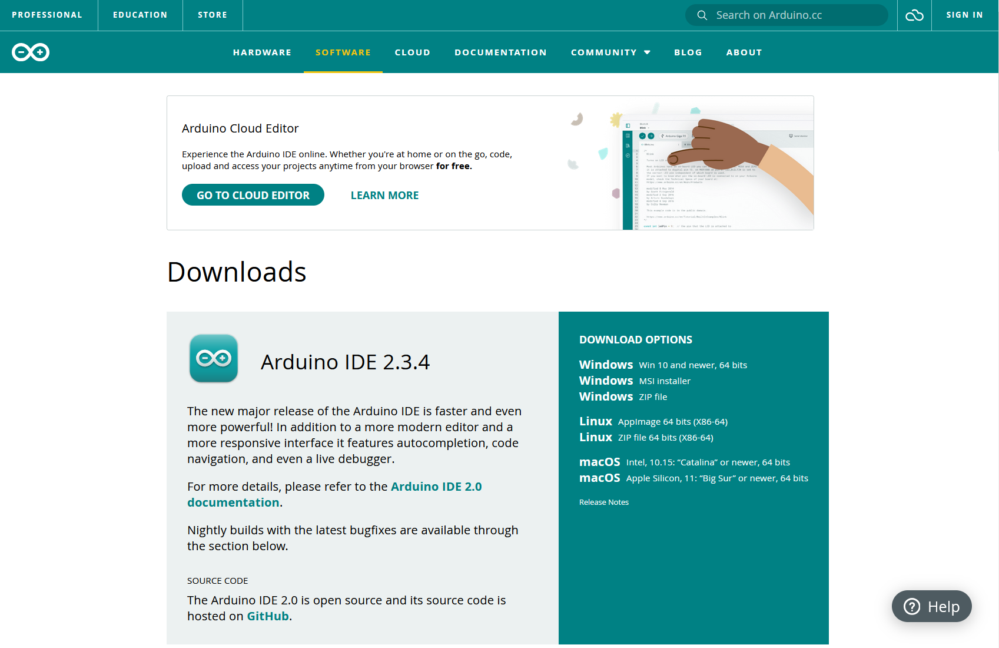
  </div><br>

  Arduino官方IDE支持不同的操作系统，请根据您的平台选择相应的版本。官方的IDE版本分为2.x和1.x两个系列版本。其中，Arduino 2.x版本仅支持Windows 10及其之后的系统。如果实验的是Windows 10或Windows 11的电脑，点击"Windows Win10 and newer，64 bits"进入下载页面。

  <div align="center">
    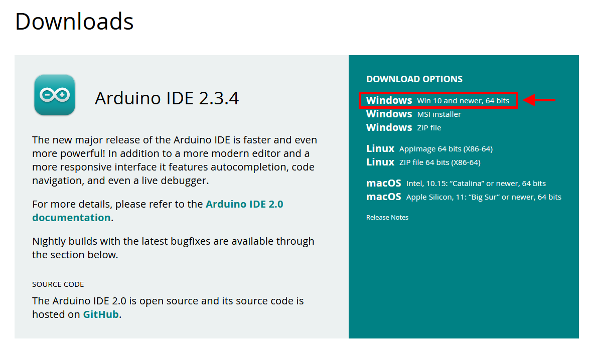
  </div><br>

  如果电脑运行的是Windows 7，则只能选择Arduino 1.x版本。继续向下滚动页面，找到Arduino 1.8.19版本。点击"Windows Win7 and newer"进入下载页面。

  <div align="center">
    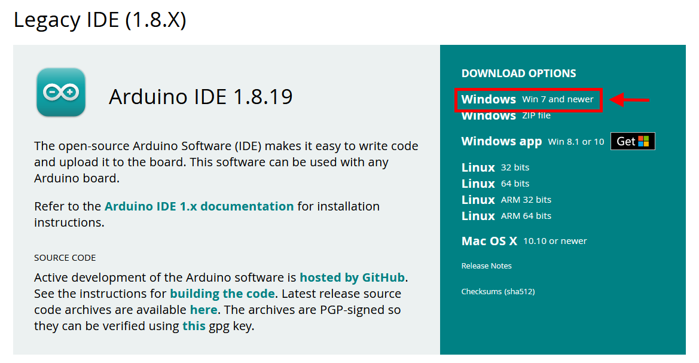
  </div><br>

  点击下载链接后，将会跳转到下载界面。如果愿意为开源软件做出贡献，可以选择捐款。如果不想捐款，请点击"JUST DOWNLOAD"按钮。

  <div align="center">
    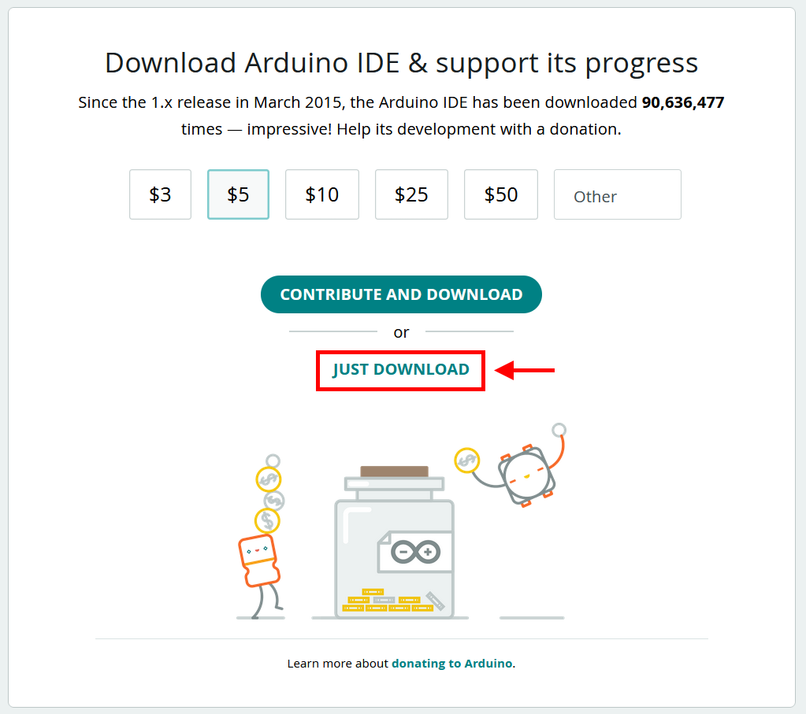
  </div><br>

  之后会进入一个订阅页面，如果想接收Arduino官方的新闻邮件，可以留下email。如果不想接收新闻邮件，直接点击"JUST DOWNLOAD"按钮即可开始下载

  <div align="center">
    
  </div><br>
  通过以上步骤，就可以下载Arduino IDE的安装包。后面会使用这个安装包，安装开发环境。

- 安装Arduino IDE

  双击运行下载好的安装包文件，会弹出"许可证协议"，点击"我同意"。
  <div align="center">
    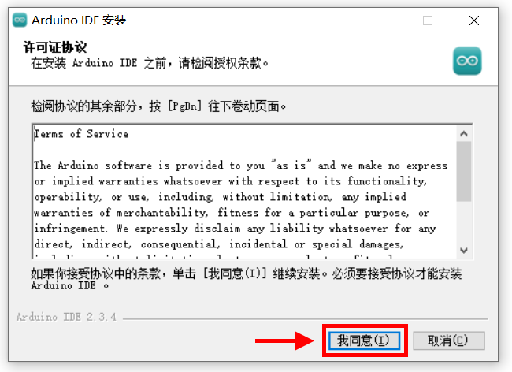
  </div><br>

  在安装选项里选择要安装的用户，然后点击"下一步"。
  <div align="center">
    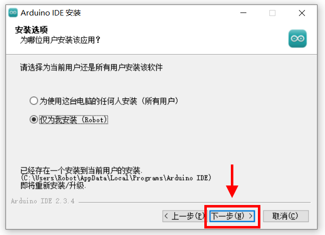
  </div><br>

  选择好安装的目标文件夹，点击"安装"，就可以开始安装了。

  <div align="center">
    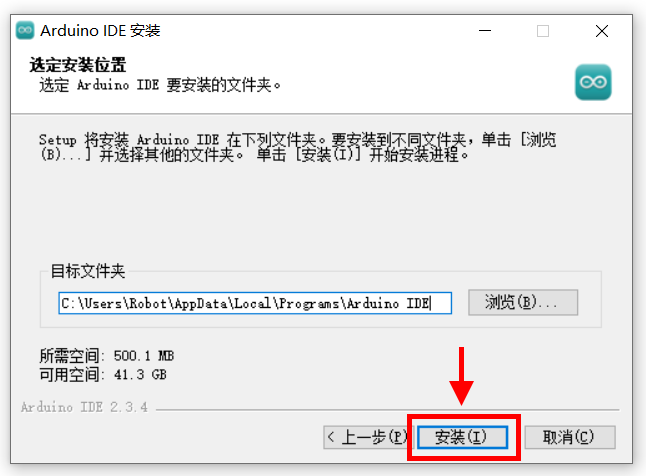
  </div><br>

  安装过程会有进度条，等待安装完成即可。
  <div align="center">
    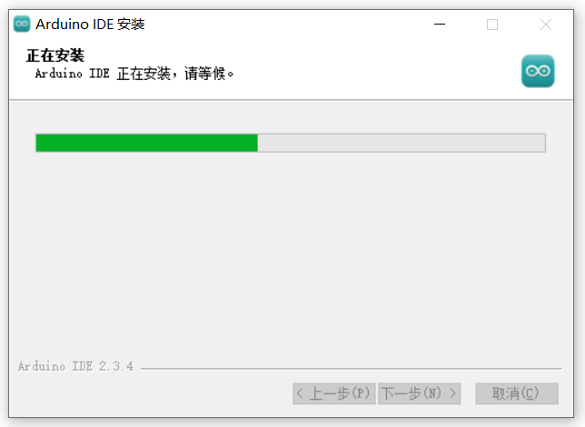
  </div><br>

  安装完成后，选中"运行 Arduino IDE"，点击"完成"按钮。
  <div align="center">
    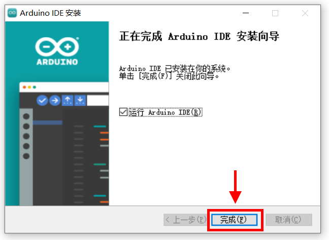
  </div><br>

  这时候会启动安装好的Arduino IDE。此时界面文字是默认的英文语言，下面把它设置为中文语言。点击左上角菜单栏的"File"，在弹出的菜单页里选择"Preference..."。

  <div align="center">
    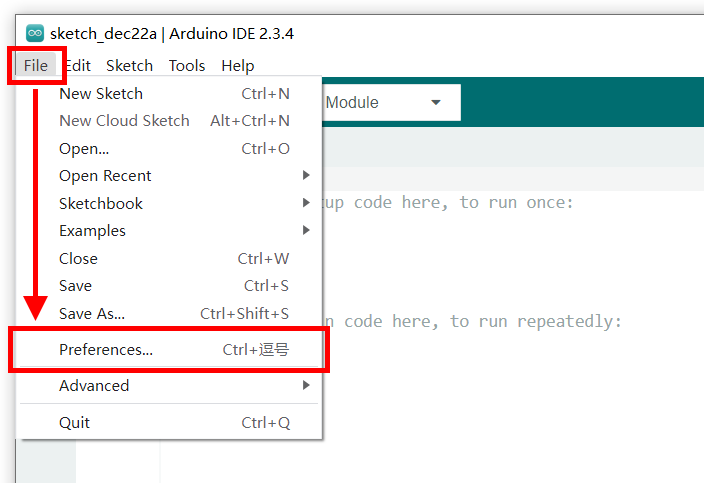
  </div><br>

  在弹出的窗口里，有一项"Language"，右边是个下拉框，默认选择是"English"。

  <div align="center">
    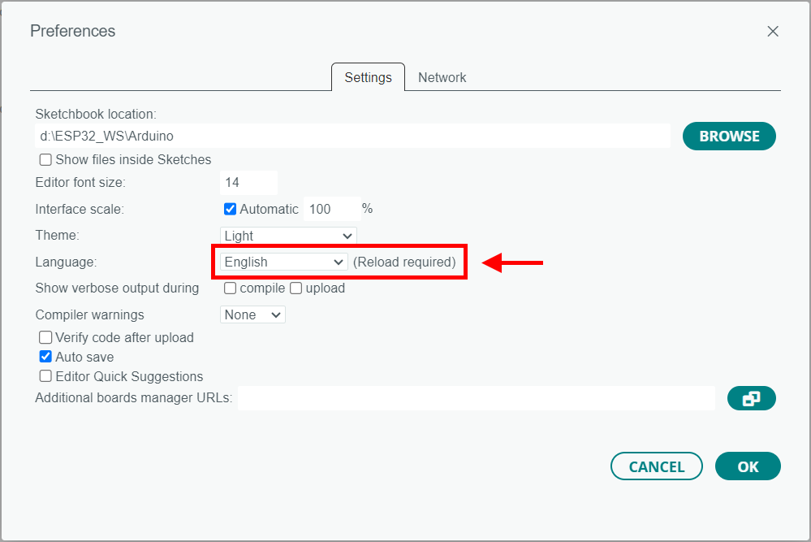
  </div><br>

  点击下拉菜单按钮，选择"中文(简体)"，然后点击右侧的"OK"按钮。

  <div align="center">
    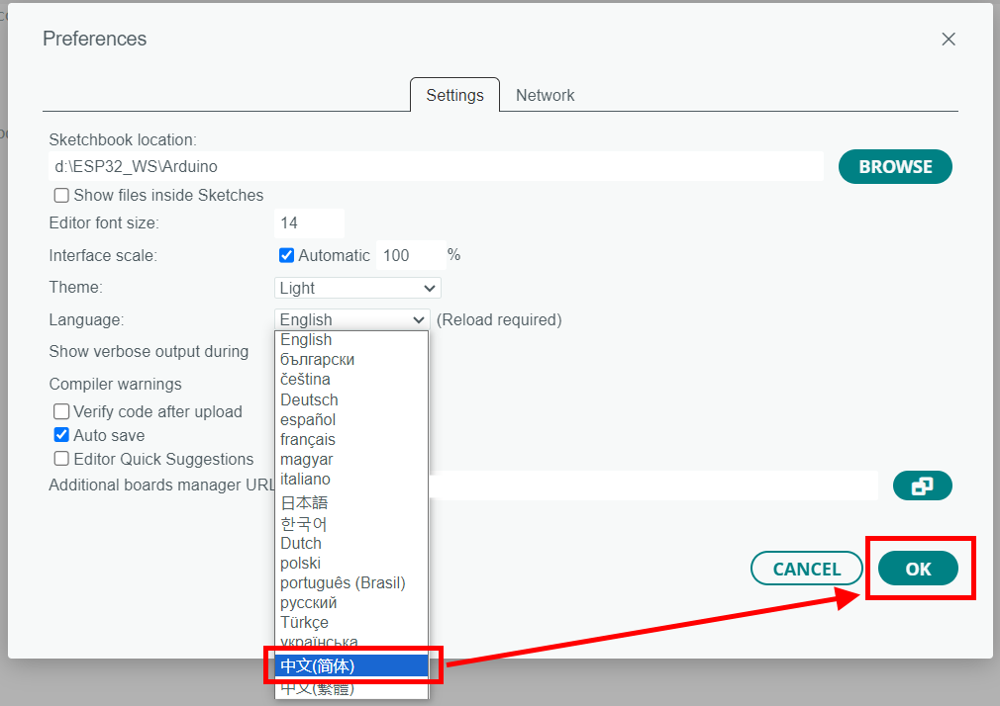
  </div><br>

  窗口界面重新刷新之后，界面上的文字就变成了简体中文。

  <div align="center">
    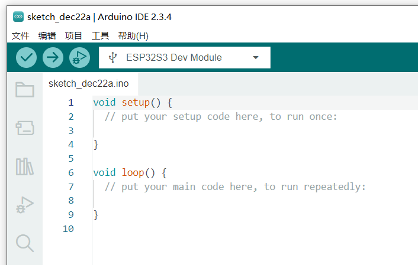
  </div><br>

- 安装ESP32开发包

  Arduino
  IDE只是一个开发软件，还需要为其安装ESP32的开发包，才能让其编译和下载ESP32的程序。ESP32的开发包可以通过在线安装和离线安装两种方式来完成，其中在线安装由于服务器在国外，下载速度非常慢，所以建议使用离线安装的方式。离线安装的第一步是下载离线安装包，从如下网盘地址下载离线安装包：

  https://pan.baidu.com/s/1CAtMbIohBZs4_O9fjvR6iw?pwd=6666 （提取码: 6666）

  下载网盘中的“ESP32开发包_离线安装”文件夹里的arduino-esp32.exe文件。接着将Arduino IDE界面关闭。然后在Windows的资源管理器里打开Arduino IDE的开发包文件夹，通常是如下地址，其中“{用户名}”为Windows的用户名。

    ```
    C:\Users\{用户名}\AppData\Local\Arduino15\packages\
    ```

  将ESP32开发包的离线安装文件arduino-esp32.exe拷贝到这个文件夹中，双击运行离线安装文件。

  <div align="center">
    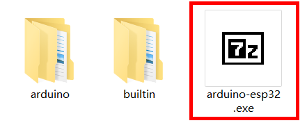
  </div><br>

  点击"Extract"进行开发包的解压缩。

  <div align="center">
    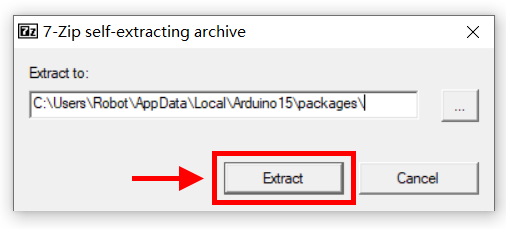
  </div><br>
  <div align="center">
    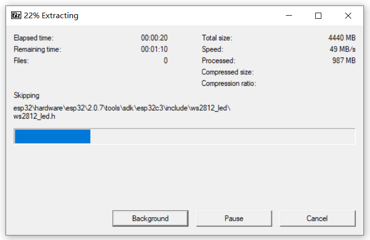
  </div><br>

  解压完毕能看到一个esp32的文件夹。

  <div align="center">
    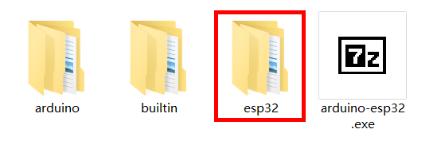
  </div><br>

  重新启动Arduino IDE窗口，点击左侧边栏上的开发板图标，会弹出开发板管理界面。

  <div align="center">
    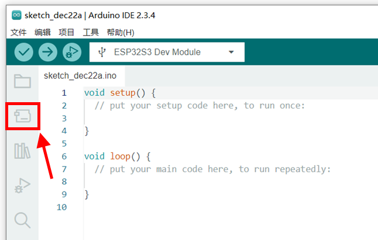
  </div><br>

  在开发板管理界面的搜索栏，输入"esp32"，会列出相关的开发包。

  <div align="center">
    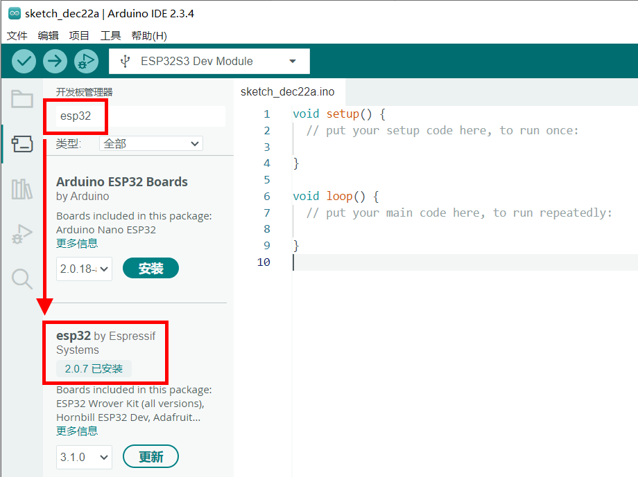
  </div><br>

  在开发包列表中，可以看到已经安装的esp32开发包版本为2.0.7。注意不要点击"更新"按钮，因为新版的开发包会和LCD显示屏的驱动不兼容。所以需要将这个esp32的开发包版本保持低于2.0.14版本。

  最后，还需要为ESP32的程序上传安装USB驱动。安装文件CH341SER.EXE也在之前的网盘地址中下载，下载完毕后在文件管理器里双击运行这个安装文件。

  <div align="center">
    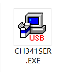
  </div><br>

  在弹出的提示中选择"是"，会进入安装界面。

  <div align="center">
    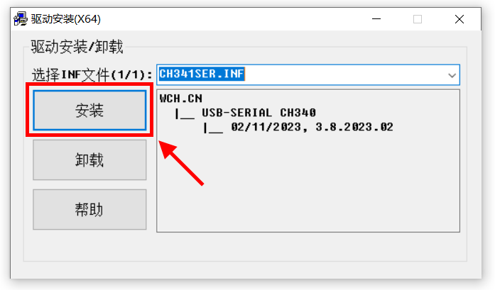
  </div><br>

  点击"安装"，然后等待安装过程结束即可。

  本开发板的所有实验程序源代码均可从网上下载。在实验过程中如果遇到问题，可以和下载的源代码进行比对，方便发现问题并改正。

  源代码下载网址：<https://gitee.com/s-robot/esp32_grail>

  <div align="center">
    
  </div><br>

  进入下载页面后，点击右侧的"克隆/下载"按钮，即可下载包含全部实验程序源代码的压缩包。双击解压后，即可用Arduino IDE打开例子程序，查看源代码内容。
