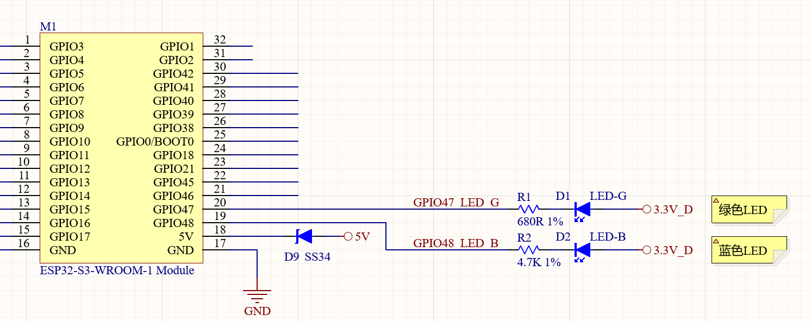
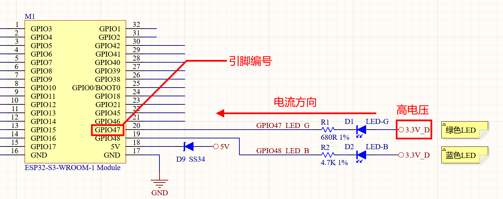
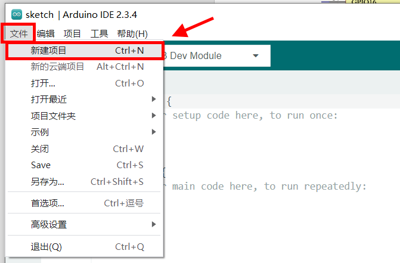
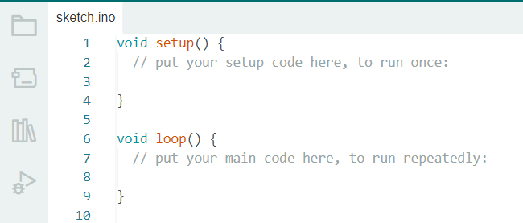
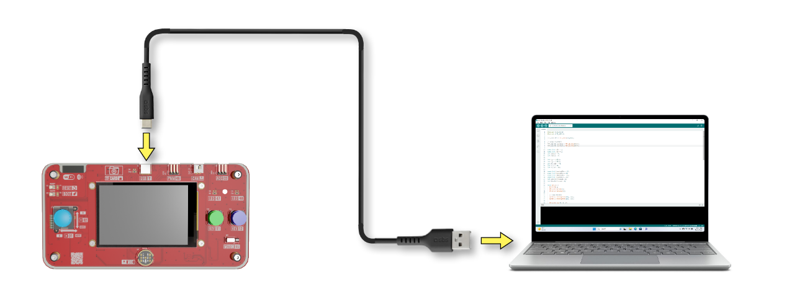
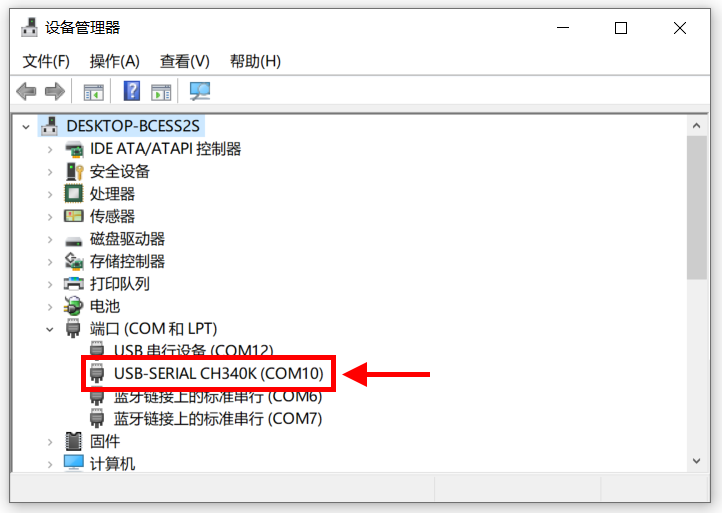
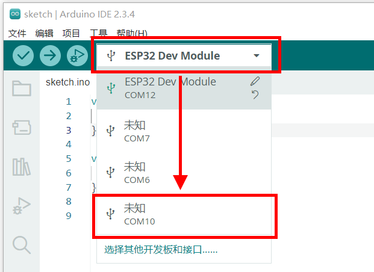
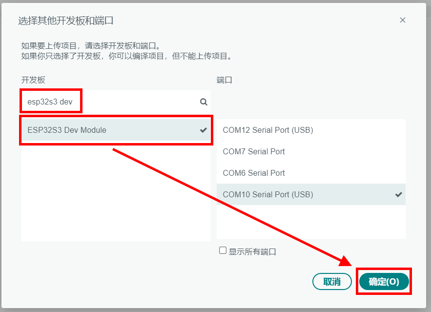
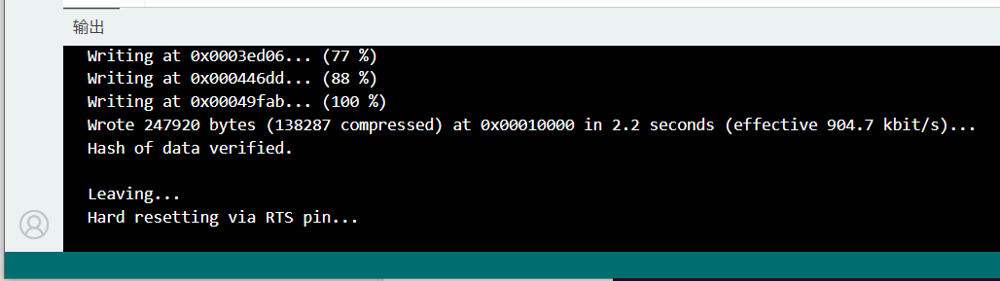
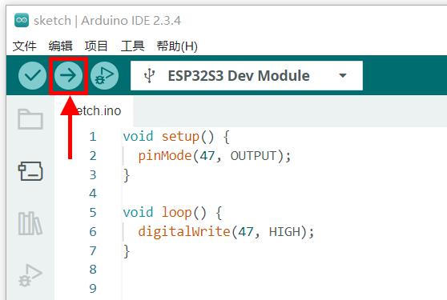

**实验一 GPIO输出实验**

【实验目的】

- 学习Arduino程序开发流程；

- 学习ESP32的GPIO输出功能的实现；

- 学习使用单片机点亮LED的方法。

【实验原理】

  在开发板的右上角，有两枚LED显示灯，点亮后从左到右分别为绿色和蓝色。它们在电路原理图中的表示如下：

  <p style="text-align: center;"></p>

  可以看到其中绿色LED右侧连接3.3V高电压，左侧通过R1限流电阻，最终和ESP32单片机的GPIO47引脚连接。所以，如果想点亮绿色LED，就需要拉低GPIO47引脚的电平。让绿色LED两侧形成电压差，让电流通过绿色LED将其点亮。

  <p style="text-align: center;"></p>

  虽然GPIO47引脚是接收电流的引脚，但是需要把它设置为输出引脚。因为除了拉低电压让LED亮起，还需要它有能力拉高电压，让LED熄灭。所以在程序里，会将GPIO47引脚设置为输出模式。

【实验步骤】

1.  在Arduino IDE里点击左上角菜单栏的"文件"，在弹出的菜单列表选择"新建项目"。

  <div align="center">
    
  </div><br>
  
  可以看到新建的程序中，只有setup()和loop()两个空函数。

  <div align="center">
    
  </div><br>

  - setup()函数只在程序启动的时候执行一次，所以可以把一些初始化的工作代码放在这个函数里。

  - loop()函数在程序执行时会被不停的循环调用，所以程序的主体代码会放在这个函数里。

  实验程序的实现思路是：在setup()函数里将GPIO47引脚设置为输出模式，然后在loop()函数里将GPIO47引脚的电平拉低。在下载的例子源代码包里，对应的源码文件为io_output.ino。完整代码如下：
```c
void setup() {
  pinMode(47, OUTPUT);
}

void loop() {
  digitalWrite(47, LOW);
}
```

  下面是对代码进行解释：
```c
void setup() {
  pinMode(47, OUTPUT);
}
```

  在程序启动时，将GPIO47引脚设置为输出模式。
```c
void loop() {
  digitalWrite(47, LOW);
}
```

  程序启动后，不停的在GPIO47引脚拉低电压。在绿色LED两侧形成电压差，点亮LED。

  程序编写完毕后，需要为其设置目标设备和程序上传端口，才能进行程序的编译和上传。首先将开发板的Type-C接口，通过USB线缆连接到电脑的USB插口上。

  <p style="text-align: center;"></p>

  在Windows系统中，鼠标右键点击桌面左下角的"开始"图标。在弹出的菜单里选择"设备管理器"。在设备管理器里，展开"端口(COM和LPT)"，查看其中的USB-SERIAL CH340K(COMx)一项。记住其中的COMx，比如下图中的COM10，就是将程序上传到ESP32的端口号。

  <div align="center">
    
  </div><br>

  回到Arduino IDE，点击工具栏里的设备框左侧的向下箭头，弹出端口列表。从中选择上传程序的端口号，比如下图中的COM10。

  <div align="center">
    
  </div><br>

  在弹出的窗口中，搜索栏里输入"esp32s3 dev"。在下方的列表中，选择"ESP32S3 Dev Module"一项。然后点击窗口右下角的"确定"按钮。

  <div align="center">
    
  </div><br>

  回到Arduino IDE界面，点击工具栏里的上传按钮，就可以开始编译程序并上传到开发板的ESP32里运行了。

  <div align="center">
    
  </div><br>

  编译的过程会比较耗时，需要耐心等待。直到界面下方的终端窗口提示如下信息，说明程序上传完毕并已经开始执行。

  <p style="text-align: center;"></p>

  这时候再看开发板的右上角，可以看到绿色LED亮起。然后可以修改程序，将GPIO47的引脚拉高，看看会发生什么。将代码中的

  ```c
  digitalWrite(47, LOW);
  ```

  修改为

  ```c
  digitalWrite(47, HIGH);
  ```

  <div align="center">
    
  </div><br>

  然后再次点击工具栏中的上传按钮。

  <div align="center">
    
  </div><br>

  可以观察开发板里绿色LED的变化。

【扩展实验】

可以在程序中加入延时，让LED交替闪烁，在下载的例子源代码包里，对应的源码文件为io_output_ext.ino。具体代码如下：
```c
void setup() {
  pinMode(47, OUTPUT);
}

void loop() {
  digitalWrite(47, LOW);   // LED 亮
  delay(1000);             // 延时1秒

  digitalWrite(47, HIGH);  // LED 熄灭
  delay(1000);             // 延时1秒
}
```