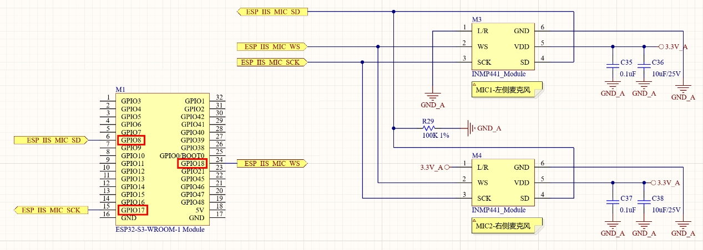
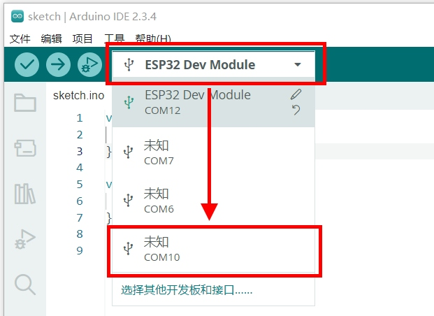

实验十 音频输入实验

【实验目的】

- 复习ESP32的I2S（Inter-IC Sound）接口通讯的使用方法；

- 学习通过I2S接口，实现音频信号采集，获取麦克风输入的音频数据。

【实验原理】

在开发板面板的下方，有左右两枚麦克风。它们在电路原理图中的表示如下：

<div align="center">
  
</div>

可以看到，这两枚麦克风使用INMP411芯片。INMP441是一种数字MEMS麦克风芯片，能够将声音信号转换为数字信号，主要用于音频采集和录音应用。在这个电路图里，这枚芯片是与ESP32的GPIO8、GPIO17和GPIO18连接，使用I2S接口与ESP32通讯。ESP32的内部I2S控制器有两个，主要用于音频数据的输入和输出。支持多种音频格式，包括PCM和I2S。可以配置为主模式或从模式，适用于各种音频应用。在这个实验里，将通过ESP32的其中一个I2S控制器来获取INMP441的音频输入数据。为了验证获取的音频数据是否正确，实验里会通过另外一个I2S控制器，将输入的音频数据再发送给MAX98357A进行播放。所以，在这个实验里，ESP32的两个I2S控制器都使用上了。

【实验步骤】

1.  在Arduino IDE里点击左上角菜单栏的"文件"，在弹出的菜单列表选择"新建项目"。

<div align="center">
  
</div>

在下载的例子源代码包里，对应的源码文件为mic.ino。完整代码如下：
```c
#include <driver/i2s.h>

static int INMP441_WS_Pin =     18;
static int INMP441_SCK_Pin =    17;
static int INMP441_SD_Pin =     8;
static int MAX98357_LRC_Pin =   13;
static int MAX98357_BCLK_PIn =  14;
static int MAX98357_DIN_Pin =   4;

#define SAMPLE_RATE 44100

static int Green_Btn_Pin = 11;
static int Green_LED_Pin = 47;
static int Blue_Btn_Pin = 12;
static int Blue_LED_Pin = 48;

i2s_config_t i2sIn_config = {
  .mode = i2s_mode_t(I2S_MODE_MASTER | I2S_MODE_RX),
  .sample_rate = SAMPLE_RATE,
  .bits_per_sample = i2s_bits_per_sample_t(16),
  .channel_format = I2S_CHANNEL_FMT_ONLY_LEFT,
  .communication_format = i2s_comm_format_t(I2S_COMM_FORMAT_STAND_I2S),
  .intr_alloc_flags = ESP_INTR_FLAG_LEVEL1,
  .dma_buf_count = 8,
  .dma_buf_len = 1024
};

const i2s_pin_config_t i2sIn_pin_config = {
  .bck_io_num = INMP441_SCK_Pin,
  .ws_io_num = INMP441_WS_Pin,
  .data_out_num = -1,
  .data_in_num = INMP441_SD_Pin
};

i2s_config_t i2sOut_config = {
  .mode = i2s_mode_t(I2S_MODE_MASTER | I2S_MODE_TX),
  .sample_rate = SAMPLE_RATE,
  .bits_per_sample = i2s_bits_per_sample_t(16),
  .channel_format = I2S_CHANNEL_FMT_ONLY_RIGHT,
  .communication_format = i2s_comm_format_t(I2S_COMM_FORMAT_STAND_I2S),
  .intr_alloc_flags = ESP_INTR_FLAG_LEVEL1,
  .dma_buf_count = 8,
  .dma_buf_len = 1024
};

const i2s_pin_config_t i2sOut_pin_config = {
  .bck_io_num = MAX98357_BCLK_PIn,
  .ws_io_num = MAX98357_LRC_Pin,
  .data_out_num = MAX98357_DIN_Pin,
  .data_in_num = -1
};


void setup() {
  i2s_driver_install(I2S_NUM_0, &i2sIn_config, 0, NULL);
  i2s_set_pin(I2S_NUM_0, &i2sIn_pin_config);
  i2s_driver_install(I2S_NUM_1, &i2sOut_config, 0, NULL);
  i2s_set_pin(I2S_NUM_1, &i2sOut_pin_config);

  pinMode(Blue_Btn_Pin, INPUT_PULLUP);
  pinMode(Blue_LED_Pin, OUTPUT);
  digitalWrite(Blue_LED_Pin, HIGH);
  pinMode(Green_Btn_Pin, INPUT_PULLUP);
  pinMode(Green_LED_Pin, OUTPUT);
  digitalWrite(Green_LED_Pin, HIGH);
}

int16_t data[SAMPLE_RATE * 3];

void loop() {
  size_t bytes_read;
  if (digitalRead(Green_Btn_Pin) == LOW)
  {
    digitalWrite(Green_LED_Pin, LOW);
    i2s_read(I2S_NUM_0, &data, sizeof(data), &bytes_read, portMAX_DELAY);
    int data_length = sizeof(data) / sizeof(data[0]);
    for (int i = 0; i < data_length; i++) {
      data[i] *= 10;
    }
    digitalWrite(Green_LED_Pin, HIGH);
  }

  if (digitalRead(Blue_Btn_Pin) == LOW)
  {
    digitalWrite(Blue_LED_Pin, LOW);
    i2s_write(I2S_NUM_1, &data, sizeof(data), &bytes_read, portMAX_DELAY);
    i2s_zero_dma_buffer(I2S_NUM_1);
    digitalWrite(Blue_LED_Pin, HIGH);
  }
  delay(10);
}
```
对代码进行解释：
```c
#include <driver/i2s.h>

static int INMP441_WS_Pin =     18;
static int INMP441_SCK_Pin =    17;
static int INMP441_SD_Pin =     8;
static int MAX98357_LRC_Pin =   13;
static int MAX98357_BCLK_PIn =  14;
static int MAX98357_DIN_Pin =   4;
```
引入I2S通讯的头文件。然后按照电路图，定义INMP441麦克风与ESP32连接的引脚序号。以及MAX98357A音频输出芯片与ESP32连接的引脚序号。最后定义音频的采样率为44100Hz。
```c
i2s_config_t i2sIn_config = {
  .mode = i2s_mode_t(I2S_MODE_MASTER | I2S_MODE_RX),
  .sample_rate = SAMPLE_RATE,
  .bits_per_sample = i2s_bits_per_sample_t(16),
  .channel_format = I2S_CHANNEL_FMT_ONLY_LEFT,
  .communication_format = i2s_comm_format_t(I2S_COMM_FORMAT_STAND_I2S),
  .intr_alloc_flags = ESP_INTR_FLAG_LEVEL1,
  .dma_buf_count = 8,
  .dma_buf_len = 1024
};
```
这段代码定义了一个名为i2sIn_config的结构体对象，类型为i2s_config_t，用于配置 I2S（Inter-IC Sound）接口的输入参数。

- mode设置I2S为主模式（Master）并且为接收模式（RX）。

- sample_rate设置音频信号的采样率为前面定义的SAMPLE_RATE，也就是44100Hz。

- bits_per_sample设置每个音频样本的位数为16位。

- channel_format设置输出模式为只使用左侧声道，也就是单声道输入。

- communication_format设置通讯格式为标准I2S通信格式。

- intr_alloc_flags设置中断的优先级为ESP_INTR_FLAG_LEVEL1，中等优先级。

- dma_buf_count设置DMA（直接内存访问）缓冲区的数量为8个。

- dma_buf_len设置每个DMA缓冲区的长度为1024字节。
```c
const i2s_pin_config_t i2sIn_pin_config = {
  .bck_io_num = INMP441_SCK_Pin,
  .ws_io_num = INMP441_WS_Pin,
  .data_out_num = -1,
  .data_in_num = INMP441_SD_Pin
};
```
这段代码定义了一个名为i2sIn_pin_config的结构体对象，类型为i2s_pin_config_t。这个结构体用于配置 I2S（Inter-IC Sound）接口的引脚设置。下面是对每个部分的详细解释：

- bck_io_num指定了I2S的时钟引脚（BCLK），在这里它被设置为INMP441_SCK_Pin，也就是ESP32的GPIO17。

- ws_io_num指定了I2S的字选择引脚（LRCK），在这里被设置为INMP441_WS_Pin，也就是ESP32的GPIO18。

- data_out_num指定了数据输出引脚（DIN），在这里被设置为-1，表示没有使用数据输入引脚。

- data_in_num:指定数据输入引脚，在这里被设置为INMP441_SD_Pin，也就是ESP32的GPIO8。
```c
i2s_config_t i2sOut_config = {
  .mode = i2s_mode_t(I2S_MODE_MASTER | I2S_MODE_TX),
  .sample_rate = SAMPLE_RATE,
  .bits_per_sample = i2s_bits_per_sample_t(16),
  .channel_format = I2S_CHANNEL_FMT_ONLY_RIGHT,
  .communication_format = i2s_comm_format_t(I2S_COMM_FORMAT_STAND_I2S),
  .intr_alloc_flags = ESP_INTR_FLAG_LEVEL1,
  .dma_buf_count = 8,
  .dma_buf_len = 1024
};
```
这段代码定义了一个名为 i2sOut_config 的结构体对象，类型为i2s_config_t，用于配置 I2S（Inter-IC Sound）接口的输出参数。

- mode设置I2S为主模式（Master）并且为发送模式（TX）。

- sample_rate设置音频信号的采样率为前面定义的SAMPLE_RATE，也就是44100Hz。

- bits_per_sample设置每个音频样本的位数为16位。

- channel_format设置输出模式为只使用右声道，也就是单声道输出。

- communication_format设置通讯格式为标准I2S通信格式。

- intr_alloc_flags设置中断的优先级为ESP_INTR_FLAG_LEVEL1，中等优先级。

- dma_buf_count设置DMA（直接内存访问）缓冲区的数量为8个。

- dma_buf_len设置每个DMA缓冲区的长度为1024字节。
```c

const i2s_pin_config_t i2sOut_pin_config = {
  .bck_io_num = MAX98357_BCLK_PIn,
  .ws_io_num = MAX98357_LRC_Pin,
  .data_out_num = MAX98357_DIN_Pin,
  .data_in_num = -1
};
```
这段代码定义了一个名为 i2sOut_pin_config 的结构体对象，类型为i2s_pin_config_t。这个结构体用于配置 I2S（Inter-IC Sound）接口的引脚设置。下面是对每个部分的详细解释：

- bck_io_num指定了 I2S 的时钟引脚（BCLK），在这里它被设置为MAX98357_BCLK_PIn，也就是ESP32的GPIO14。

- ws_io_num指定了 I2S 的字选择引脚（LRCK），在这里被设置为MAX98357_LRC_Pin，也就是ESP32的GPIO13。

- data_out_num指定了数据输出引脚（DIN），在这里被设置为MAX98357_DIN_Pin，也就是ESP32的GPIO4。

- data_in_num:指定数据输入引脚（通常用于接收数据），在这里被设置为-1，表示没有使用数据输入引脚。
```c

void setup() {
  i2s_driver_install(I2S_NUM_0, &i2sIn_config, 0, NULL);
  i2s_set_pin(I2S_NUM_0, &i2sIn_pin_config);
  i2s_driver_install(I2S_NUM_1, &i2sOut_config, 0, NULL);
  i2s_set_pin(I2S_NUM_1, &i2sOut_pin_config);
  ...... 
}
```
在初始化函数中，使用前面定义的两个i2s_config结构体，对ESP32的I2S控制器进行初始化。其中与INMP441的通讯使用第一个I2S控制器（序号0）。与MAX98357A的通讯使用第二个I2S控制器（序号1）。然后用两个pin_config结构体分别对INMP441和MAX98357A进行通讯引脚的配置。
```c

void setup() {
  ...... 
  pinMode(Blue_Btn_Pin, INPUT_PULLUP);
  pinMode(Blue_LED_Pin, OUTPUT);
  digitalWrite(Blue_LED_Pin, HIGH);
  pinMode(Green_Btn_Pin, INPUT_PULLUP);
  pinMode(Green_LED_Pin, OUTPUT);
  digitalWrite(Green_LED_Pin, HIGH);
}
```
在初始化函数的后半段，对蓝色按钮和蓝色LED的引脚进行配置，并让蓝色LED初始状态为熄灭状态。同样的，对绿色按钮和绿色LED也进行了引脚配置，并让绿色LED初始状态也为熄灭状态。
```c
int16_t data[SAMPLE_RATE * 3];
```
定义了一个数组data用来承载从INMP441麦克风采集的音频数据，数组长度是采样率的3倍，也就是能存储3秒钟的音频数据。需要注意的是ESP32的SRAM空间只有512KB，无法一次存储过长的音频文件。如果这里的录音时长过大的话，会在编译的时候报错。虽然可以通过降低SAMPLE_RATE采样频率来减少内存的占用，但是作用比较有限。在后面的实验中会通过使用扩展内存PSRAM（8MB）和TF卡来录制较长的音频数据。
```c
void loop() {
  size_t bytes_read;
  if (digitalRead(Green_Btn_Pin) == LOW)
  {
    digitalWrite(Green_LED_Pin, LOW);
    i2s_read(I2S_NUM_0, &data, sizeof(data), &bytes_read, portMAX_DELAY);
    int data_length = sizeof(data) / sizeof(data[0]);
    for (int i = 0; i < data_length; i++) {
      data[i] *= 10;
    }
    digitalWrite(Green_LED_Pin, HIGH);
  }
  ...... 
}
```
在循环函数中，如果检测到绿色按钮按下的信号，则先点亮绿色LED，表示开始录音了。然后调用i2s_read()函数，通过使用第一个I2S控制器读取INMP441麦克风采集到的音频数据。并将采集到的数据存储在data数组里。当data数组存满时，将data数组里的音频数值放大10倍，不然播放的时候音量太小，容易听不清楚。最后熄灭绿色LED，表示录音结束。
```c
void loop() {
  ...... 
  if (digitalRead(Blue_Btn_Pin) == LOW)
  {
    digitalWrite(Blue_LED_Pin, LOW);
    i2s_write(I2S_NUM_1, &data, sizeof(data), &bytes_read, portMAX_DELAY);
    i2s_zero_dma_buffer(I2S_NUM_1);
    digitalWrite(Blue_LED_Pin, HIGH);
  }
  delay(10);
}
```
在循环函数中，如果检测到蓝色按钮按下的信号，则先点亮蓝色LED，表示开始播放刚才的录音。然后调用i2s_write()函数，使用第二个I2S控制器向MAX98357A芯片发送data数组里的音频数据。让MAX98357A驱动扬声器发声，把之前录制的声音播放出来。录音播放完毕后，调用i2s_zero_dma_buffer()函数对I2S发送缓存里的音频数据进行清零，避免持续不断的重复播放尾音。最后熄灭蓝色LED，表示音频播放结束。最后调用delay(10)函数产生一个10毫秒的延时，避免按钮信号抖动的影响。

2.  程序编写完毕后，需要为其设置目标设备和程序上传端口，才能进行程序的编译和上传。首先将开发板的Type-C接口，通过USB线缆连接到电脑的USB插口上。

<div align="center">
  
</div>

在Windows系统中，鼠标右键点击桌面左下角的"开始"图标。在弹出的菜单里选择"设备管理器"。在设备管理器里，展开"端口(COM和LPT)"，查看其中的USB-SERIAL CH340K(COMx)一项。记住其中的COMx，比如下图中的COM10，就是将程序上传到ESP32的端口号。

<div align="center">
  
</div>

回到Arduino IDE，点击工具栏里的设备框左侧的向下箭头，弹出端口列表。从中选择上传程序的端口号，比如下图中的COM10。

<div align="center">
  
</div>

在弹出的窗口中，搜索栏里输入"esp32s3 dev"。在下方的列表中，选择"ESP32S3 Dev Module"一项。然后点击窗口右下角的"确定"按钮。

<div align="center">
  
</div>

3.  回到Arduino IDE界面，点击工具栏里的上传按钮，就可以开始编译程序并上传到开发板的ESP32里运行了。

<div align="center">
  
</div>

编译的过程会比较耗时，需要耐心等待。直到界面下方的终端窗口提示如下信息，说明程序上传完毕并已经开始执行。

<div align="center">
  
</div>

程序执行之后，先按下开发板面板上的绿色按钮，待绿色LED亮起时，对着麦克风说话。当绿色LED熄灭后，再按蓝色按钮，就能把从麦克风录制的音频播放出来。

【扩展实验】

启用ESP32的扩展内存PSRAM，可以录制更长的音频数据。首先需要在Arduino IDE中打开"工具"菜单，在"PSRAM"一项中勾选"OPI PSRAM"。

<div align="center">
  
</div>

然后编译运行如下代码。在下载的例子源代码包里，对应的源码文件为mic_psram.ino。
```c
#include <driver/i2s.h>
#include <esp_system.h>

static int INMP441_WS_Pin =     18;
static int INMP441_SCK_Pin =    17;
static int INMP441_SD_Pin =     8;
static int MAX98357_LRC_Pin =   13;
static int MAX98357_BCLK_PIn =  14;
static int MAX98357_DIN_Pin =   4;
#define SAMPLE_RATE 44100
static int Green_Btn_Pin = 11;
static int Green_LED_Pin = 47;
static int Blue_Btn_Pin = 12;
static int Blue_LED_Pin = 48;

i2s_config_t i2sIn_config = {
  .mode = i2s_mode_t(I2S_MODE_MASTER | I2S_MODE_RX),
  .sample_rate = SAMPLE_RATE,
  .bits_per_sample = i2s_bits_per_sample_t(16),
  .channel_format = I2S_CHANNEL_FMT_ONLY_LEFT,
  .communication_format = i2s_comm_format_t(I2S_COMM_FORMAT_STAND_I2S),
  .intr_alloc_flags = ESP_INTR_FLAG_LEVEL1,
  .dma_buf_count = 8,
  .dma_buf_len = 1024
};

const i2s_pin_config_t i2sIn_pin_config = {
  .bck_io_num = INMP441_SCK_Pin,
  .ws_io_num = INMP441_WS_Pin,
  .data_out_num = -1,
  .data_in_num = INMP441_SD_Pin
};

i2s_config_t i2sOut_config = {
  .mode = i2s_mode_t(I2S_MODE_MASTER | I2S_MODE_TX),
  .sample_rate = SAMPLE_RATE,
  .bits_per_sample = i2s_bits_per_sample_t(16),
  .channel_format = I2S_CHANNEL_FMT_ONLY_RIGHT,
  .communication_format = i2s_comm_format_t(I2S_COMM_FORMAT_STAND_I2S),
  .intr_alloc_flags = ESP_INTR_FLAG_LEVEL1,
  .dma_buf_count = 8,
  .dma_buf_len = 1024
};

const i2s_pin_config_t i2sOut_pin_config = {
  .bck_io_num = MAX98357_BCLK_PIn,
  .ws_io_num = MAX98357_LRC_Pin,
  .data_out_num = MAX98357_DIN_Pin,
  .data_in_num = -1
};

int16_t* data;
int data_length = SAMPLE_RATE * 60; // 录制60秒音频

void setup() {
  i2s_driver_install(I2S_NUM_0, &i2sIn_config, 0, NULL);
  i2s_set_pin(I2S_NUM_0, &i2sIn_pin_config);
  i2s_driver_install(I2S_NUM_1, &i2sOut_config, 0, NULL);
  i2s_set_pin(I2S_NUM_1, &i2sOut_pin_config);
  pinMode(Blue_Btn_Pin, INPUT_PULLUP);
  pinMode(Blue_LED_Pin, OUTPUT);
  digitalWrite(Blue_LED_Pin, HIGH);
  pinMode(Green_Btn_Pin, INPUT_PULLUP);
  pinMode(Green_LED_Pin, OUTPUT);
  digitalWrite(Green_LED_Pin, HIGH);
  Serial.begin(115200);
  size_t psramSize = heap_caps_get_free_size(MALLOC_CAP_SPIRAM);
  Serial.printf("可用PSRAM大小: %d bytes\\n", psramSize);

  // 从PSRAM中申请内存建立数组
  data = (int16_t*)(ps_malloc(data_length * sizeof(int16_t)));
  if (data == NULL) {
    digitalWrite(Blue_LED_Pin, LOW); // 内存申请失败的话就亮蓝灯
  }
}

void loop() {
  size_t bytes_read;
  if (digitalRead(Green_Btn_Pin) == LOW)
  {
    digitalWrite(Green_LED_Pin, LOW);
    i2s_read(I2S_NUM_0, data, data_length, &bytes_read, portMAX_DELAY);
    for (int i = 0; i < data_length; i++) {
      data[i] *= 10;
    }
    digitalWrite(Green_LED_Pin, HIGH);
  }
  if (digitalRead(Blue_Btn_Pin) == LOW)
  {
    digitalWrite(Blue_LED_Pin, LOW);
    i2s_write(I2S_NUM_1, data, data_length, &bytes_read, portMAX_DELAY);
    i2s_zero_dma_buffer(I2S_NUM_1);
    digitalWrite(Blue_LED_Pin, HIGH);
  }
  delay(10);
}
```
运行之后，即可单次录制60秒的音频数据。

<div align="center">
  <a href="../README.md" style="display: inline-block; margin: 10px 0 18px; padding: 10px 18px; border-radius: 999px; background: linear-gradient(135deg, #1f6feb, #3fb950); color: #ffffff; text-decoration: none; font-weight: 700; box-shadow: 0 4px 12px rgba(31, 111, 235, 0.25);">返回 README 主页</a>
</div>
