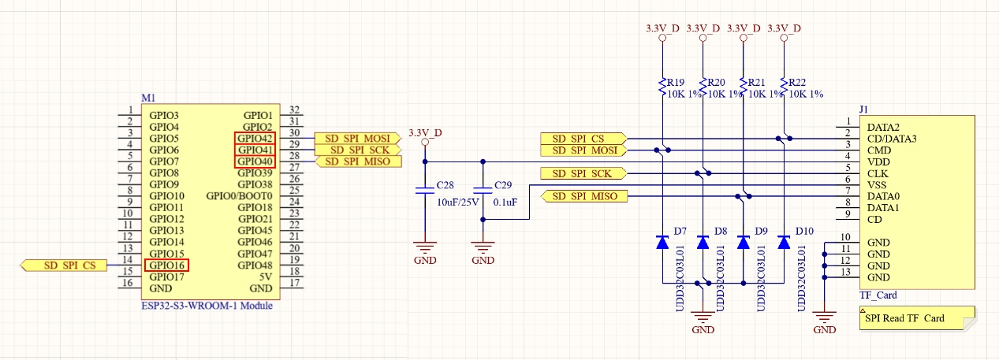
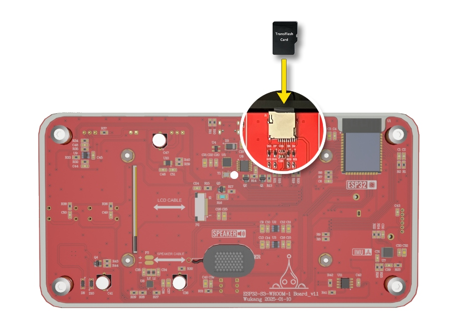

实验十二 TF卡读取实验

【实验目的】

- 复习ESP32的SPI通讯的使用方法；

- 学习通过SPI接口，实现从TF卡中读取文件数据。

【实验原理】

在开发板面板的左上方，有一个TF读卡器。它们在电路原理图中的表示如下：

<p style="text-align: center;"></p>

可以看到，这个TF读卡器是通过SPI与ESP32通讯的。在这个电路图里，TF读卡器是与ESP32的GPIO16、GPIO40、GPIO41和GPIO42连接。在这个实验里，将从TF卡中读取WAV声音文件数据，然后通过MAX98357A音频芯片将音频数据播放出来。

【实验步骤】

1.  在Arduino
    IDE里点击左上角菜单栏的"文件"，在弹出的菜单列表选择"新建项目"。

<p style="text-align: center;"></p>

在下载的例子源代码包里，对应的源码文件为tf_player.ino。完整代码如下：
```c
#include <SPI.h>
#include <SD.h>
#include <FS.h>
#include <driver/i2s.h>

static int SD_CS_Pin =    16;
static int SD_MOSI_Pin =  42;
static int SD_MISO_Pin =  40;
static int SD_SCK_Pin =   41;
SPIClass SD_SPI(HSPI);

static int MAX98357_LRC_Pin =   13;
static int MAX98357_BCLK_PIn =  14;
static int MAX98357_DIN_Pin =   4;
#define SAMPLE_RATE 44100

static int Blue_Btn_Pin = 12;
static int Blue_LED_Pin = 48;

struct wavStruct {
  const char chunkID[4] = {'R', 'I', 'F', 'F'};
  uint32_t chunkSize = 36;
  const char format[4] = {'W', 'A', 'V', 'E'};
  const char subchunk1ID[4] = {'f', 'm', 't', ' '};
  const uint32_t subchunk1Size = 16;
  const uint16_t audioFormat = 1;
  const uint16_t numChannels = 1;
  const uint32_t sampleRate = SAMPLE_RATE;
  const uint32_t byteRate = 32000;
  const uint16_t blockAlign = 2;
  const uint16_t bitsPerSample = 16;
  const char subchunk2ID[4] = {'d', 'a', 't', 'a'};
  uint32_t subchunk2Size = 0;
};

File playFile;
wavStruct wavHeader;

i2s_config_t i2sOut_config = {
  .mode = i2s_mode_t(I2S_MODE_MASTER | I2S_MODE_TX),
  .sample_rate = SAMPLE_RATE,
  .bits_per_sample = i2s_bits_per_sample_t(16),
  .channel_format = I2S_CHANNEL_FMT_ONLY_RIGHT,
  .communication_format = i2s_comm_format_t(I2S_COMM_FORMAT_STAND_I2S),
  .intr_alloc_flags = ESP_INTR_FLAG_LEVEL1,
  .dma_buf_count = 8,
  .dma_buf_len = 1024
};

const i2s_pin_config_t i2sOut_pin_config = {
  .bck_io_num = MAX98357_BCLK_PIn,
  .ws_io_num = MAX98357_LRC_Pin,
  .data_out_num = MAX98357_DIN_Pin,
  .data_in_num = -1
};

void setup() {
  pinMode(Blue_Btn_Pin, INPUT_PULLUP);
  pinMode(Blue_LED_Pin, OUTPUT);
  digitalWrite(Blue_LED_Pin, HIGH);
  SD_SPI.begin(SD_SCK_Pin, SD_MISO_Pin, SD_MOSI_Pin, SD_CS_Pin);
  if(SD.begin(SD_CS_Pin, SD_SPI) == false) {
    digitalWrite(Blue_LED_Pin, LOW);
    return;
  }
  i2s_driver_install(I2S_NUM_1, &i2sOut_config, 0, NULL);
  i2s_set_pin(I2S_NUM_1, &i2sOut_pin_config);
}

void loop() {
  size_t bytes_read;
  if (digitalRead(Blue_Btn_Pin) == LOW)
  {
    playFile = SD.open("/record.wav");
    if (playFile) {
      digitalWrite(Blue_LED_Pin, LOW);
      playFile.readBytes((char*)&wavHeader, sizeof(wavHeader));
      size_t bytesToRead = wavHeader.subchunk2Size;
      int16_t data[1024];
      while (bytesToRead > 0) {
        size_t bytesToPlay = 1024;
        if(bytesToRead < 1024)
          bytesToPlay = bytesToRead;
        size_t bytesRead = playFile.read((uint8_t*)data, bytesToPlay);
        for (size_t i = 0; i < bytesRead / sizeof(int16_t); i++) {
            data[i] *= 10;
        }
        i2s_write(I2S_NUM_1, data, bytesToPlay, &bytes_read, portMAX_DELAY);
        bytesToRead -= bytesRead;
      }
      i2s_zero_dma_buffer(I2S_NUM_1);
      playFile.close();
    }
    digitalWrite(Blue_LED_Pin, HIGH);
  }
  delay(300);
}
```
对代码进行解释：
```c
#include <SPI.h>
#include <SD.h>
#include <FS.h>
#include <driver/i2s.h>
```
引入SPI通讯需要的头文件SPI.h，SD卡（TF卡是Micro SD卡）操作需要的头文件SD.h，以及文件格式头文件FS.h。然后引入I2S通讯的头文件，以便使用MAX98357A播放音频数据。
```c
static int SD_CS_Pin =    16;
static int SD_MOSI_Pin =  42;
static int SD_MISO_Pin =  40;
static int SD_SCK_Pin =   41;
SPIClass SD_SPI(HSPI);
```
定义了TF读卡器在电路图中与ESP32进行连接的引脚序号。然后定义一个SPI控制器，准备用于驱动TF读卡器。
```c
static int MAX98357_LRC_Pin =   13;
static int MAX98357_BCLK_PIn =  14;
static int MAX98357_DIN_Pin =   4;
#define SAMPLE_RATE 44100
```
定义了MAX98357A音频芯片在电路图中与ESP32进行连接的引脚序号。然后声明一个音频采样频率，后面会按照这个采样频率去采集声音信号。
```c
static int Blue_Btn_Pin = 12;
static int Blue_LED_Pin = 48;
```
定义了蓝色按钮和蓝色LED在电路图中与ESP32进行连接的引脚序号。后面会使用蓝色按钮来进行音频文件的播放，并使用蓝色LED来表示WAV文件的读取结果。
```c
struct wavStruct {
  const char chunkID[4] = {'R', 'I', 'F', 'F'};
  uint32_t chunkSize = 36;
  const char format[4] = {'W', 'A', 'V', 'E'};
  const char subchunk1ID[4] = {'f', 'm', 't', ' '};
  const uint32_t subchunk1Size = 16;
  const uint16_t audioFormat = 1;
  const uint16_t numChannels = 1;
  const uint32_t sampleRate = SAMPLE_RATE;
  const uint32_t byteRate = 32000;
  const uint16_t blockAlign = 2;
  const uint16_t bitsPerSample = 16;
  const char subchunk2ID[4] = {'d', 'a', 't', 'a'};
  uint32_t subchunk2Size = 0;
};
```
定义了一个WAV文件的头文件结构体格式，后面读取声音文件的时候会用到。
```c
File playFile;
wavStruct wavHeader;
```
定义一个文件对象playFile，后面会用来读取声音文件。将WAV文件的头文件结构体实例化为一个对象wavHeader，后面读取文件的时候会用到。
```c
i2s_config_t i2sOut_config = {
  .mode = i2s_mode_t(I2S_MODE_MASTER | I2S_MODE_TX),
  .sample_rate = SAMPLE_RATE,
  .bits_per_sample = i2s_bits_per_sample_t(16),
  .channel_format = I2S_CHANNEL_FMT_ONLY_RIGHT,
  .communication_format = i2s_comm_format_t(I2S_COMM_FORMAT_STAND_I2S),
  .intr_alloc_flags = ESP_INTR_FLAG_LEVEL1,
  .dma_buf_count = 8,
  .dma_buf_len = 1024
};
```
这段代码定义了一个名为 i2sOut_config 的结构体对象，类型为i2s_config_t，用于配置I2S（Inter-IC Sound）接口的输出参数。

- mode设置I2S为主模式（Master）并且为发送模式（TX）。

- sample_rate设置音频信号的采样率为前面定义的SAMPLE_RATE
  ，也就是44100Hz。

- bits_per_sample设置每个音频样本的位数为16位。

- channel_format设置输出模式为只使用右声道，也就是单声道输出。

- communication_format设置通讯格式为标准I2S通信格式。

- intr_alloc_flags设置中断的优先级为ESP_INTR_FLAG_LEVEL1，中等优先级。

- dma_buf_count设置DMA（直接内存访问）缓冲区的数量为8个。

- dma_buf_len设置每个DMA缓冲区的长度为1024字节。
```c
const i2s_pin_config_t i2sOut_pin_config = {
  .bck_io_num = MAX98357_BCLK_PIn,
  .ws_io_num = MAX98357_LRC_Pin,
  .data_out_num = MAX98357_DIN_Pin,
  .data_in_num = -1
};
```
这段代码定义了一个名为 i2sOut_pin_config 的结构体对象，类型为i2s_pin_config_t。这个结构体用于配置 I2S（Inter-IC Sound）接口的引脚设置。下面是对每个部分的详细解释：

- bck_io_num指定了 I2S 的时钟引脚（BCLK），在这里它被设置为MAX98357_BCLK_PIn，也就是ESP32的GPIO14。

- ws_io_num指定了 I2S 的字选择引脚（LRCK），在这里被设置为MAX98357_LRC_Pin，也就是ESP32的GPIO13。

- data_out_num指定了数据输出引脚（DIN），在这里被设置为MAX98357_DIN_Pin，也就是ESP32的GPIO4。

- data_in_num:指定数据输入引脚（通常用于接收数据），在这里被设置为-1，表示没有使用数据输入引脚。
```c
void setup() {
  pinMode(Blue_Btn_Pin, INPUT_PULLUP);
  pinMode(Blue_LED_Pin, OUTPUT);
  digitalWrite(Blue_LED_Pin, HIGH);
  ......   
}
```
在初始化函数的前半段，对蓝色按钮和蓝色LED进行了引脚配置，并让蓝色LED初始状态为熄灭状态。
```c
void setup() {
  ...... 
  SD_SPI.begin(SD_SCK_Pin, SD_MISO_Pin, SD_MOSI_Pin, SD_CS_Pin);
  if(SD.begin(SD_CS_Pin, SD_SPI) == false) {
    digitalWrite(Blue_LED_Pin, LOW);
    return;
  }
  ...... 
}
```
接下来，对TF读卡器所使用SPI控制器进行初始化，将前面定义好的通讯引脚序号传递进去。然后调用SD.begin()函数启动与TF读卡器的通讯，如果启动失败，则会将蓝色灯点亮，表示实验失败，同时中断初始化过程。
```c
void setup() {
  ...... 
  i2s_driver_install(I2S_NUM_1, &i2sOut_config, 0, NULL);
  i2s_set_pin(I2S_NUM_1, &i2sOut_pin_config);
}
```
在初始化函数的后半段，使用前面定义的i2sOut_config结构体，对ESP32的I2S控制器进行初始化。与MAX98357A的通讯使用第二个I2S控制器（序号1）。然后用i2sOut_pin_config结构体对MAX98357A进行了通讯引脚的配置。
```c
void loop() {
  size_t bytes_read;
  if (digitalRead(Blue_Btn_Pin) == LOW)
  {
    playFile = SD.open("/record.wav");
    if (playFile) {
      digitalWrite(Blue_LED_Pin, LOW);
      playFile.readBytes((char*)&wavHeader, sizeof(wavHeader));
      size_t bytesToRead = wavHeader.subchunk2Size;
      ...... 
    }
  }
  ...... 
}
```
在循环函数中，如果检测到蓝色按钮按下的信号，就尝试读取TF卡中的record.wav文件。如果读取成功，则点亮蓝色LED，表示开始播放文件的声音数据了。从record.wav文件先读取WAV文件头数据到wavHeader结构体，从中获取record.wav文件中音频数据的长度，赋值到变量bytesToRead。
```c
void loop() {
  ......
      int16_t data[1024];
      while (bytesToRead > 0) {
        size_t bytesToPlay = 1024;
        if(bytesToRead < 1024)
          bytesToPlay = bytesToRead;
        size_t bytesRead = playFile.read((uint8_t*)data,bytesToPlay);
        for (size_t i = 0; i < bytesRead / sizeof(int16_t); i++) {
            data[i] *= 10;
        }
        i2s_write(I2S_NUM_1, data, bytesToPlay, &bytes_read,portMAX_DELAY);
        bytesToRead -= bytesRead;
      }
      i2s_zero_dma_buffer(I2S_NUM_1);
      playFile.close();
    }
    digitalWrite(Blue_LED_Pin, HIGH);
  }
  delay(300);
}
```
构建一个数组data，用于分批小量的从record.wav文件中读取音频数据。否则一次读取太多数据，会导致内存溢出。使用一个while循环，每次只读取1024字节的音频数据。每读取一次数据，就将音频放大10倍再通过i2s_write()函数将数据发送给MAX98357A进行播放。将已经读取的数据长度从变量bytesToRead中减去。当bytesToRead减到0时，说明record.wav文件中的音频数据已经读取并播放完毕。跳出while循环。将播放缓存里的音频数据清空避免尾音循环播放，然后执行playFile.close()关闭record.wav文件。最后熄灭蓝色LED，表示文件播放完成。

2.  程序编写完毕后，需要为其设置目标设备和程序上传端口，才能进行程序的编译和上传。首先将开发板的Type-C接口，通过USB线缆连接到电脑的USB插口上。

<p style="text-align: center;"></p>

在Windows系统中，鼠标右键点击桌面左下角的"开始"图标。在弹出的菜单里选择"设备管理器"。在设备管理器里，展开"端口(COM和LPT)"，查看其中的USB-SERIAL CH340K(COMx)一项。记住其中的COMx，比如下图中的COM10，就是将程序上传到ESP32的端口号。

<p style="text-align: center;"></p>

回到Arduino IDE，点击工具栏里的设备框左侧的向下箭头，弹出端口列表。从中选择上传程序的端口号，比如下图中的COM10。

<p style="text-align: center;"></p>

在弹出的窗口中，搜索栏里输入"esp32s3 dev"。在下方的列表中，选择"ESP32S3 Dev Module"一项。然后点击窗口右下角的"确定"按钮。

<p style="text-align: center;"></p>

3.  将存储了record.wav文件的TF卡插入开发板背面的TF读卡器。

<p style="text-align: center;"></p>

4.  回到Arduino IDE界面，点击工具栏里的上传按钮，就可以开始编译程序并上传到开发板的ESP32里运行了。

<p style="text-align: center;"></p>

编译的过程会比较耗时，需要耐心等待。直到界面下方的终端窗口提示如下信息，说明程序上传完毕并已经开始执行。

<p style="text-align: center;"></p>

程序执行之后，先观察实验面板上的蓝色LED。如果按钮未按下的情况下，蓝色LED亮起，说明TF读卡器初始化失败或者TF卡中读取不到record.wav文件。拔插TF卡，并给开发板重新上电。

当重新上电后，蓝色LED处于熄灭状态，说明TF读卡器初始化成功，且文件也读取到了。此时按下开发板面板上的蓝色按钮，蓝色LED亮起，开发板下方的扬声器就会播放TF卡中record.wav文件里的声音。

<div align="center">
  <a href="../README.md" style="display: inline-block; margin: 10px 0 18px; padding: 10px 18px; border-radius: 999px; background: linear-gradient(135deg, #1f6feb, #3fb950); color: #ffffff; text-decoration: none; font-weight: 700; box-shadow: 0 4px 12px rgba(31, 111, 235, 0.25);">返回 README 主页</a>
</div>
