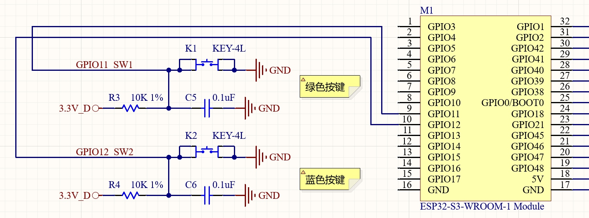
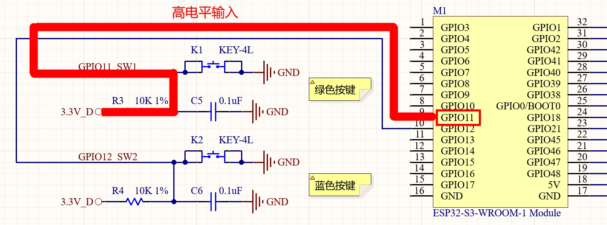
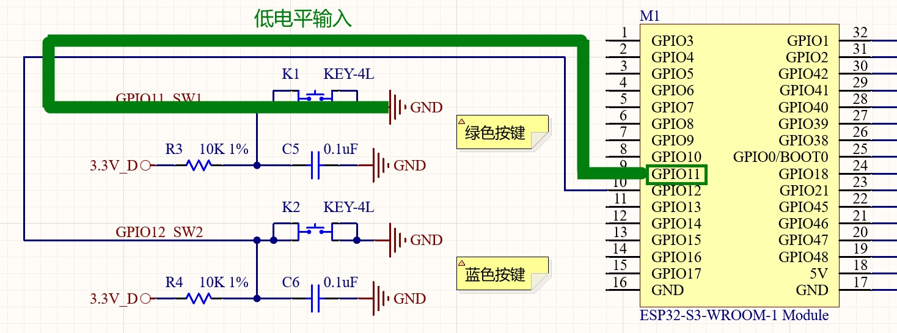
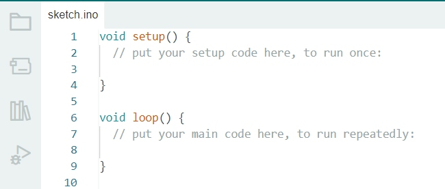
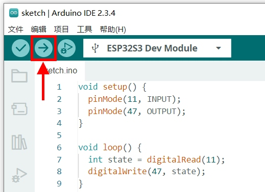

**实验二 GPIO输入实验**

【实验目的】

- 复习Arduino程序开发流程；

- 学习ESP32的GPIO输入功能的实现；

- 学习使用单片机读取按钮信号的方法。

【实验原理】

在开发板的右侧，有两个按钮，分别为绿色和蓝色。它们在电路原理图中的表示如下：

<div align="center">
  
</div>

可以看到其中绿色按钮对应图中的K1开关，它连接的是ESP32的GPIO11引脚。默认按钮未按下时，K1处于断开状态。这样GPIO11通过上拉电阻R3与3.3V连接，GPIO11读取的就是高电平数值。

<div align="center">
  
</div>

当绿色按钮按下时，K1处于闭合状态。这样GPIO11会与GND连通，GPIO11读取的就是低电平数值。

<div align="center">
  
</div>

所以这里获取按钮信号的思路就是：将按钮连接的GPIO引脚设置为输入模式，然后读取引脚上的电平高低即可。为了能够知道电平读取结果，可以和上节课实验内容结合起来，使用LED的亮灭来表示读取电平的高低。

【实验步骤】

在Arduino IDE里点击左上角菜单栏的"文件"，在弹出的菜单列表选择"新建项目"。

<div align="center">
  
</div>

可以看到新建的程序中，可以看到setup()和loop()两个空函数。

<div align="center">
  
</div>

- setup()函数只在程序启动的时候执行一次，所以可以把一些初始化的工作代码放在这个函数里。

- loop()函数在程序执行时会被不停的循环调用，所以程序的主体代码会放在这个函数里。

本节实验的实现思路是：在setup()函数里将GPIO11引脚设置为输入模式，用于读取绿色按钮K1的电平信号。GPIO47引脚设置为输出模式，用于控制绿色LED的亮灭。然后在loop()函数里根据GPIO11的电平状态，来输出GPIO47的电平即可。在下载的例子源代码包里，对应的源码文件为io_input.ino。完整代码如下：
```c
void setup() {
  pinMode(11, INPUT);
  pinMode(47, OUTPUT);
}

void loop() {
  int state = digitalRead(11);
  digitalWrite(47, state);
}
```

对代码进行解释：
```c
void setup() {
  pinMode(11, INPUT);
  pinMode(47, OUTPUT);
}
```
在程序启动时，将GPIO11引脚设置为输入模式，用于获取绿色按钮K1的输入电平。将GPIO47引脚设置为输出模式，用于控制绿色LED的亮灭。
```c
void loop() {
  int state = digitalRead(11);
  digitalWrite(47, state);
}
```
程序启动后，不停的从GPIO11引脚读取绿色按钮电平状态，然后输出到GPIO47引脚控制绿色LED的亮灭。

程序编写完毕后，需要为其设置目标设备和程序上传端口，才能进行程序的编译和上传。首先将开发板的Type-C接口，通过USB线缆连接到电脑的USB插口上。

<div align="center">
  
</div>

在Windows系统中，鼠标右键点击桌面左下角的"开始"图标。在弹出的菜单里选择"设备管理器"。在设备管理器里，展开"端口(COM和LPT)"，查看其中的USB-SERIAL CH340K(COMx)一项。记住其中的COMx，比如下图中的COM10，就是将程序上传到ESP32的端口号。

<div align="center">
  
</div>

回到Arduino IDE，点击工具栏里的设备框左侧的向下箭头，弹出端口列表。从中选择上传程序的端口号，比如下图中的COM10。

<div align="center">
  
</div>

在弹出的窗口中，搜索栏里输入"esp32s3 dev"。在下方的列表中，选择"ESP32S3 Dev Module"一项。然后点击窗口右下角的"确定"按钮。

<div align="center">
  
</div>

回到Arduino IDE界面，点击工具栏里的上传按钮，就可以开始编译程序并上传到开发板的ESP32里运行了。

<div align="center">
  
</div>

编译的过程会比较耗时，需要耐心等待。直到界面下方的终端窗口提示如下信息，说明程序上传完毕并已经开始执行。

<div align="center">
  
</div>

这时候再来到开发板的右上角，按下绿色按钮，看看绿色LED是否会亮起。

【扩展实验】

可以将蓝色按钮和蓝色LED也加入这个实验。在下载的例子源代码包里，对应的源码文件为io_output_ext.ino。具体代码如下：
```c
void setup() {
  pinMode(12, INPUT);
  pinMode(48, OUTPUT);
  pinMode(11, INPUT);
  pinMode(47, OUTPUT);
}

void loop() {
  int state = digitalRead(12);
  digitalWrite(48, state);

  int state2 = digitalRead(11);
  digitalWrite(47, state2);
}
```

<div align="center">
  <a href="../README.md" style="display: inline-block; margin: 10px 0 18px; padding: 10px 18px; border-radius: 999px; background: linear-gradient(135deg, #1f6feb, #3fb950); color: #ffffff; text-decoration: none; font-weight: 700; box-shadow: 0 4px 12px rgba(31, 111, 235, 0.25);">返回 README 主页</a>
</div>
