**实验三 LCD显示屏实验**

【实验目的】

- 学习在Arduino程序中引入第三方库；

- 学习使用单片机驱动SPI显示屏的方法；

- 学习使用第三方库显示中文的方法。

【实验原理】

在开发板的正中央，有一个3.5英寸显示屏，这个显示屏和ESP32之间使用SPI通讯。SPI通信是单片机与外设交互的方式之一，它采用四线制设计，包含时钟、数据和片选信号线。在屏幕显示应用中，SPI通信表现出独特优势：它能够提供高达10 MHz的传输速率，完全满足LCD显示时大量图像数据的传输需求。当前程序中使用的320x480分辨率显示屏，每次刷新都需要传输大量数据，SPI的高速特性确保了显示的流畅性。此外，SPI接口的硬件实现简单，抗干扰能力强，且大多数单片机都内置了SPI硬件模块，这使得开发者能够轻松实现各种显示功能，同时通过DMA传输方式还可以降低CPU负担。这些特点使SPI成为单片机显示应用的理想选择。本开发板的ESP32与LCD显示屏的SPI通讯的电路原理图如下：

<div align="center">
  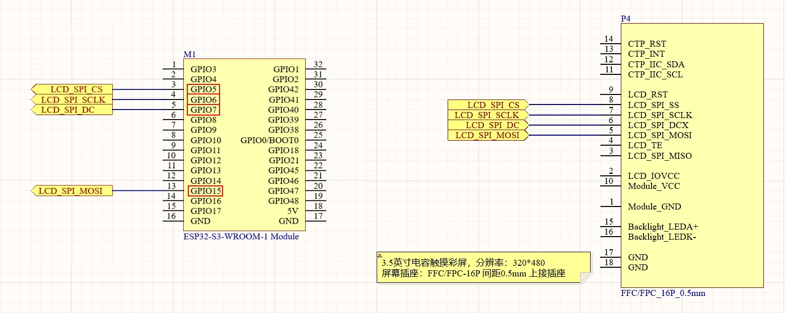
</div>

可以看到其中ESP32的SPI引脚分配：

<div align="center">
  <table>
    <thead>
      <tr>
        <th>功能</th>
        <th>名称</th>
        <th>ESP32引脚</th>
      </tr>
    </thead>
    <tbody>
      <tr>
        <td>片选信号线</td>
        <td><code>SPI_CS</code></td>
        <td><strong>GPIO5</strong></td>
      </tr>
      <tr>
        <td>时钟信号线</td>
        <td><code>SPI_SCLK</code></td>
        <td><strong>GPIO6</strong></td>
      </tr>
      <tr>
        <td>数据/命令控制线</td>
        <td><code>SPI_DC</code></td>
        <td><strong>GPIO7</strong></td>
      </tr>
      <tr>
        <td>主机输出/从机输入数据线</td>
        <td><code>SPI_MOSI</code></td>
        <td><strong>GPIO15</strong></td>
      </tr>
    </tbody>
  </table>
</div>

如果从零编写LCD的SPI通讯时序工作量比较大，所以一般都是借助第三方的驱动库来完成这个功能。这里用到的LCD驱动库为TFT_eSPI，可以从Arduino IDE中进行该库的下载和编译。在下载好的TFT_eSPI进行通讯引脚的设置，就可以调用TFT_eSPI的函数在LCD上显示文字和图像了。

【实验步骤】

将开发用的电脑连接互联网，后面的操作将会从互联网上下载库文件。

在Arduino IDE的左侧边栏，点击"库管理"图标打开管理库的窗口。

<div align="center">
  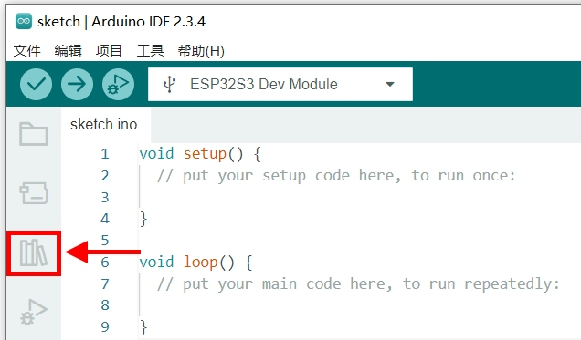
</div> 

在"库管理"窗口的搜索栏中，输入"TFT_eSPI"，下方列表中会出现TFT_eSPI这个库的信息。点击"安装"按钮，自动完成这个库的下载安装。

<div align="center">
  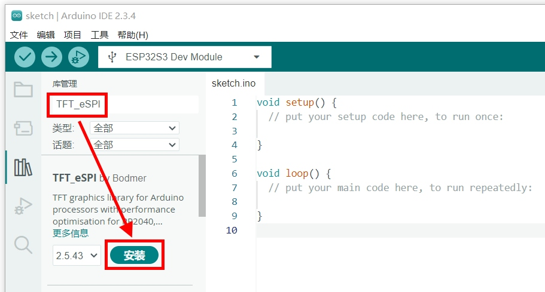
</div>

安装完毕后，需要在这个TFT_eSPI库里设置ESP32与之通讯的引脚编号。首先需要找到这个库文件所在的磁盘路径。在Arduino
    IDE里点击左上角菜单栏的"文件"，在弹出的菜单列表选择"首选项..."。

<div align="center">
  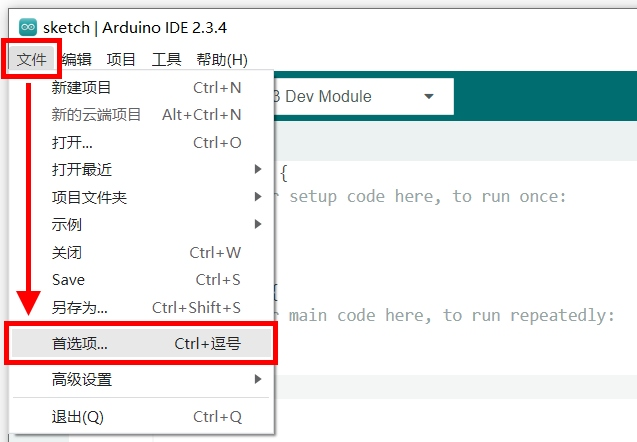
</div>

在弹出的"首选项"窗口中，"项目文件夹地址"一项就是库文件所在的文件夹地址。记下这个文件夹地址，在Windows的文件管理器打开这个地址。

<div align="center">
  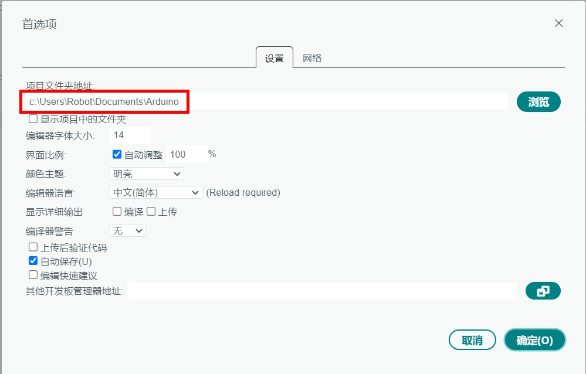
</div>

在文件管理器中，可以看到这个文件夹中有个"liberaries"文件夹，双击进入这个文件夹。

<div align="center">
  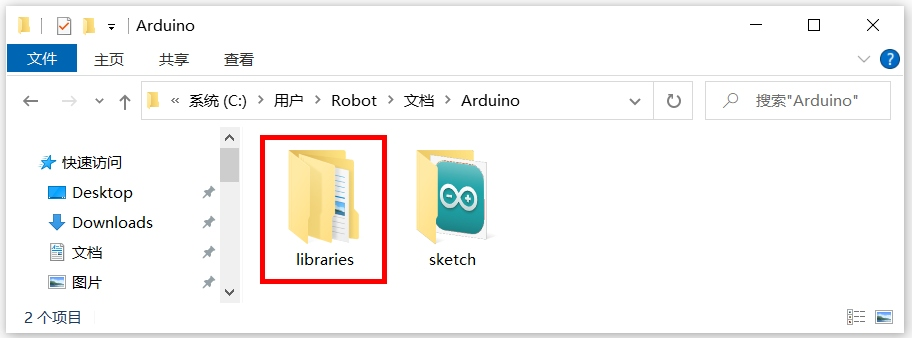
</div>

可以看到刚才下载的TFT_eSPI库的文件夹，双击进入这个文件夹。

<div align="center">
  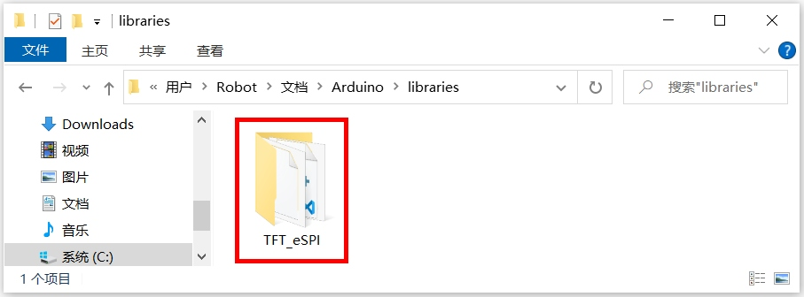
</div>

在TFT_eSPI库的文件夹中，找到"User_Setup.h"这个文件，双击打开它。

<div align="center">
  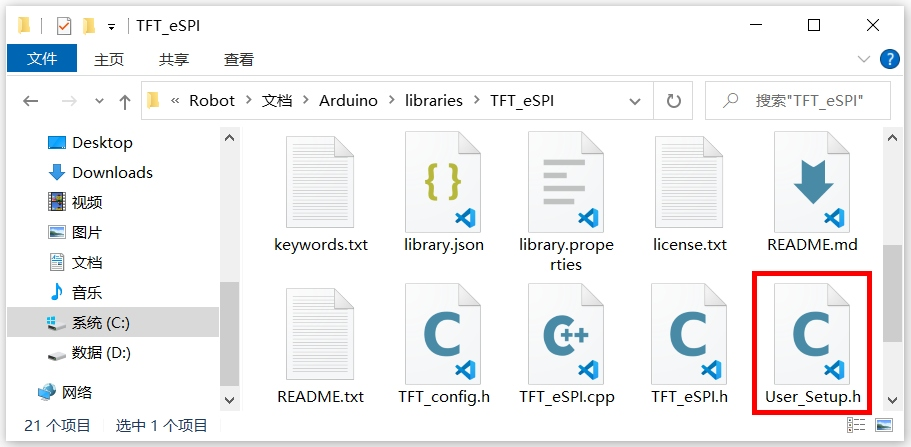
</div>

在 "User_Setup.h"文件中，进行两处修改：

- 本开发板使用的LCD驱动芯片为ST7796U，需要切换驱动型号到ST779x系列。所以将"#define ILI9341_DRIVER"一项注释掉，将"#define ST7796_DRIVER"一项恢复。

<div align="center">
  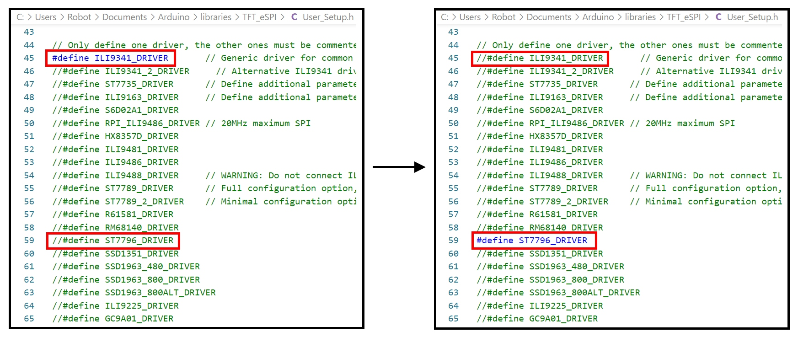
</div>

- 按照电路图中ESP32与显示屏连接的SPI引脚序号，对文件中的引脚序号进行修改。

  <div align="center">
    <table>
      <thead>
        <tr>
          <th>功能</th>
          <th>名称</th>
          <th>ESP32引脚</th>
        </tr>
      </thead>
      <tbody>
        <tr>
          <td>片选信号线</td>
          <td><code>SPI_CS</code></td>
          <td><strong>GPIO5</strong></td>
        </tr>
        <tr>
          <td>时钟信号线</td>
          <td><code>SPI_SCLK</code></td>
          <td><strong>GPIO6</strong></td>
        </tr>
        <tr>
          <td>数据/命令控制线</td>
          <td><code>SPI_DC</code></td>
          <td><strong>GPIO7</strong></td>
        </tr>
        <tr>
          <td>主机输出/从机输入数据线</td>
          <td><code>SPI_MOSI</code></td>
          <td><strong>GPIO15</strong></td>
        </tr>
      </tbody>
    </table>
  </div>

<div align="center">
  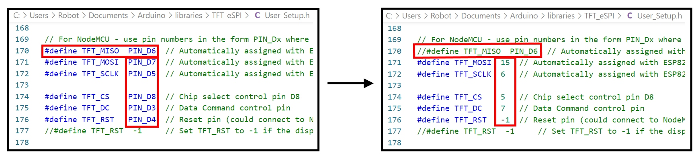
</div>

上述修改完成后，按下键盘的Ctrl + S组合键，保存修改的内容。

在Arduino IDE里点击左上角菜单栏的"文件"，在弹出的菜单列表选择"新建项目"。

<div align="center">
  
</div>

本节实验的实现思路是：在setup()函数里对LCD显示屏进行初始化。然后在loop()函数在LCD屏幕上显示"Hello World！"。在下载的例子源代码包里，对应的源码文件为lcd.ino。完整代码如下：
```c
#include <TFT_eSPI.h>

TFT_eSPI tft = TFT_eSPI(320,480);

void setup() {
  tft.init();
  tft.setRotation(1);
  tft.invertDisplay(1);
  tft.fillScreen(TFT_RED);
}

void loop() {
  tft.setCursor(0, 0, 2);
  tft.setTextSize(2);
  tft.println("Hello World!");
}
```
对代码进行解释：
```c
#include <TFT_eSPI.h>

TFT_eSPI tft = TFT_eSPI(320,480);
```

将TFT_eSPI库的头文件包含进来，以便使用它的函数对显示屏进行初始化和绘制。然后定义一个TFT_eSPI类型的操作对象，对象名字为tft，后面会调用这个对象上的函数来进行初始化和绘图操作。参数(320,480)是显示屏的分辨率，也就是320×480的分辨率。这里是把竖屏当做横屏来使用，在后面初始化的时候，会把屏幕显示的方向从竖屏翻转到横屏。
```c
void setup() {
  tft.init();
  tft.setRotation(1);
  tft.invertDisplay(1);
  tft.fillScreen(TFT_RED);
}
```
在setup()函数中进行了显示屏的初始化设置：通过init()函数初始化显示屏；setRotation(1)设置显示方向从纵向翻转为横向；invertDisplay(1)进行显示颜色反转；最后使用fillScreen函数将整个屏幕填充为红色背景。这些都是程序运行时只需执行一次的初始化操作。
```c
void loop() {
  tft.setCursor(0, 0, 2);
  tft.setTextSize(2);
  tft.println("Hello World!");
}
```
在loop()循环函数中，程序不断执行显示文本的操作：首先通过setCursor将文本显示的起始位置设置在屏幕左上角(0,0)位置，并选择字体2；然后调用setTextSize(2)将文本大小设置为2倍；最后使用println函数在屏幕上显示"Hello World!"文字，并自动换行。由于这些代码在loop()函数中，它们会不断重复执行，文本会持续在相同位置刷新显示。通过这个程序，展示了如何使用TFT_eSPI库来控制LCD显示屏的基本操作。

程序编写完毕后，需要为其设置目标设备和程序上传端口，才能进行程序的编译和上传。首先将开发板的Type-C接口，通过USB线缆连接到电脑的USB插口上。

<div align="center">
  
</div>

在Windows系统中，鼠标右键点击桌面左下角的"开始"图标。在弹出的菜单里选择"设备管理器"。在设备管理器里，展开"端口(COM和LPT)"，查看其中的USB-SERIAL CH340K(COMx)一项。记住其中的COMx，比如下图中的COM10，就是将程序上传到ESP32的端口号。

<div align="center">
  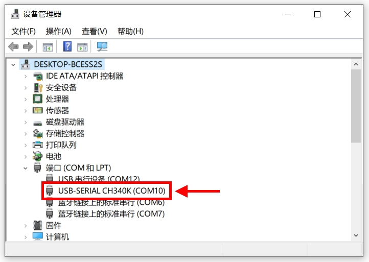
</div>

回到Arduino IDE，点击工具栏里的设备框左侧的向下箭头，弹出端口列表。从中选择上传程序的端口号，比如下图中的COM10。

<div align="center">
  
</div>

在弹出的窗口中，搜索栏里输入"esp32s3 dev"。在下方的列表中，选择"ESP32S3 Dev Module"一项。然后点击窗口右下角的"确定"按钮。

<div align="center">
  
</div>

回到Arduino IDE界面，点击工具栏里的上传按钮，就可以开始编译程序并上传到开发板的ESP32里运行了。

<div align="center">
  
</div>

编译的过程会比较耗时，需要耐心等待。直到界面下方的终端窗口提示如下信息，说明程序上传完毕并已经开始执行。

<div align="center">
  
</div>

这时候再来查看开发板的显示屏，可以看到红色的背景，左上角显示文字"Hello World!"。

【扩展实验】

可以引入U8g2库，在LCD屏幕上显示中文。在Windows的文件管理器打开之前的那个库文件地址。将配套资料里的U8g2_for_TFT_eSPI文件夹拷贝进去。

<div align="center">
  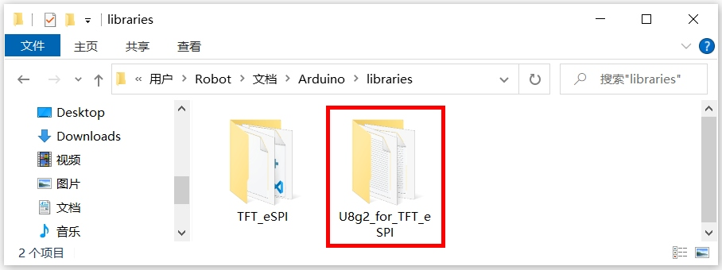
</div>

在下载的例子源代码包里，对应的源码文件为lcd_chinese.ino。程序代码修改如下：
```c
#include <TFT_eSPI.h>
#include <U8g2_for_TFT_eSPI.h>

TFT_eSPI tft = TFT_eSPI(320,480);
U8g2_for_TFT_eSPI u8g2;

void setup() {
  tft.init();
  tft.setRotation(1);
  tft.invertDisplay(1);
  tft.fillScreen(TFT_RED);
  u8g2.begin(tft);
  u8g2.setFont(u8g2_font_wqy16_t_gb2312);
  u8g2.setForegroundColor(TFT_WHITE);
  u8g2.setBackgroundColor(TFT_RED);
}

void loop() {
  u8g2.setCursor(0, 16);
  u8g2.print("世界你好！");
}
```
其中增加的代码解释：
```c
#include <U8g2_for_TFT_eSPI.h>

U8g2_for_TFT_eSPI u8g2;
```
保护U8g2库的头文件，以调用这个库的函数。然后定义一个U8g2_for_TFT_eSPI类型的操作对象，对象名字为u8g2，后面会调用这个对象上的函数来进行初始化和绘图操作。
```c
void setup() {
  ......
  u8g2.begin(tft);
  u8g2.setFont(u8g2_font_wqy16_t_gb2312);
  u8g2.setForegroundColor(TFT_WHITE);
  u8g2.setBackgroundColor(TFT_RED);
}
```
在setup()初始化函数里，通过u8g2.begin(tft)完成字体引擎的初始化，将TFT显示屏对象作为参数传入，建立起u8g2字体引擎与显示屏驱动之间的连接。

接着，u8g2.setFont(u8g2_font_wqy16_t_gb2312)选择了文泉驿16像素大小的中文字体，这个字体支持GB2312编码的简体中文字符集，字符显示效果清晰，适合在LCD屏幕上展示。

最后，u8g2.setForegroundColor(TFT_WHITE)设置了文字显示的颜色为白色。接着调用u8g2.setBackgroundColor(TFT_RED)设置了文字的背景颜色为红色，这样能和屏幕背景色保持一致。
```c
void loop() {
  u8g2.setCursor(0, 16);
  u8g2.print("世界你好！");
}
```
在主循环函数loop()中，首先使用u8g2.setCursor(0,16)设置文本显示的起始位置，其中参数0表示从屏幕最左边开始(X坐标)，16表示距离屏幕顶部16像素的位置(Y坐标)。这个Y坐标值选择16是因为前面设置的文泉驿字体大小为16像素，这样可以确保文字完整显示。接下来，u8g2.print("世界你好！")这行代码使用u8g2库的print函数在设定位置显示中文文本"世界你好！"。由于之前已经设置了中文字体和白色文字颜色，这段文本会以白色的16像素文泉驿字体显示在屏幕上。

回到Arduino IDE界面，点击工具栏里的上传按钮，就可以开始编译程序并上传到开发板的ESP32里运行了。

<div align="center">
  
</div>

经过一段时间的编译和上传过程，再来查看开发板的显示屏，可以看到红色的背景，左上角显示中文文字"世界你好！"。

<div align="center">
  <a href="../README.md" style="display: inline-block; margin: 10px 0 18px; padding: 10px 18px; border-radius: 999px; background: linear-gradient(135deg, #1f6feb, #3fb950); color: #ffffff; text-decoration: none; font-weight: 700; box-shadow: 0 4px 12px rgba(31, 111, 235, 0.25);">返回 README 主页</a>
</div>
