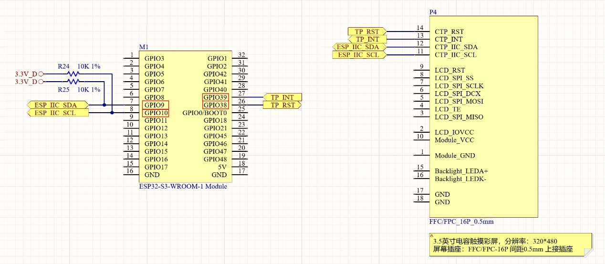
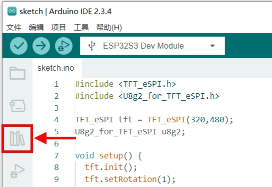
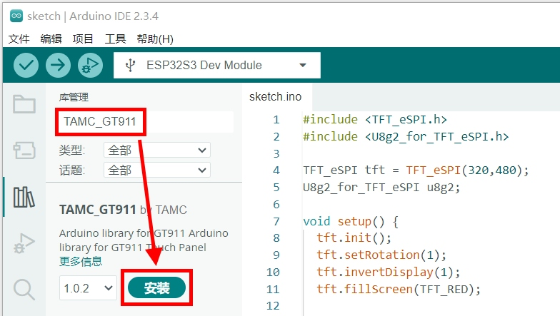
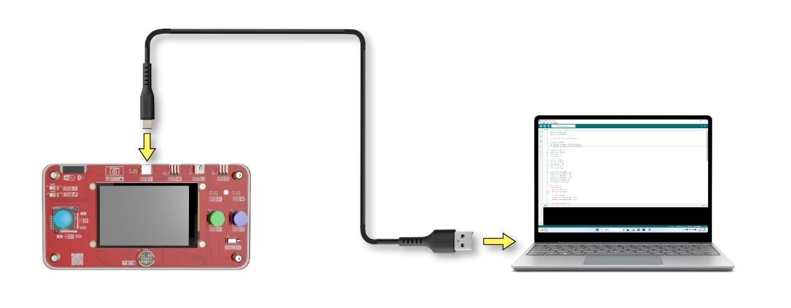

**实验四 触摸屏实验**

【实验目的】

- 复习Arduino程序引入第三方库的方法；

- 学习ESP32的触摸屏驱动方法；

- 学习TFT_eSPI库新的绘图方法。

【实验原理】

开发板使用的LCD显示屏，是一款带多点电容触控感知的屏幕。触控感知使用的GT911芯片，ESP32和GT911触控芯片是通过I2C总线进行通讯的。I2C通信是单片机与触控屏交互的理想选择，它仅需要两根信号线（SDA和SCL）就能实现双向数据传输。在触控屏应用中，因为人手触摸的操作频率相对通讯速率来说比较低，I2C通信的低速特性（通常100kHz-400kHz）可以很好满足触控采样的需求。再加上其抗干扰能力强、线路简单的特点，使其成为触控屏应用的理想选择。在本实验中，触控芯片GT911与ESP32连接的电路图如下：

<p style="text-align: center;"></p>

可以看到连接的引脚分配如下：

  -----------------------------------------------------------------------
              功能                     名称               ESP32引脚
  ---------------------------- -------------------- ---------------------
    Serial Data，I2C通信的数据线       IIC_SDA              GPIO9

    Serial Clock，I2C通信的时钟线      IIC_SCL              GPIO10

    Interrupt，触摸中断信号线          TP_INT               GPIO39

    Reset，触摸芯片的复位引脚           TP_RST              GPIO38
  -----------------------------------------------------------------------

如果从零编写GT911触控芯片的I2C通讯时序工作量比较大，所以一般借助第三方的驱动库来完成这个功能。这里用到的驱动库为TAMC_GT911，可以从Arduino IDE中进行这个库的下载和编译。在下载好的TAMC_GT911进行通讯引脚的设置，就可以调用TAMC_GT911的函数读取屏幕的触控信息了。

【实验步骤】

将开发用的电脑连接互联网，后面的操作将会从互联网上下载库文件。

在Arduino IDE的左侧边栏，点击"库管理"图标打开管理库的窗口。

<p style="text-align: center;"></p>

在"库管理"窗口的搜索栏中，输入"TAMC_GT911"，下方列表中会出现TAMC_GT911这个库的信息。点击"安装"按钮，自动完成这个库的下载安装。

<p style="text-align: center;"></p>

在Arduino IDE里进行代码编写。本节实验的实现思路是：在setup()函数里进行触控芯片GT911和LCD显示驱动库TFT_eSPI的初始化。然后在loop()函数里使用TFT_eSPI的绘图函数，显示触控点在屏幕上的位置。同时在屏幕上显示触控点的坐标数值，这样就能比较直观的观察触控点信息的变化了。
在下载的例子源代码包里，对应的源码文件为touch.ino。具体代码如下：

```c
#include <TAMC_GT911.h>
#include <TFT_eSPI.h>

#define IIC_SDA 9
#define IIC_SCL 10
#define TP_INT 39
#define TP_RST 38

TAMC_GT911 tp(IIC_SDA, IIC_SCL, TP_INT, TP_RST, 480, 320);
TFT_eSPI tft = TFT_eSPI(320, 480);

void setup() {
  tp.begin();
  tp.setRotation(ROTATION_RIGHT);
  tft.init();
  tft.setRotation(1);
  tft.invertDisplay(1);
  tft.setTextSize(2);
  tft.setTextColor(TFT_WHITE, TFT_RED);
  tft.fillScreen(TFT_RED);
}

void loop() {
  tp.read();
  if (tp.isTouched) {
    tft.setCursor(0, 0);
    for (int i=0; i<tp.touches; i++) {
      tft.printf("Touch[%d]:(%d,%d) Size:%d\n",
                 i+1, tp.points[i].x, tp.points[i].y,
                 tp.points[i].size);
      int tp_r = tp.points[i].size/2;
      tft.fillCircle(tp.points[i].x, tp.points[i].y, tp_r, TFT_GREEN);
    }
  }
  delay(30);
}
```

对代码进行解释：

```c   
#include <TAMC_GT911.h>
#include <TFT_eSPI.h>
```

包含了触控芯片GT911驱动库和LCD显示驱动库的头文件。

```c
#define IIC_SDA 9
#define IIC_SCL 10
#define TP_INT 39
#define TP_RST 38
```

定义了和触控芯片GT911连接的ESP32引脚序号，跟前面电路图显示的引脚序号一致：

  -----------------------------------------------------------------------
              功能                     名称               ESP32引脚
  ---------------------------- -------------------- ---------------------
    Serial Data，I2C通信的数据线       IIC_SDA              GPIO9

    Serial Clock，I2C通信的时钟线      IIC_SCL              GPIO10

    Interrupt，触摸中断信号线          TP_INT               GPIO39

    Reset，触摸芯片的复位引脚           TP_RST              GPIO38
  -----------------------------------------------------------------------


接下来的代码：

```c
TAMC_GT911 tp(IIC_SDA, IIC_SCL, TP_INT, TP_RST, 480, 320);
TFT_eSPI tft = TFT_eSPI(320, 480);
```

对触控驱动进行初始化。将前面定义的触控芯片通讯的I2C总线引脚，连同屏幕分辨率一起传入触控对象的构造函数里。然后对LCD显示对象进行了初始化。

```c    
void setup() {
  tp.begin();
  tp.setRotation(ROTATION_RIGHT);
  ......
}
```

在程序启动时，调用begin()函数启动与触控芯片的通讯。调用setRotation()函数将触控坐标系顺时针旋转90度，从竖屏翻转到横屏，与LCD显示的坐标系进行对齐。

```c 
void setup() {
  ......
  tft.init();
  tft.setRotation(1);
  tft.invertDisplay(1);
  tft.setTextSize(2);
  tft.setTextColor(TFT_WHITE, TFT_RED);
  tft.fillScreen(TFT_RED);
}
```

对LCD显示对象进行初始化。调用setRotation(1)将屏幕顺时针旋转90度，从竖屏显示变成横屏显示。调用invertDisplay(1)调正屏幕颜色显示。调用setTextSize(2)设置字体的尺寸。调用setTextColor(TFT_WHITE, TFT_RED)将字体设置为白色，字体背景设置为红色，和背景色保持一致，比较美观。调用fillScreen(TFT_RED)将屏幕背景色设置为红色。

```c 
void loop() {
  tp.read();
  if (tp.isTouched) {
    tft.setCursor(0, 0);
    for (int i=0; i<tp.touches; i++) {
      tft.printf("Touch[%d]:(%d,%d) Size:%d\n",
                 i+1, tp.points[i].x, tp.points[i].y,
                 tp.points[i].size);
      int tp_r = tp.points[i].size/2;
      tft.fillCircle(tp.points[i].x, tp.points[i].y, tp_r, TFT_GREEN);
    }
  }
  delay(30);
}
```

在循环函数loop()里，首先通过tp.read()读取触摸屏的当前状态信息。接着判断是否有触摸事件发生(tp.isTouched)，如果检测到触摸，就将文字光标位置设置到屏幕左上角(0,0)位置。然后开始一个循环，遍历所有的触摸点，tp.touches表示当前检测到的触摸点数量。对于每个触摸点，使用printf函数在屏幕上显示这个触摸点的信息，包括触摸点的序号(从1开始)、X坐标、Y坐标以及触摸点的大小，每条信息后面都会自动换行。
接着计算触摸点要显示的圆形半径，将触摸点的size值除以2作为半径大小。最后在触摸点的位置(由x和y坐标确定)绘制一个绿色实心圆，圆的大小由前面计算的半径决定。
整个循环结束后，程序会延时30毫秒，这样可以控制刷新频率，避免程序运行过快。这个延时值可以根据实际需求调整，值越小刷新越快，但也会占用更多系统资源。

程序编写完毕后，需要为其设置目标设备和程序上传端口，才能进行程序的编译和上传。首先将开发板的Type-C接口，通过USB线缆连接到电脑的USB插口上。
<p style="text-align: center;"></p>

在Windows系统中，鼠标右键点击桌面左下角的"开始"图标。在弹出的菜单里选择"设备管理器"。在设备管理器里，展开"端口(COM和LPT)"，查看其中的USB-SERIAL CH340K(COMx)一项。记住其中的COMx，比如下图中的COM10，就是将程序上传到ESP32的端口号。
<p style="text-align: center;"></p>

回到Arduino IDE，点击工具栏里的设备框左侧的向下箭头，弹出端口列表。从中选择上传程序的端口号，比如下图中的COM10。
<p style="text-align: center;"></p>

在弹出的窗口中，搜索栏里输入"esp32s3 dev"。在下方的列表中，选择"ESP32S3 Dev Module"一项。然后点击窗口右下角的"确定"按钮。
<p style="text-align: center;"></p>
     
回到Arduino IDE界面，点击工具栏里的上传按钮，就可以开始编译程序并上传到开发板的ESP32里运行了。

<p style="text-align: center;"></p>

编译的过程会比较耗时，需要耐心等待。直到界面下方的终端窗口提示如下信息，说明程序上传完毕并已经开始执行。
<p style="text-align: center;"></p>

这时候再来到开发板面板上的显示屏。用手指在屏幕上滑动，查看触控点的信息显示，以及触控点位置的显示。用不同手指的不同接触面积来进行测试，直观的感受这块屏幕的触控传感能力。

<div align="center">
  <a href="../README.md" style="display: inline-block; margin: 10px 0 18px; padding: 10px 18px; border-radius: 999px; background: linear-gradient(135deg, #1f6feb, #3fb950); color: #ffffff; text-decoration: none; font-weight: 700; box-shadow: 0 4px 12px rgba(31, 111, 235, 0.25);">返回 README 主页</a>
</div>
