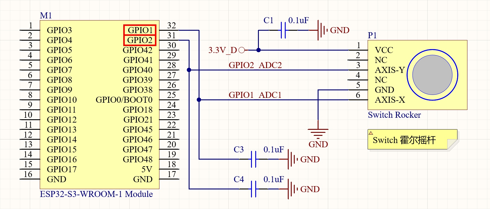

实验五 摇杆控制实验

【实验目的】

- 学习ESP32的ADC输入功能的实现；

- 学习LCD绘图函数的用法。

【实验原理】

在开发板的左侧，有一枚控制摇杆。它们在电路原理图中的表示如下：

<p style="text-align: center;"></p>

可以看到，这个摇杆的横向X轴的控制量，连接到了ESP32的GPIO1，是一个ADC输入信号。Y轴的控制量，连接到了ESP32的GPIO2，也是一个ADC输入信号。所以获取这个摇杆信号的思路就是：将摇杆连接的GPIO引脚设置为输入模式，然后读取引脚上的ADC数值即可。为了能够知道推杆位置对应的ADC数值，可以和之前的LCD显示屏实验结合起来，使用显示屏来显示摇杆的ADC数值。

【实验步骤】

1.  在Arduino IDE里点击左上角菜单栏的"文件"，在弹出的菜单列表选择"新建项目"。

<p style="text-align: center;"></p>

在下载的例子源代码包里，对应的源码文件为joystick.ino，完整代码如下：
```c
#include <TFT_eSPI.h>

TFT_eSPI tft = TFT_eSPI(320,480);

void setup() {
  tft.init();
  tft.setRotation(1);
  tft.invertDisplay(1);
  tft.setTextSize(3);
  tft.fillScreen(TFT_RED);

  pinMode(1, INPUT);
  pinMode(2, INPUT);
}

char text[20];

void loop() {
  int x_adc = analogRead(1);
  int y_adc = analogRead(2);
  sprintf(text, "x_adc = %04d", x_adc);
  tft.setCursor(0, 0);
  tft.print(text); 

  sprintf(text, "y_adc = %04d", y_adc);
  tft.setCursor(0, 30);
  tft.print(text);
}
```
对代码进行解释：

```c
#include <TFT_eSPI.h>

TFT_eSPI tft = TFT_eSPI(320,480);
```

引入TFT_eSPI库头文件,
并创建一个TFT_eSPI对象tft，设置显示屏分辨率为320x480像素。
```c
void setup() {
  tft.init();
  tft.setRotation(1);
  tft.invertDisplay(1);
  tft.setTextSize(3);
  tft.fillScreen(TFT_RED);
  ......
}
```
程序启动时，调用init()初始化TFT显示屏；setRotation(1)设置显示屏旋转方向为1，表示横向（0-3数值分别对应四个方向）；invertDisplay(1)反转显示颜色；setTextSize(3)设置文字大小为3倍默认大小；最后fillScreen(TFT_RED)将整个屏幕填充为红色背景。
```c
void setup() {
  ......
  pinMode(1, INPUT);
  pinMode(2, INPUT);
}
```
设置引脚GPIO1和引腿GPIO2为输入模式，分别用于读取摇杆X轴和Y轴的模拟值。
```c
  char text[20];
```
定义一个长度为20的字符数组,用于存储要显示的文本。
```c
void loop() {
  int x_adc = analogRead(1);
  int y_adc = analogRead(2);
  ......
}
```
在程序启动后的循环函数中，不停读取引脚GPIO1（X轴）和引腿GPIO2（Y轴）的模拟值。
```c
void loop() {
  ......
  sprintf(text, "x_adc = %04d", x_adc);
  tft.setCursor(0, 0);
  tft.print(text);
  ......
}
```
将X轴数值格式化为带前缀零的4位数字，存入text字符数组。然后将文本光标位置移动到屏幕左上角(0,0)位置，在这个位置显示text字符数组内容（X轴数值）。使用前缀0来保持数字为4位，是为了能保持显示区域的稳定。避免数字较小时，字符串变短，无法覆盖之前显示的数字图案。
```c
void loop() {
  ......
  sprintf(text, "y_adc = %04d", y_adc);
  tft.setCursor(0, 30);
  tft.print(text);
}
```
将Y轴数值格式化为带前缀零的4位数字，存入text字符数组。然后将文本光标位置移动到屏幕左上角(0,30)位置，在这个位置显示text字符数组内容（Y轴数值）。

2.  程序编写完毕后，需要为其设置目标设备和程序上传端口，才能进行程序的编译和上传。首先将开发板的Type-C接口，通过USB线缆连接到电脑的USB插口上。

<p style="text-align: center;"></p>

在Windows系统中，鼠标右键点击桌面左下角的"开始"图标。在弹出的菜单里选择"设备管理器"。在设备管理器里，展开"端口(COM和LPT)"，查看其中的USB-SERIAL CH340K(COMx)一项。记住其中的COMx，比如下图中的COM10，就是将程序上传到ESP32的端口号。

<p style="text-align: center;"></p>

回到Arduino IDE，点击工具栏里的设备框左侧的向下箭头，弹出端口列表。从中选择上传程序的端口号，比如下图中的COM10。

<p style="text-align: center;"></p>

在弹出的窗口中，搜索栏里输入"esp32s3 dev"。在下方的列表中，选择"ESP32S3 Dev Module"一项。然后点击窗口右下角的"确定"按钮。

<p style="text-align: center;"></p>

3.  回到Arduino IDE界面，点击工具栏里的上传按钮，就可以开始编译程序并上传到开发板的ESP32里运行了。

<p style="text-align: center;"></p>

编译的过程会比较耗时，需要耐心等待。直到界面下方的终端窗口提示如下信息，说明程序上传完毕并已经开始执行。

<p style="text-align: center;"></p>

这时候再来到开发板的右上角，拨动摇杆，分别在X轴和Y轴上活动。观察LCD显示屏上的数值，可以发现X轴和Y轴的数值在0\~4095的范围内变化（因为器件个体的物理特性差异，这个数值范围会略有误差，这属于正常现象）。

【扩展实验】

使用摇杆来控制LCD屏幕中显示的圆点。在下载的例子源代码包里，对应的源码文件为joystick_cycle.ino。完整代码如下：
```c
#include <TFT_eSPI.h>

TFT_eSPI tft = TFT_eSPI(320,480);

int circle_x = 240;
int circle_y = 160;
int prev_x = 240;    //上一个位置的坐标
int prev_y = 160;

void setup() {
  tft.init();
  tft.setRotation(1);
  tft.invertDisplay(1);
  tft.fillScreen(TFT_RED);
  pinMode(1, INPUT);
  pinMode(2, INPUT);
}

void loop() {
  // 保存当前位置为上一个位置
  prev_x = circle_x;
  prev_y = circle_y;

  int x_adc = analogRead(1);
  int y_adc = analogRead(2);

  // 根据摇杆值移动圆点
  if(x_adc > 3000) circle_x+=10;
  if(x_adc < 1000) circle_x-=10;
  if(y_adc > 3000) circle_y+=10;
  if(y_adc < 1000) circle_y-=10;

  // 限制圆点在屏幕范围内
  circle_x = constrain(circle_x, 0, 480);
  circle_y = constrain(circle_y, 0, 320);

  // 只清除上一个圆点区域
  tft.fillCircle(prev_x, prev_y, 10, TFT_RED);

  // 绘制新的黑色圆点
  tft.fillCircle(circle_x, circle_y, 10, TFT_BLACK);
  delay(30);
}
```

<div align="center">
  <a href="../README.md" style="display: inline-block; margin: 10px 0 18px; padding: 10px 18px; border-radius: 999px; background: linear-gradient(135deg, #1f6feb, #3fb950); color: #ffffff; text-decoration: none; font-weight: 700; box-shadow: 0 4px 12px rgba(31, 111, 235, 0.25);">返回 README 主页</a>
</div>
