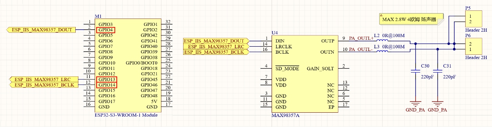
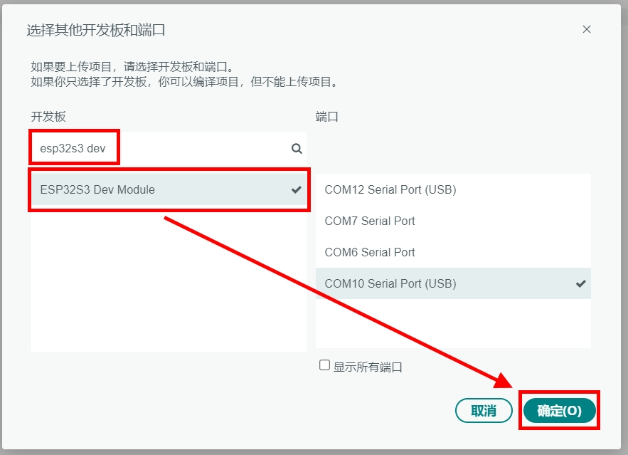
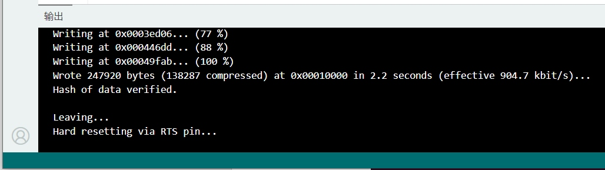

实验九 音频输出实验

【实验目的】

- 学习ESP32的I2S（Inter-IC Sound）通讯的使用方法；

- 学习通过I2S接口，实现音频信号输出，驱动扬声器发声。

【实验原理】

在开发板面板的下方，有一个由功放芯片驱动的扬声器。它们在电路原理图中的表示如下：

<p style="text-align: center;"></p>

可以看到，这个扬声器由一枚MAX98357A芯片驱动。MAX98357A是一种数字音频放大器芯片，通常用于音频应用中。它可以将数字音频信号转换为模拟信号，并放大到可以驱动扬声器的水平。这枚芯片与ESP32的GPIO4、GPIO13和GPIO14连接，使用I2S接口与ESP32通讯。ESP32的内部I2S控制器有两个，主要用于音频数据的输入和输出。支持多种音频格式，包括PCM和I2S。可以配置为主模式或从模式，适用于各种音频应用。在这个实验里，将通过ESP32的一个I2S控制器来实现音频输出。

【实验步骤】

1.  在Arduino IDE里点击左上角菜单栏的"文件"，在弹出的菜单列表选择"新建项目"。

<p style="text-align: center;"></p>

在下载的例子源代码包里，对应的源码文件为speaker.ino。完整代码如下：
```c
#include <driver/i2s.h>

static int MAX98357_LRC_Pin =   13;
static int MAX98357_BCLK_PIn =  14;
static int MAX98357_DIN_Pin =   4;

#define SAMPLE_RATE 44100

i2s_config_t i2sOut_config = {
    .mode = i2s_mode_t(I2S_MODE_MASTER | I2S_MODE_TX),
    .sample_rate = SAMPLE_RATE,
    .bits_per_sample = i2s_bits_per_sample_t(16),
    .channel_format = I2S_CHANNEL_FMT_ONLY_RIGHT,
    .communication_format = i2s_comm_format_t(I2S_COMM_FORMAT_STAND_I2S),
    .intr_alloc_flags = ESP_INTR_FLAG_LEVEL1,
    .dma_buf_count = 8,
    .dma_buf_len = 1024
};

const i2s_pin_config_t i2sOut_pin_config = {
    .bck_io_num = MAX98357_BCLK_PIn,
    .ws_io_num = MAX98357_LRC_Pin,
    .data_out_num = MAX98357_DIN_Pin,
    .data_in_num = -1
};

void setup() {
    i2s_driver_install(I2S_NUM_1, &i2sOut_config, 0, NULL);
    i2s_set_pin(I2S_NUM_1, &i2sOut_pin_config);
}

#define DO_1 262  // Do
#define RE_2 294  // Re
#define MI_3 330  // Mi
#define FA_4 349  // Fa
#define SO_5 392  // So
#define LA_6 440  // La

void generateTone(int16_t* buffer, int frequency, int duration, int amplitude) {
    const float pi = 3.14159;
    float period = SAMPLE_RATE / float(frequency);
    int samples = (SAMPLE_RATE * duration) / 1000;

    for(int i = 0; i < samples; i++) {
        buffer[i] = amplitude * sin(2 * pi * i / period);
    }
}

int16_t music_buffer[SAMPLE_RATE * 2];

void loop() {
    delay(3000);

    int notes[] = {DO_1, RE_2, MI_3, FA_4, SO_5, LA_6};
    int duration = 300;
    int amplitude = 10000;

    int notes_length = sizeof(notes) / sizeof(notes[0]);
    for(int i = 0; i < notes_length; i++) {
        generateTone(music_buffer, notes[i], duration, amplitude);
        size_t bytes_written;
        i2s_write(I2S_NUM_1, music_buffer, duration * (SAMPLE_RATE/1000) * sizeof(int16_t), &bytes_written, portMAX_DELAY);
    }

    i2s_zero_dma_buffer(I2S_NUM_1);
}
```
对代码进行解释：
```c   
#include <driver/i2s.h>

static int MAX98357_LRC_Pin =   13;
static int MAX98357_BCLK_PIn =  14;
static int MAX98357_DIN_Pin =   4;

#define SAMPLE_RATE 44100
```
引入I2S通讯的头文件。然后按照电路图，定义MAX98357A音频输出芯片与ESP32连接的引脚序号。再定义音频的采样率为44100Hz。
```c
i2s_config_t i2sOut_config = {
    .mode = i2s_mode_t(I2S_MODE_MASTER | I2S_MODE_TX),
    .sample_rate = SAMPLE_RATE,
    .bits_per_sample = i2s_bits_per_sample_t(16),
    .channel_format = I2S_CHANNEL_FMT_ONLY_RIGHT,
    .communication_format = i2s_comm_format_t(I2S_COMM_FORMAT_STAND_I2S),
    .intr_alloc_flags = ESP_INTR_FLAG_LEVEL1,
    .dma_buf_count = 8,
    .dma_buf_len = 1024
};
```
这段代码定义了一个名为 i2sOut_config 的结构体对象，类型为
i2s_config_t，用于配置 I2S（Inter-IC Sound）接口的输出参数。

- mode设置I2S为主模式（Master）并且为发送模式（TX）。

- sample_rate设置音频信号的采样率为前面定义的SAMPLE_RATE
  ，也就是44100Hz。

- bits_per_sample设置每个音频样本的位数为16位。

- channel_format设置输出模式为只使用右声道，也就是单声道输出。

- communication_format设置通讯格式为标准I2S通信格式。

- intr_alloc_flags设置中断的优先级为ESP_INTR_FLAG_LEVEL1，中等优先级。

- dma_buf_count设置DMA（直接内存访问）缓冲区的数量为8个。

- dma_buf_len设置每个DMA缓冲区的长度为1024字节。
```c
const i2s_pin_config_t i2sOut_pin_config = {
    .bck_io_num = MAX98357_BCLK_PIn,
    .ws_io_num = MAX98357_LRC_Pin,
    .data_out_num = MAX98357_DIN_Pin,
    .data_in_num = -1
};
```
这段代码定义了一个名为i2sOut_pin_config 的结构体对象，类型为i2s_pin_config_t。这个结构体用于配置I2S（Inter-IC Sound）接口的引脚设置。下面是对每个部分的详细解释：

- bck_io_num指定了 I2S 的时钟引脚（BCLK），在这里它被设置为MAX98357_BCLK_PIn，也就是ESP32的GPIO14。

- ws_io_num指定了 I2S 的字选择引脚（LRCK），在这里被设置为MAX98357_LRC_Pin，也就是ESP32的GPIO13。

- data_out_num指定了数据输出引脚（DIN），在这里被设置为MAX98357_DIN_Pin，也就是ESP32的GPIO4。

- data_in_num:指定数据输入引脚（通常用于接收数据），在这里被设置为-1，表示没有使用数据输入引脚。
```c
void setup() {
    i2s_driver_install(I2S_NUM_1, &i2sOut_config, 0, NULL);
    i2s_set_pin(I2S_NUM_1, &i2sOut_pin_config);
}
```
在初始化函数中，使用前面定义的两个结构体，对ESP32的I2S控制器进行初始化，并进行引脚配置。
```c
#define DO_1 262  // Do
#define RE_2 294  // Re
#define MI_3 330  // Mi
#define FA_4 349  // Fa
#define SO_5 392  // So
#define LA_6 440  // La

void generateTone(int16_t* buffer, int frequency, int duration, int amplitude) {
    const float pi = 3.14159;
    float period = SAMPLE_RATE / float(frequency);
    int samples = (SAMPLE_RATE * duration) / 1000;

    for(int i = 0; i < samples; i++) {
        buffer[i] = amplitude * sin(2 * pi * i / period);
    }
}

int16_t music_buffer[SAMPLE_RATE * 2];
```
定义一组音阶的频率。然后再定义一个正弦波生成函数generateTone()，后面会将音阶频率传入这个函数，生成一组音频数据。再下来定义了一个数组music_buffer用来承载要播放的音频数据，数组长度是采样率的2倍，也就是能存储2秒钟的音频数据。
```c
void loop() {
    delay(3000);

    int notes[] = {DO_1, RE_2, MI_3, FA_4, SO_5, LA_6};
    int duration = 300;
    int amplitude = 10000;

    ......
}
```
在循环函数中，先延迟3000毫秒，也就是3秒。然后定义一个notes数组用来存储要播放的音符顺序，这里把前面定义的音符顺序播放一遍。duration是每个音符播放的时长，这里定义为300毫秒。amplitude是播放的音量，可以根据需要来调整。
```c
void loop() {
    ......
    int notes_length = sizeof(notes) / sizeof(notes[0]);
    for(int i = 0; i < notes_length; i++) {
        generateTone(music_buffer, notes[i], duration, amplitude);
        size_t bytes_written;
        i2s_write(I2S_NUM_1, music_buffer, duration * (SAMPLE_RATE/1000) * sizeof(int16_t), &bytes_written, portMAX_DELAY);
    }
    ......
}
```
这里使用一个for循环，将notes数组中的音符，连同单个音符播放时长duration，以及音量amplitude都传入generateTone函数中，生成对应音频数据。这个生成的音频数据，存储在数组music_buffer里。接着调用i2s_write()函数，将生成的音频数据，通过I2S接口，发送给MAX98357A音频芯片。由MAX98357A音频芯片驱动扬声器发出对应的声音。
```c
void loop() {
    ......
    i2s_zero_dma_buffer(I2S_NUM_1);
}
```
每次播放完毕后，调用i2s_zero_dma_buffer()函数对I2S发送缓存里的音频数据进行清零，避免持续不断的重复播放尾音。

2.  程序编写完毕后，需要为其设置目标设备和程序上传端口，才能进行程序的编译和上传。首先将开发板的Type-C接口，通过USB线缆连接到电脑的USB插口上。

<p style="text-align: center;"></p>

在Windows系统中，鼠标右键点击桌面左下角的"开始"图标。在弹出的菜单里选择"设备管理器"。在设备管理器里，展开"端口(COM和LPT)"，查看其中的USB-SERIAL CH340K(COMx)一项。记住其中的COMx，比如下图中的COM10，就是将程序上传到ESP32的端口号。

<p style="text-align: center;"></p>

回到Arduino IDE，点击工具栏里的设备框左侧的向下箭头，弹出端口列表。从中选择上传程序的端口号，比如下图中的COM10。

<p style="text-align: center;"></p>

在弹出的窗口中，搜索栏里输入"esp32s3 dev"。在下方的列表中，选择"ESP32S3 Dev Module"一项。然后点击窗口右下角的"确定"按钮。

<p style="text-align: center;"></p>

3.  回到Arduino IDE界面，点击工具栏里的上传按钮，就可以开始编译程序并上传到开发板的ESP32里运行了。

<p style="text-align: center;"></p>

编译的过程会比较耗时，需要耐心等待。直到界面下方的终端窗口提示如下信息，说明程序上传完毕并已经开始执行。

<p style="text-align: center;"></p>

程序执行之后，就可以听到扬声器循环的播放音阶了。

【扩展实验】

通过对notes数组中的音符顺序进行编辑，可以让程序播放特定的音乐。比如下面这个程序，运行之后，按下开发板面板的蓝色按钮，会播放著名歌曲《两只老虎》。在下载的例子源代码包里，对应的源码文件为speaker_two_tigers.ino。
```c
#include <driver/i2s.h>

static int MAX98357_LRC_Pin =   13;
static int MAX98357_BCLK_PIn =  14;
static int MAX98357_DIN_Pin =   4;

#define SAMPLE_RATE 44100

static int Blue_Btn_Pin = 12;
static int Blue_LED_Pin = 48;

i2s_config_t i2sOut_config = {
    .mode = i2s_mode_t(I2S_MODE_MASTER | I2S_MODE_TX),
    .sample_rate = SAMPLE_RATE,
    .bits_per_sample = i2s_bits_per_sample_t(16),
    .channel_format = I2S_CHANNEL_FMT_ONLY_RIGHT,
    .communication_format = i2s_comm_format_t(I2S_COMM_FORMAT_STAND_I2S),
    .intr_alloc_flags = ESP_INTR_FLAG_LEVEL1,
    .dma_buf_count = 8,
    .dma_buf_len = 1024
};

const i2s_pin_config_t i2sOut_pin_config = {
    .bck_io_num = MAX98357_BCLK_PIn,
    .ws_io_num = MAX98357_LRC_Pin,
    .data_out_num = MAX98357_DIN_Pin,
    .data_in_num = -1
};

void setup() {
    i2s_driver_install(I2S_NUM_1, &i2sOut_config, 0, NULL);
    i2s_set_pin(I2S_NUM_1, &i2sOut_pin_config);

    pinMode(Blue_Btn_Pin, INPUT_PULLUP);
    pinMode(Blue_LED_Pin, OUTPUT);
    digitalWrite(Blue_LED_Pin, HIGH);
}

// 定义音符频率
#define SNAP_0 0    // 暂停
#define L_DO_1 131  // Do
#define L_RE_2 147  // Re
#define L_MI_3 165  // Mi
#define L_FA_4 175  // Fa
#define L_SO_5 196  // So
#define L_LA_6 220  // La
#define DO_1 262  // Do
#define RE_2 294  // Re
#define MI_3 330  // Mi
#define FA_4 349  // Fa
#define SO_5 392  // So
#define LA_6 440  // La

// 生成指定频率音频数据的函数
void generateTone(int16_t* buffer, int frequency, int duration, int amplitude) {
    const float pi = 3.14159;
    float period = SAMPLE_RATE / float(frequency);
    int samples = (SAMPLE_RATE * duration) / 1000; // duration in ms

    for(int i = 0; i < samples; i++) {
        buffer[i] = amplitude * sin(2 * pi * i / period);
    }
}

// 音乐缓冲区
int16_t music_buffer[SAMPLE_RATE * 2]; // 2秒的缓冲区

void loop() {
    if (digitalRead(Blue_Btn_Pin) == LOW) {
        digitalWrite(Blue_LED_Pin, LOW);

        // 《两只老虎》的音符顺序
        int notes[] = {
            DO_1, RE_2, MI_3, DO_1, DO_1, RE_2, MI_3, DO_1,
            MI_3, FA_4, SO_5, SNAP_0, MI_3, FA_4, SO_5, SNAP_0,
            SO_5, LA_6, SO_5, FA_4, MI_3, DO_1, SNAP_0,
            SO_5, LA_6, SO_5, FA_4, MI_3, DO_1, SNAP_0,
            RE_2, L_SO_5, DO_1, SNAP_0, RE_2, L_SO_5, DO_1, SNAP_0
        };
        int duration = 300; // 每个音符持续300ms
        int amplitude = 10000; // 音量


        int notes_length = sizeof(notes) / sizeof(notes[0]);
        for(int i = 0; i < notes_length; i++) {
            generateTone(music_buffer, notes[i], duration, amplitude);
            size_t bytes_written;
            i2s_write(I2S_NUM_1, music_buffer, duration * (SAMPLE_RATE/1000) * sizeof(int16_t), &bytes_written, portMAX_DELAY);
        }
        // 清空缓冲区
        i2s_zero_dma_buffer(I2S_NUM_1);

        digitalWrite(Blue_LED_Pin, HIGH);
    }

    delay(10);
}
```

<div align="center">
  <a href="../README.md" style="display: inline-block; margin: 10px 0 18px; padding: 10px 18px; border-radius: 999px; background: linear-gradient(135deg, #1f6feb, #3fb950); color: #ffffff; text-decoration: none; font-weight: 700; box-shadow: 0 4px 12px rgba(31, 111, 235, 0.25);">返回 README 主页</a>
</div>
