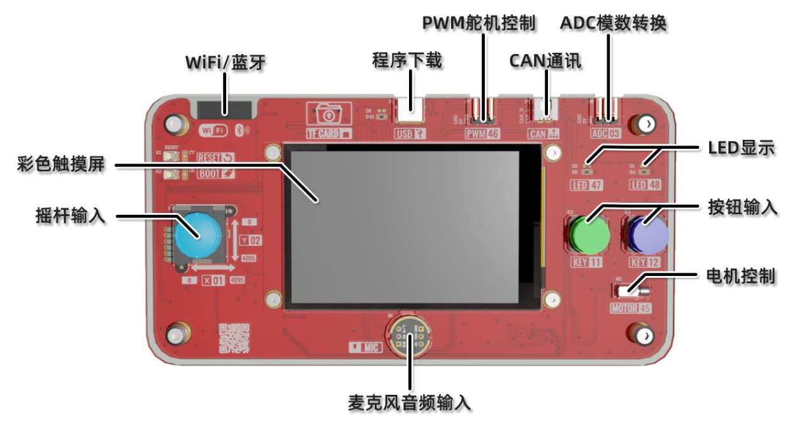

ESP32-Grail 介绍

**【功能组成】**

ESP32-Grail是一款AI人工智能硬件入门的学习套件。套件的主体开发板由多个功能模块组成，可以通过相关实验的学习，掌握各种传感器和输入输出设备的基础使用方法。借助其核心ESP32的强劲性能，还能与云端大模型通讯，实现语音识别、语意理解以及语音合成等高阶功能。由浅入深，从传统功能到新的AI应用，逐步掌握新时代智能硬件的开发方法。

- I&O按钮，用于GPIO的操作实验。

- ADC摇杆，用于ADC模数转换的实验。

- 彩色触控屏，用于SPI显示屏和I2C触摸屏实验。

- TF读卡器，用于TF卡的数据读取和写入实验。

- 直流电机，用于PWM控制电机转速的实验。

- 模拟舵机，用于PWM控制舵机转角的实验。

- 麦克风，用于音频输入和语音识别实验。

- 扬声器，用于音频输出和语音合成实验。

- IMU姿态传感器，用于I2C通讯获取姿态信息的实验。

- ESP32核心模组，用于WiFi无线网和蓝牙通讯实验。

 

**【入门实验】**

- [安装 ESP32 Arduino 开发环境](./0/0_ide.md)
- [实验一 GPIO输出实验](./1/1_gpio_output.md)
- [实验二 GPIO输入实验](./2/2_gpio_input.md)
- [实验三 LCD显示屏实验](./3/3_lcd.md)
- [实验四 触摸屏实验](./4/4_touch.md)
- [实验五 摇杆控制实验](./5/5_joystick.md)
- [实验六 电机控制实验](./6/6_motor.md)
- [实验七 舵机控制实验](./7/7_servo.md)
- [实验八 姿态传感器实验](./8/8_imu.md)
- [实验九 音频输出实验](./9/9_speaker.md)
- [实验十 音频输入实验](./10/10_mic.md)
- [实验十一 TF卡存储实验](./11/11_tf_recorder.md)
- [实验十二 TF卡读取实验](./12/12_tf_player.md)
- [实验十三 WiFi通讯实验](./13/13_wifi.md)
- [实验十四 语音识别实验](./14/14_speech_recognizer.md)
- [实验十五 大语言模型实验](./15/15_llm_doubao.md)
- [实验十六 AI语音对话实验](./16/16_chatbot_doubao.md)

