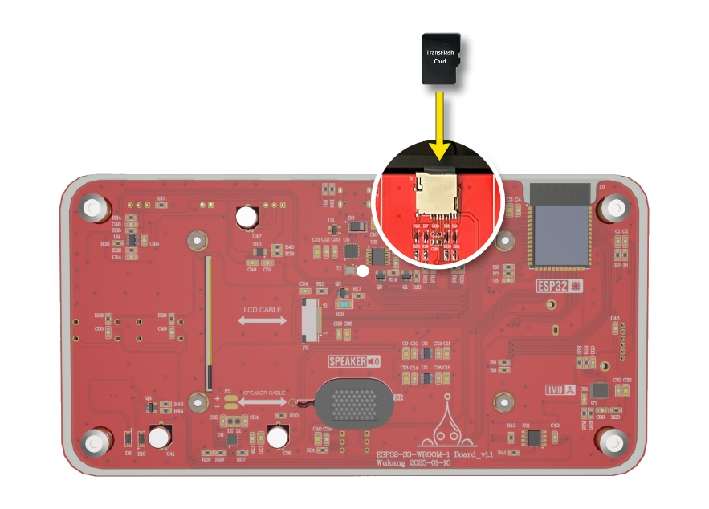

实验十一 TF卡存储实验

【实验目的】

- 复习ESP32的SPI通讯的使用方法；

- 学习通过SPI接口，实现将内存数据存储到TF卡里。

【实验原理】

在开发板面板的左上方，有一个TF读卡器。它们在电路原理图中的表示如下：

<div align="center">
  
</div>

可以看到，这个TF读卡器是通过SPI与ESP32通讯的。在这个电路图里，TF读卡器是与ESP32的GPIO16、GPIO40、GPIO41和GPIO42连接。在这个实验里，将通过INMP441麦克风采集音频数据，然后将这些音频数据以WAV文件格式存储到TF卡中去。

【实验步骤】

1. 在Arduino IDE里点击左上角菜单栏的"文件"，在弹出的菜单列表选择"新建项目"。

<div align="center">
  
</div>

在下载的例子源代码包里，对应的源码文件为tf_recoder.ino。完整代码如下：
```c
#include <SPI.h>
#include <SD.h>
#include <FS.h>
#include <driver/i2s.h>

static int SD_CS_Pin =    16;
static int SD_MOSI_Pin =  42;
static int SD_MISO_Pin =  40;
static int SD_SCK_Pin =   41;
SPIClass SD_SPI(HSPI);

static int INMP441_WS_Pin =     18;
static int INMP441_SCK_Pin =    17;
static int INMP441_SD_Pin =     8;
#define SAMPLE_RATE 44100

static int Green_Btn_Pin = 11;
static int Green_LED_Pin = 47;

struct wavStruct {
  const char chunkID[4] = {'R', 'I', 'F', 'F'};
  uint32_t chunkSize = 36;
  const char format[4] = {'W', 'A', 'V', 'E'};
  const char subchunk1ID[4] = {'f', 'm', 't', ' '};
  const uint32_t subchunk1Size = 16;
  const uint16_t audioFormat = 1;
  const uint16_t numChannels = 1;
  const uint32_t sampleRate = SAMPLE_RATE;
  const uint32_t byteRate = 32000;
  const uint16_t blockAlign = 2;
  const uint16_t bitsPerSample = 16;
  const char subchunk2ID[4] = {'d', 'a', 't', 'a'};
  uint32_t subchunk2Size = 0;
};

File recordFile;
wavStruct wavHeader;
bool isRecording = false;

i2s_config_t i2sIn_config = {
  .mode = i2s_mode_t(I2S_MODE_MASTER | I2S_MODE_RX),
  .sample_rate = SAMPLE_RATE,
  .bits_per_sample = i2s_bits_per_sample_t(16),
  .channel_format = I2S_CHANNEL_FMT_ONLY_LEFT,
  .communication_format = i2s_comm_format_t(I2S_COMM_FORMAT_STAND_I2S),
  .intr_alloc_flags = ESP_INTR_FLAG_LEVEL1,
  .dma_buf_count = 8,
  .dma_buf_len = 1024
};

const i2s_pin_config_t i2sIn_pin_config = {
  .bck_io_num = INMP441_SCK_Pin,
  .ws_io_num = INMP441_WS_Pin,
  .data_out_num = -1,
  .data_in_num = INMP441_SD_Pin
};

void setup() {
  pinMode(Green_Btn_Pin, INPUT_PULLUP);
  pinMode(Green_LED_Pin, OUTPUT);
  digitalWrite(Green_LED_Pin, HIGH);
  SD_SPI.begin(SD_SCK_Pin, SD_MISO_Pin, SD_MOSI_Pin, SD_CS_Pin);
  if(SD.begin(SD_CS_Pin, SD_SPI) == false) {
    digitalWrite(Green_LED_Pin, LOW);
    return;
  }
  i2s_driver_install(I2S_NUM_0, &i2sIn_config, 0, NULL);
  i2s_set_pin(I2S_NUM_0, &i2sIn_pin_config);
}

void loop() {
  if (digitalRead(Green_Btn_Pin) == LOW)
  {
    digitalWrite(Green_LED_Pin, LOW);
    if(isRecording == false) {
      recordFile = SD.open("/record.wav", FILE_WRITE);
      if(!recordFile) {
        return;
      }
      recordFile.write((uint8_t*)&wavHeader, sizeof(wavHeader));
      isRecording = true;
    }
    esp_err_t result;
    size_t bytes_read = 0;
    int16_t data[1024];
    result = i2s_read(I2S_NUM_0, &data, sizeof(data), &bytes_read, portMAX_DELAY);
    if(result == ESP_OK && bytes_read > 0) {
      recordFile.write((uint8_t*)data, bytes_read);
      wavHeader.chunkSize += bytes_read;
      wavHeader.subchunk2Size += bytes_read;
    }
  }
  else
  {
    digitalWrite(Green_LED_Pin, HIGH);
    if(recordFile) {
      recordFile.seek(0);
      recordFile.write((uint8_t*)&wavHeader, sizeof(wavHeader));
      recordFile.close();
      wavHeader.chunkSize = 36;
      wavHeader.subchunk2Size = 0;
    }
    isRecording = false;
    delay(300);
  }
}
```
对代码进行解释：
```c
#include <SPI.h>
#include <SD.h>
#include <FS.h>
#include <driver/i2s.h>
```
引入SPI通讯需要的头文件SPI.h，SD卡（TF卡是Micro SD卡）操作需要的头文件SD.h，以及文件格式头文件FS.h。然后还引入I2S通讯的头文件以便使用INMP441麦克风采集音频数据。
```c
static int SD_CS_Pin =    16;
static int SD_MOSI_Pin =  42;
static int SD_MISO_Pin =  40;
static int SD_SCK_Pin =   41;
SPIClass SD_SPI(HSPI);
```
定义了TF读卡器在电路图中与ESP32进行连接的引脚序号。然后定义一个SPI控制器，准备用于驱动TF读卡器。
```c
static int INMP441_WS_Pin =     18;
static int INMP441_SCK_Pin =    17;
static int INMP441_SD_Pin =     8;
#define SAMPLE_RATE 44100
```
定义了INMP441麦克风在电路图中与ESP32进行连接的引脚序号。然后声明一个音频采样频率，后面会按照这个采样频率去采集声音信号。
```c
static int Green_Btn_Pin = 11;
static int Green_LED_Pin = 47;
```
定义了绿色按钮和绿色LED在电路图中与ESP32进行连接的引脚序号。后面会使用绿色按钮来控制音频采集的时间，并使用绿色LED来表示TF卡的初始化结果和录音状态的开始和停止。
```c
struct wavStruct {
  const char chunkID[4] = {'R', 'I', 'F', 'F'};
  uint32_t chunkSize = 36;
  const char format[4] = {'W', 'A', 'V', 'E'};
  const char subchunk1ID[4] = {'f', 'm', 't', ' '};
  const uint32_t subchunk1Size = 16;
  const uint16_t audioFormat = 1;
  const uint16_t numChannels = 1;
  const uint32_t sampleRate = SAMPLE_RATE;
  const uint32_t byteRate = 32000;
  const uint16_t blockAlign = 2;
  const uint16_t bitsPerSample = 16;
  const char subchunk2ID[4] = {'d', 'a', 't', 'a'};
  uint32_t subchunk2Size = 0;
};
```
定义了一个WAV文件的头文件结构体格式，后面保存声音文件的时候会用到。
```c
File recordFile;
wavStruct wavHeader;
bool isRecording = false;
```
定义一个文件对象recordFile，后面会用来保存声音文件。将WAV文件的头文件结构体实例化为一个对象wavHeader。再定义一个标记变量isRecording用来标记录音状态。
```c
i2s_config_t i2sIn_config = {
  .mode = i2s_mode_t(I2S_MODE_MASTER | I2S_MODE_RX),
  .sample_rate = SAMPLE_RATE,
  .bits_per_sample = i2s_bits_per_sample_t(16),
  .channel_format = I2S_CHANNEL_FMT_ONLY_LEFT,
  .communication_format = i2s_comm_format_t(I2S_COMM_FORMAT_STAND_I2S),
  .intr_alloc_flags = ESP_INTR_FLAG_LEVEL1,
  .dma_buf_count = 8,
  .dma_buf_len = 1024
};
```
这段代码定义了一个名为i2sIn_config的结构体对象，类型为i2s_config_t，用于配置I2S（Inter-IC Sound）接口的输入参数。

- mode设置I2S为主模式（Master）并且为接收模式（RX）。

- sample_rate设置音频信号的采样率为前面定义的SAMPLE_RATE，也就是44100Hz。

- bits_per_sample设置每个音频样本的位数为16位。

- channel_format设置输出模式为只使用左侧声道，也就是单声道输入。

- communication_format设置通讯格式为标准I2S通信格式。

- intr_alloc_flags设置中断的优先级为ESP_INTR_FLAG_LEVEL1，中等优先级。

- dma_buf_count设置DMA（直接内存访问）缓冲区的数量为8个。

- dma_buf_len设置每个DMA缓冲区的长度为1024字节。
```c
const i2s_pin_config_t i2sIn_pin_config = {
  .bck_io_num = INMP441_SCK_Pin,
  .ws_io_num = INMP441_WS_Pin,
  .data_out_num = -1,
  .data_in_num = INMP441_SD_Pin
};
```
这段代码定义了一个名为i2sIn_pin_config的结构体对象，类型为i2s_pin_config_t。这个结构体用于配置I2S（Inter-IC Sound）接口的引脚设置。下面是对每个部分的详细解释：

- bck_io_num指定了I2S的时钟引脚（BCLK），在这里它被设置为INMP441_SCK_Pin，也就是ESP32的GPIO17。

- ws_io_num指定了I2S的字选择引脚（LRCK），在这里被设置为INMP441_WS_Pin，也就是ESP32的GPIO18。

- data_out_num指定了数据输出引脚（DIN），在这里被设置为-1，表示没有使用数据输入引脚。

- data_in_num:指定数据输入引脚，在这里被设置为INMP441_SD_Pin，也就是ESP32的GPIO8。
```c
void setup() {
  pinMode(Green_Btn_Pin, INPUT_PULLUP);
  pinMode(Green_LED_Pin, OUTPUT);
  digitalWrite(Green_LED_Pin, HIGH);
  ......   
}
```
在初始化函数的前半段，对绿色按钮和绿色LED进行了引脚配置，并让绿色LED初始状态为熄灭状态。
```c
void setup() {
  ......
  SD_SPI.begin(SD_SCK_Pin, SD_MISO_Pin, SD_MOSI_Pin, SD_CS_Pin);
  if(SD.begin(SD_CS_Pin, SD_SPI) == false) {
    digitalWrite(Green_LED_Pin, LOW);
    return;
  }
  ......
}
```
接下来，对TF读卡器所使用SPI控制器进行初始化，将前面定义好的通讯引脚序号传递进去。然后调用SD.begin()函数启动与TF读卡器的通讯。如果启动失败，则会将绿色灯点亮，表示实验失败，同时中断初始化过程。
```c
void setup() {
  ......
  i2s_driver_install(I2S_NUM_0, &i2sIn_config, 0, NULL);
  i2s_set_pin(I2S_NUM_0, &i2sIn_pin_config);
}
```
在初始化函数的后半段，使用前面定义的i2sIn_config结构体，对ESP32的I2S控制器进行初始化。与INMP441的通讯使用第一个I2S控制器（序号0）。然后用i2sIn_pin_config结构体对INMP441进行了通讯引脚配置。
```c
void loop() {
  if (digitalRead(Green_Btn_Pin) == LOW)
  {
    digitalWrite(Green_LED_Pin, LOW);
    if(isRecording == false) {
      recordFile = SD.open("/record.wav", FILE_WRITE);
      if(!recordFile) {
        return;
      }
      recordFile.write((uint8_t*)&wavHeader, sizeof(wavHeader));
      isRecording = true;
    }
    esp_err_t result;
    size_t bytes_read = 0;
    int16_t data[1024];
    result = i2s_read(I2S_NUM_0, &data, sizeof(data), &bytes_read, portMAX_DELAY);
    if(result == ESP_OK && bytes_read > 0) {
      recordFile.write((uint8_t*)data, bytes_read);
      wavHeader.chunkSize += bytes_read;
      wavHeader.subchunk2Size += bytes_read;
    }
  }
  ......
}
```
在循环函数中，如果检测到绿色按钮按下的信号，则先点亮绿色LED，表示开始录音了。然后判断一下，是否是从未录音状态进入录音状态。如果是，那么需要先在TF卡中创建文件record.wav。然后才开始调用i2s_read()函数，读取INMP441麦克风采集到的音频数据，并存储到data数组里。当data数组存满时，将data数组里的音频数值写入record.wav文件中，同时更新WAV文件头wavHeader里的数据长度信息（注意此时这个文件头结构体是在内存里，而不是在record.wav文件里）。
```c
void loop() {
  ......
  else
  {
    digitalWrite(Green_LED_Pin, HIGH);
    if(recordFile) {
      recordFile.seek(0);
      recordFile.write((uint8_t*)&wavHeader, sizeof(wavHeader));
      recordFile.close();
      wavHeader.chunkSize = 36;
      wavHeader.subchunk2Size = 0;
    }
    isRecording = false;
    delay(300);
  }
}
```
当绿色按钮松开时，熄灭绿色LED，表示录音结束。然后将更新了数据长度信息的WAV文件头wavHeader写入到record.wav文件的头部，这样文件头的数据长度才和实际存储的数据长度对应上。最后对内存中的WAV文件头wavHeader的数据长度进行重新赋值，为下一次新的录音做好重置工作。接着延时300毫秒，避免按钮的抖动信号误触了录音操作。

2. 程序编写完毕后，需要为其设置目标设备和程序上传端口，才能进行程序的编译和上传。首先将开发板的Type-C接口，通过USB线缆连接到电脑的USB插口上。

<div align="center">
  
</div>

在Windows系统中，鼠标右键点击桌面左下角的"开始"图标。在弹出的菜单里选择"设备管理器"。在设备管理器里，展开"端口(COM和LPT)"，查看其中的USB-SERIAL CH340K(COMx)一项。记住其中的COMx，比如下图中的COM10，就是将程序上传到ESP32的端口号。

<div align="center">
  
</div>

回到Arduino IDE，点击工具栏里的设备框左侧的向下箭头，弹出端口列表。从中选择上传程序的端口号，比如下图中的COM10。

<div align="center">
  
</div>

在弹出的窗口中，搜索栏里输入"esp32s3 dev"。在下方的列表中，选择"ESP32S3 Dev Module"一项。然后点击窗口右下角的"确定"按钮。

<div align="center">
  
</div>

3.  将TF卡插入开发板背面的TF读卡器。

<div align="center">
  
</div>

4.  回到Arduino IDE界面，点击工具栏里的上传按钮，就可以开始编译程序并上传到开发板的ESP32里运行了。

<div align="center">
  
</div>

编译的过程会比较耗时，需要耐心等待。直到界面下方的终端窗口提示如下信息，说明程序上传完毕并已经开始执行。

<div align="center">
  
</div>

程序执行之后，先观察实验面板上的绿色LED。如果按钮未按下的情况下，绿色LED亮起，说明TF读卡器初始化失败。重新拔插TF卡，并给开发板重新上电。

当重新上电后，绿色LED处于熄灭状态，说明TF读卡器初始化成功了。此时按下开发板面板上的绿色按钮，绿色LED亮起，对着麦克风说话。然后松开绿色按钮，绿色LED熄灭，录音结束。将TF卡取下，插入电脑的TF读卡器中，查看卡中是否保存了record.wav文件。双击播放该文件，检查是否是刚才录制的声音。

<div align="center">
  <a href="../../README.md" style="display: inline-block; margin: 10px 0 18px; padding: 10px 18px; border-radius: 999px; background: linear-gradient(135deg, #1f6feb, #3fb950); color: #ffffff; text-decoration: none; font-weight: 700; box-shadow: 0 4px 12px rgba(31, 111, 235, 0.25);">返回 README 主页</a>
</div>
