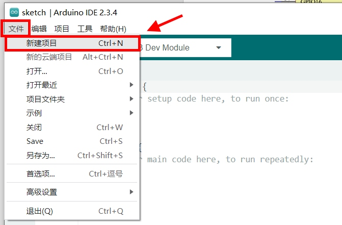

实验十三 WiFi通讯实验

【实验目的】

- 学习使用ESP32的WiFi无线网通讯功能；

- 学习通过网页浏览器控制硬件的方法。

【实验原理】

在开发板的ESP32模组里，内置了WiFi无线通讯功能，结合ESP32的硬件控制功能，可以很方便的实现各种通过网络远程控制硬件的效果。这一节实现将会在ESP32上构建一个小型的网页服务器。然后使用电脑、平板和手机等具备网页浏览功能的设备，通过WiFi远程登录到ESP32中，完成对硬件设备的控制。为了让实验代码简单清晰，本实验就使用LED灯的亮灭，来作为网页控制的对象。

【实验步骤】

1.  实验需要一个WiFi网络，需要知道网络名称和连接密码。

2.  在Arduino IDE里点击左上角菜单栏的"文件"，在弹出的菜单列表选择"新建项目"。

<div align="center">
  
</div>

在下载的例子源代码包里，对应的源码文件为wifi.ino。完整代码如下：
```c
#include <TFT_eSPI.h>
#include <WiFi.h>

const char* ssid = "xxxx";
const char* password = "xxxx";
const int blue_led_pin = 48;
TFT_eSPI tft = TFT_eSPI(320,480);

WiFiServer server(80);

void setup() {
  tft.init();
  tft.setRotation(1);
  tft.invertDisplay(1);
  tft.fillScreen(TFT_BLACK);
  tft.setTextSize(2);
  tft.setCursor(0,0);
  tft.print("Connecting to ");
  tft.print(ssid);
  WiFi.begin(ssid, password);
  while (WiFi.status() != WL_CONNECTED) {
    delay(500);
    tft.print(".");
  }
  tft.setCursor(0,30);
  tft.println("WiFi connected.");
  tft.println("IP address: ");
  tft.println(WiFi.localIP());
  pinMode(blue_led_pin, OUTPUT);
  pinMode(blue_led_pin, HIGH);
  server.begin();
}

void loop() {
  WiFiClient client = server.accept();
  if (client) {
    tft.println("New Client.");
    String currentLine = "";
    while (client.connected()) {
      if (client.available()) {
        char c = client.read();
        if (c == '\n') {
          if (currentLine.length() == 0) {
            client.println("HTTP/1.1 200 OK");
            client.println("Content-type:text/html; charset=utf-8");
            client.println();
            client.print("点击 <a href=\"/H\">这里</a> 熄灭蓝色LED<br>");
            client.print("点击 <a href=\"/L\">这里</a> 点亮蓝色LED<br>");
            client.println();
            break;
          } else {
            currentLine = "";
          }
        } else if (c != '\r') {
          currentLine += c;
        }
        if (currentLine.endsWith("GET /H")) {
          digitalWrite(blue_led_pin, HIGH);
        }
        if (currentLine.endsWith("GET /L")) {
          digitalWrite(blue_led_pin, LOW);
        }
      }
    }
    client.stop();
    tft.println("Client Disconnected.");
  }
}
```
对代码进行解释：
```c
#include <TFT_eSPI.h>
#include <WiFi.h>
```
包含LCD屏显示库的头文件和WiFi通讯的头文件。
```c
const char* ssid = "xxxx";
const char* password = "xxxx";
```
定义要连接的WiFi网络名称和连接需要的密码。
```c
const int blue_led_pin = 48;
```
定义蓝色LED的引脚序号。
```c
TFT_eSPI tft = TFT_eSPI(320,480);
```
定义一个LCD的显示对象，后面会在屏幕上显示WiFi的连接状态和IP信息。
```c
WiFiServer server(80);
```
创建一个在80端口上监听的HTTP服务器，以便处理来自外部浏览器的HTTP请求。
```c
void setup() {
  tft.init();
  tft.setRotation(1);
  tft.invertDisplay(1);
  tft.fillScreen(TFT_BLACK);
  tft.setTextSize(2);
  tft.setCursor(0,0);
  tft.print("Connecting to ");
  tft.print(ssid);
  ......
}
```
在初始化函数中，对LCD显示对象进行初始化，设置显示方向和反色模式。将显示屏背景色设置为黑色。字体大小为2倍大小。然后将显示光标移动到左上角(0,0)处，显示连接到无线网名称的英文信息。
```c
void setup() {
  ......
  WiFi.begin(ssid, password);
  while (WiFi.status() != WL_CONNECTED) {
    delay(500);
    tft.print(".");
  }
  ......
}
```
在初始化函数中，使用WiFi对象连接无线网。然后检测无线网是否已经连接上，若没有连接上，则每隔500毫秒尝试重连一次。每次重连都会在屏幕上显示一个"."符号。
```c
void setup() {
  ......
  tft.setCursor(0,30);
  tft.println("WiFi connected.");
  tft.println("IP address: ");
  tft.println(WiFi.localIP());
  ......
}
```
如果连接成功，则在LCD屏幕上换一行显示WiFi连接成功的消息。并把自己的IP地址显示在屏幕上，方便使用网页浏览器按照这个IP进行访问。
```c
void setup() {
  ......
  pinMode(blue_led_pin, OUTPUT);
  pinMode(blue_led_pin, HIGH);
  ......
}
```
对蓝色LED的控制引脚进行初始化，并设置其初始状态为熄灭状态。
```c
void setup() {
  ......
  server.begin();
}
```
上述工作都完成后，启动网页服务，等待外部浏览器的访问。
```c
void loop() {
  WiFiClient client = server.accept();
  ......
}
```
在loop()循环函数的开始部分，会调用服务器对象的监听函数。循环会在这里阻塞，直到有浏览器的访问到来才往下执行。
```c
void loop() {
  ......
  if (client) {
    tft.println("New Client.");
    String currentLine = "";
  ......
  }
}
```
一旦有浏览器访问ESP32的网页服务器，就会执行到这一段。其中client是与外部浏览器通讯的对象。如果这个访问是有效访问，则在屏幕提示有新的浏览器客户端连接进来。然后准备一个currentLine对象，用于存储从浏览器客户端读取的HTTP请求的内容。
```c
void loop() {
  ......
  while (client.connected()) {
    if (client.available()) {
      char c = client.read();
      if (c == '\n') {
        if (currentLine.length() == 0) {
          client.println("HTTP/1.1 200 OK");
          client.println("Content-type:text/html; charset=utf-8");
          client.println();
          client.print("点击 <a href=\"/H\">这里</a> 熄灭蓝色LED<br>");
          client.print("点击 <a href=\"/L\">这里</a> 点亮蓝色LED<br>");
          client.println();
          break;
        } else {
          currentLine = "";
        }
      } else if (c != '\r') {
        currentLine += c;
      }
      if (currentLine.endsWith("GET /H")) {
        digitalWrite(blue_led_pin, HIGH);
      }
      if (currentLine.endsWith("GET /L")) {
        digitalWrite(blue_led_pin, LOW);
      }
    }
  }
  ......
}
```
调用client.connected()来确认连接状态。如果连接状态还保持着，调用client.available()来检查浏览器是否有发送请求数据。如果有浏览器发来的数据，则调用client.read()将其读取到字符c里。对c的数据进行解析，如果c接收到一个换行符号，且currentLine的长度为0，则说明浏览器连续发送了两个换行符号，也就是浏览器刚刚发送完一个完整的HTTP请求（这里使用的是一个取巧的方法）。这时候调用client.println()发送一个简单的网页内容给浏览器。这个网页的内容是在网页上显示两行字："点击这里熄灭蓝色LED"和"点击这里点亮蓝色LED"。其中"这里"这个词加上了超链接，在浏览器上点击"这里"这个词会进行网址跳转。跳转的新地址是在现在网页地址的后面添加"/H"和"/L"，后面会根据这个来判断点击的是熄灭LED还是点亮LED。接下来的else分支里，如果c接收换行符号，但是currentLine里有数据，说明接收到的是第一个换行符。那么就把currentLine清空，这样当下一个换行符到来时，才能满足前面发送网页内容的条件。第二个else if这里，是将"\\r"回车符过滤掉，不记录到currentLine中。通常情况下，回车符"\\r"用于表示行的开头。但是在处理HTTP请求时，"\\r"不代表有效数据，因此在构建currentLine时需要忽略它。最后调用currentLine.endsWith()来判断点击跳转的新地址是"/H"结尾还是"/L"结尾。根据不同的结尾，对蓝色LED进行相应的点亮或熄灭操作。
```c
void loop() {
  ......
  client.stop();
  tft.println("Client Disconnected.");
}
```
每一次访问结束后，都会断开与浏览器的连接，等待下一次浏览器的访问。

3.  程序编写完毕后，需要为其设置目标设备和程序上传端口，才能进行程序的编译和上传。首先将开发板的Type-C接口，通过USB线缆连接到电脑的USB插口上。

<div align="center">
  
</div>

在Windows系统中，鼠标右键点击桌面左下角的"开始"图标。在弹出的菜单里选择"设备管理器"。在设备管理器里，展开"端口(COM和LPT)"，查看其中的USB-SERIAL CH340K(COMx)一项。记住其中的COMx，比如下图中的COM10，就是将程序上传到ESP32的端口号。

<div align="center">
  
</div>

回到Arduino IDE，点击工具栏里的设备框左侧的向下箭头，弹出端口列表。从中选择上传程序的端口号，比如下图中的COM10。

<div align="center">
  
</div>

在弹出的窗口中，搜索栏里输入"esp32s3 dev"。在下方的列表中，选择"ESP32S3 Dev Module"一项。然后点击窗口右下角的"确定"按钮。

<div align="center">
  
</div>

4.  回到Arduino IDE界面，点击工具栏里的上传按钮，就可以开始编译程序并上传到开发板的ESP32里运行了。

<div align="center">
  
</div>

编译的过程会比较耗时，需要耐心等待。直到界面下方的终端窗口提示如下信息，说明程序上传完毕并已经开始执行。

<div align="center">
  
</div>

这时候再来查看开发板的显示屏，可以看到连接WiFi的过程信息。当ESP32连接到WiFi，并在屏幕上显示自身IP时。用电脑或者手机连接同一个WiFi，然后在网页浏览器里输入ESP32的IP地址。就能打开一个网页，显示两行文字："点击这里熄灭蓝色LED"和"点击这里点亮蓝色LED"，其中"这里"这个单词是可以点击的。分别点击这两个"这里"，查看开发板上的蓝色LED是否按照点击指令进行亮灭处理。

<div align="center">
  <a href="../../README.md" style="display: inline-block; margin: 10px 0 18px; padding: 10px 18px; border-radius: 999px; background: linear-gradient(135deg, #1f6feb, #3fb950); color: #ffffff; text-decoration: none; font-weight: 700; box-shadow: 0 4px 12px rgba(31, 111, 235, 0.25);">返回 README 主页</a>
</div>
