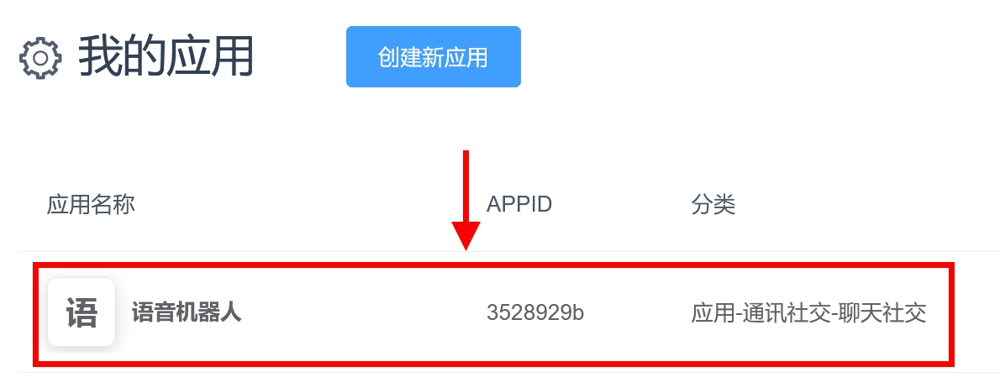
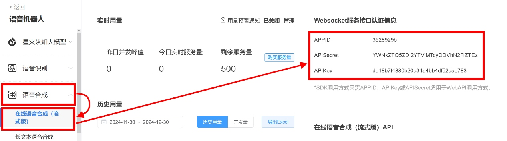
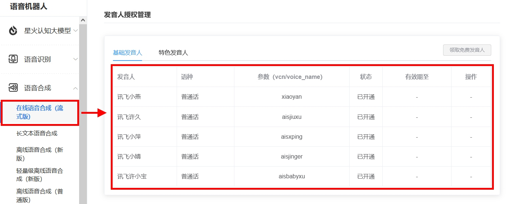
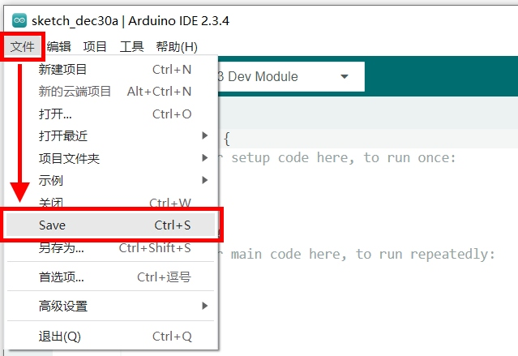
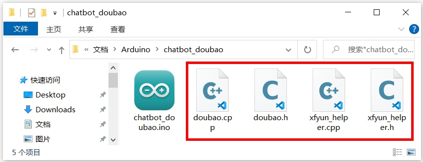
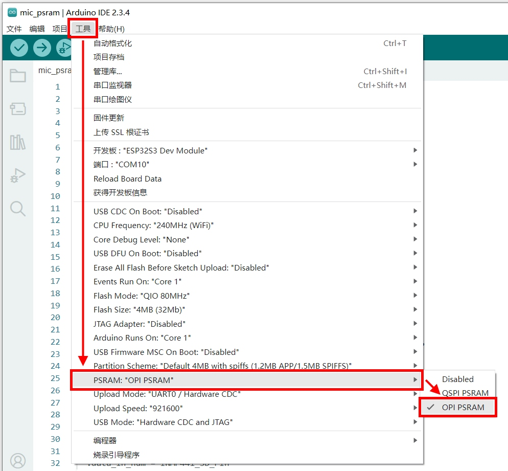
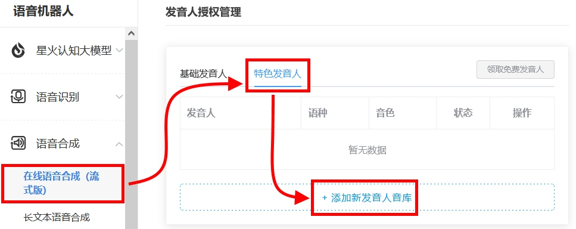
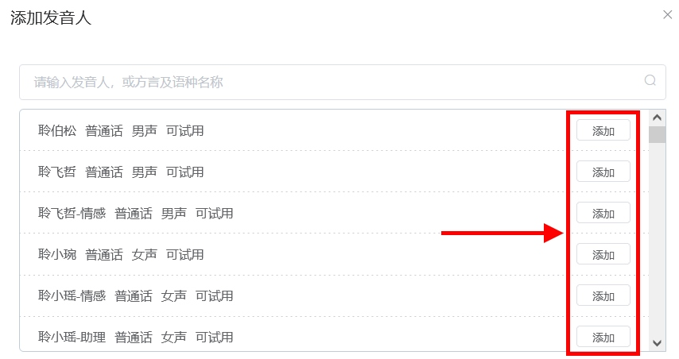
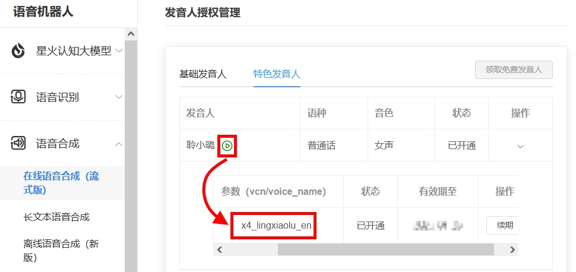

实验十六 AI语音对话实验

【实验目的】

- 复习ESP32使用云端服务的方法；

- 学习连接云端大模型，实现语音交流。

【实验原理】

ESP32具备WiFi通讯能力，在Arduino的开发资源中，有能与云端服务器的功能库。在前面的实验，已经实现在ESP32通过麦克风采集语音数据，发送到云端服务器识别，然后再接收服务器发来的识别结果。然后将这个语音识别结果，发送到云端大语言模型进行响应，实现与大模型AI进行语言交流的功能。在这节实验里，将会把云端大模型发回的文字信息，通过云端服务，合成语音进行播放。最终实现一个用语音回答语音提问的AI对话功能。

【实验步骤】

1.  这个实验需要调用科大讯飞的语音云服务，以及字节跳动火山引擎的豆包大模型运服务。所以需要按照前面的实验步骤注册好账号，并安装相应的功能库。

2.  实验中会用到科大讯飞的语音合成服务，需要去往讯飞云的官网查看接口信息。用浏览器打开科大讯飞云的网址：<https://www.xfyun.cn/>

<div align="center">
  
</div>

登录后，点击右上角的"控制台"按钮。

<div align="center">
  
</div>

在"我的应用"列表中，点击之前创建的语音应用项目进入其详细信息页面。

<div align="center">
  
</div>

在应用的详细信息页面，在左侧栏目中找到"语音合成"合集。展开后，点击"在线语音合成"一项。在右侧的"Websocket服务接口认证信息"里，可以看到调用服务需要的三条信息，记录下来后面编写程序会用到。

<div align="center">
  
</div>

在页面下方的"发音人授权管理"中，可以看到目前可以使用的发音人列表。记录其中的"参数(vcn/Voice_name)"一项参数，后面编写程序的时候会用到。

3.  这次的实验中，需要用到额外的函数库代码文件。所以需要先确定工程文件夹位置，以方便拷贝函数库代码文件。在Arduino IDE里点击左上角菜单栏的"文件"，在弹出的菜单列表选择"新建项目"。

<div align="center">
  
</div>

在Arduino IDE里点击左上角菜单栏的"文件"，在弹出的菜单列表选择"Save"。

<div align="center">
  
</div>

为这个工程取个名字，比如"chatbot_doubao"，保存到一个确定的位置。然后将Gitee下载的配套例程的xfyun_helper.h、xfyun_helper.cpp、doubao.h和doubao.cpp拷贝到.ino文件所在的文件夹里。
| 附加文件 | 下载链接 |
|---|---|
| xfyun_helper.h | [点击下载](./chatbot_doubao/xfyun_helper.h) |
| xfyun_helper.cpp | [点击下载](./chatbot_doubao/xfyun_helper.cpp) |
| doubao.h | [点击下载](./chatbot_doubao/doubao.h) |
| doubao.cpp | [点击下载](./chatbot_doubao/doubao.cpp) |

<div align="center">
  
</div>

然后在chatbot_doubao.ino编写实验代码。在下载的例子源代码包里，对应的源码文件为chatbot_doubao.ino。完整代码如下：
[点击下载示例代码（chatbot_doubao.ino）](./chatbot_doubao/chatbot_doubao.ino)

```c
#include <TFT_eSPI.h>
#include <U8g2_for_TFT_eSPI.h>
#include <driver/i2s.h>
#include "xfyun_helper.h"
#include "doubao.h"

const char* ssid = "xxxx";
const char* password = "xxxx";

const char* IAT_APPID = "xxxx";
const char* IAT_APISecret = "xxxx";
const char* IAT_APIKey = "xxxx";

const char* apiKey = "xxxx";
const char* endpointId = "xxxx";
const String roleDoubao = "你是一个阳光开朗的朋友，说话简短，积极向上。";

const char* TTSAPPID = "xxxx";
const char* TTSAPISecret = "xxxx";
const char* TTSAPIKey = "xxxx";
const char* TTSVoiceName = "xiaoyan";

TFT_eSPI tft = TFT_eSPI(320,480);
U8g2_for_TFT_eSPI u8g2;

static int INMP441_WS_Pin = 18;
static int INMP441_SCK_Pin = 17;
static int INMP441_SD_Pin = 8;
static int MAX98357_LRC_Pin = 13;
static int MAX98357_BCLK_PIn = 14;
static int MAX98357_DIN_Pin = 4;
#define SAMPLE_RATE 16000

static int Green_Btn_Pin = 11;
static int Green_LED_Pin = 47;
static int Blue_Btn_Pin = 12;
static int Blue_LED_Pin = 48;

i2s_config_t i2sIn_config = {
    .mode = i2s_mode_t(I2S_MODE_MASTER | I2S_MODE_RX),
    .sample_rate = SAMPLE_RATE,
    .bits_per_sample = i2s_bits_per_sample_t(16),
    .channel_format = I2S_CHANNEL_FMT_ONLY_LEFT,
    .communication_format = i2s_comm_format_t(I2S_COMM_FORMAT_STAND_I2S),
    .intr_alloc_flags = ESP_INTR_FLAG_LEVEL1,
    .dma_buf_count = 8,
    .dma_buf_len = 1024
};
const i2s_pin_config_t i2sIn_pin_config = {
    .bck_io_num = INMP441_SCK_Pin,
    .ws_io_num = INMP441_WS_Pin,
    .data_out_num = -1,
    .data_in_num = INMP441_SD_Pin
};
i2s_config_t i2sOut_config = {
    .mode = i2s_mode_t(I2S_MODE_MASTER | I2S_MODE_TX),
    .sample_rate = SAMPLE_RATE,
    .bits_per_sample = i2s_bits_per_sample_t(16),
    .channel_format = I2S_CHANNEL_FMT_ONLY_RIGHT,
    .communication_format = i2s_comm_format_t(I2S_COMM_FORMAT_STAND_I2S),
    .intr_alloc_flags = ESP_INTR_FLAG_LEVEL1,
    .dma_buf_count = 8,
    .dma_buf_len = 1024
};
const i2s_pin_config_t i2sOut_pin_config = {
    .bck_io_num = MAX98357_BCLK_PIn,
    .ws_io_num = MAX98357_LRC_Pin,
    .data_out_num = MAX98357_DIN_Pin,
    .data_in_num = -1
};

int16_t* record_data;
int data_length = SAMPLE_RATE * 5;

void setup() {
    tft.init();
    tft.setRotation(1);
    tft.invertDisplay(1);
    tft.fillScreen(TFT_BLACK);
    u8g2.begin(tft);
    u8g2.setFont(u8g2_font_wqy16_t_gb2312);
    u8g2.setForegroundColor(TFT_WHITE);
    u8g2.setBackgroundColor(TFT_BLACK);
    i2s_driver_install(I2S_NUM_0, &i2sIn_config, 0, NULL);
    i2s_set_pin(I2S_NUM_0, &i2sIn_pin_config);
    i2s_driver_install(I2S_NUM_1, &i2sOut_config, 0, NULL);
    i2s_set_pin(I2S_NUM_1, &i2sOut_pin_config);
    pinMode(Blue_Btn_Pin, INPUT_PULLUP);
    pinMode(Blue_LED_Pin, OUTPUT);
    digitalWrite(Blue_LED_Pin, HIGH);
    pinMode(Green_Btn_Pin, INPUT_PULLUP);
    pinMode(Green_LED_Pin, OUTPUT);
    digitalWrite(Green_LED_Pin, HIGH);
    record_data = (int16_t*)(ps_malloc(data_length *
    sizeof(int16_t)));
    if (record_data == NULL) {
        digitalWrite(Blue_LED_Pin, LOW);
        return;
    }
    u8g2.setCursor(0, 16);
    u8g2.print("连接 WiFi");
    u8g2.print(ssid);
    WiFi.begin(ssid, password);
    while (WiFi.status() != WL_CONNECTED) {
        delay(500);
        u8g2.print(".");
    }
    u8g2.print("\n成功连上 WiFi！\n请按绿色按钮开始录音。");

    xfyun_init();
}

void loop() {
    size_t bytes_read;
    if (digitalRead(Green_Btn_Pin) == LOW)
    {
        digitalWrite(Green_LED_Pin, LOW);
        delay(300);
        tft.fillScreen(TFT_BLACK);
        u8g2.setCursor(0, 16);
        u8g2.print("开始录音...");
        i2s_read(I2S_NUM_0, record_data, data_length * sizeof(int16_t), &bytes_read, portMAX_DELAY);
        u8g2.setCursor(0, 32);
        u8g2.print("录音完毕,开始识别...\n\n");
        digitalWrite(Green_LED_Pin, HIGH);

        xfyun_iat(record_data, data_length ,IAT_APPID, IAT_APISecret, IAT_APIKey);
    }
    String result = xfyun_get_result();
    if (result.length() > 0) {
        u8g2.print("我：\n");
        u8g2.setForegroundColor(TFT_YELLOW);
        u8g2.print(result);
        u8g2.setForegroundColor(TFT_WHITE);
        u8g2.print("\n\n");

        u8g2.print("豆包：\n");
        String answer = Doubao(result ,apiKey, endpointId, roleDoubao);
        String wrappedAnswer = WrapText(answer,60);
        u8g2.setForegroundColor(TFT_GREEN);
        u8g2.print(wrappedAnswer);
        u8g2.setForegroundColor(TFT_WHITE);
        xfyun_tts(answer, TTSVoiceName, TTSAPPID, TTSAPISecret, TTSAPIKey);
    }
    xfyun_tts_spin();
    if (digitalRead(Blue_Btn_Pin) == LOW)
    {
        digitalWrite(Blue_LED_Pin, LOW);
        i2s_write(I2S_NUM_1, record_data, data_length * sizeof(int16_t),
        &bytes_read, portMAX_DELAY);
        i2s_zero_dma_buffer(I2S_NUM_1);
        digitalWrite(Blue_LED_Pin, HIGH);
    }
    delay(10);
}
```
对代码进行解释：
```c
#include <TFT_eSPI.h>
#include <U8g2_for_TFT_eSPI.h>
#include <driver/i2s.h>
#include "xfyun_helper.h"
#include "doubao.h"
```
引入LCD显示屏驱动库以及U8g2中文显示库的头文件。然后还引入I2S通讯的头文件以便使用INMP441麦克风采集音频数据，以及使用MAX98357A芯片输出音频。最后还引入了科大讯飞服务的头文件xfyun_helper.h和豆包大模型头文件doubao.h。
```c
const char* ssid = "xxxx";
const char* password = "xxxx";
```
定义WiFi名称ssid和Wifi密码password，需要将代码中的xxxx替换成真实的名称和密码。
```c
const char* IAT_APPID = "xxxx";
const char* IAT_APISecret = "xxxx";
const char* IAT_APIKey = "xxxx";
```
定义讯飞云IAT语音识别服务所需要的Websockets接口信息。根据在讯飞云官网记录的信息，替换代码中的xxxx。
```c
const char* apiKey = "xxxx";
const char* endpointId = "xxxx";
const String roleDoubao = "你是一个阳光开朗的朋友，说话简短，积极向上。";
```
定义豆包大模型所需要的HTTP接入点信息。根据在火山引擎官网记录的信息，替换代码中的xxxx。通过roleDoubao为豆包AI设置人格。
```c
const char* TTSAPPID = "xxxx";
const char* TTSAPISecret = "xxxx";
const char* TTSAPIKey = "xxxx";
const char* TTSVoiceName = "xiaoyan";
```
定义讯飞云TTS语音合成服务所需要的Websockets接口信息。根据前面实验步骤，在讯飞云官网记录的语音合成的接口信息，替换代码中的xxxx。

<div align="center">
  
</div>
<div align="center">
  
</div>
```c
TFT_eSPI tft = TFT_eSPI(320,480);
U8g2_for_TFT_eSPI u8g2;
```
定义LCD显示屏对象以及中文显示对象u8g2。
```c
static int INMP441_WS_Pin = 18;
static int INMP441_SCK_Pin = 17;
static int INMP441_SD_Pin = 8;
static int MAX98357_LRC_Pin = 13;
static int MAX98357_BCLK_PIn = 14;
static int MAX98357_DIN_Pin = 4;
#define SAMPLE_RATE 16000
```
定义INMP441麦克风与ESP32连接的引脚序号，以及MAX98357A音频输出芯片与ESP32连接的引脚序号。最后定义音频的采样率为16000Hz，后面会按照这个采样频率去采集声音信号。这里使用了一个较低的采样率，是为了减少发送的音频数据量，这样能缩减音频发送时间，提高响应速率。
```c
static int Green_Btn_Pin = 11;
static int Green_LED_Pin = 47;
static int Blue_Btn_Pin = 12;
static int Blue_LED_Pin = 48;
```
定义了绿色按钮和绿色LED在电路图中与ESP32进行连接的引脚序号，以及蓝色按钮和蓝色LED在电路图中与ESP32进行连接的引脚序号。后面会使用绿色按钮来进行音频录制，使用蓝色按钮来播放录制的音频信号。
```c
i2s_config_t i2sIn_config = {
    .mode = i2s_mode_t(I2S_MODE_MASTER | I2S_MODE_RX),
    .sample_rate = SAMPLE_RATE,
    .bits_per_sample = i2s_bits_per_sample_t(16),
    .channel_format = I2S_CHANNEL_FMT_ONLY_LEFT,
    .communication_format = i2s_comm_format_t(I2S_COMM_FORMAT_STAND_I2S),
    .intr_alloc_flags = ESP_INTR_FLAG_LEVEL1,
    .dma_buf_count = 8,
    .dma_buf_len = 1024
};
const i2s_pin_config_t i2sIn_pin_config = {
    .bck_io_num = INMP441_SCK_Pin,
    .ws_io_num = INMP441_WS_Pin,
    .data_out_num = -1,
    .data_in_num = INMP441_SD_Pin
};
i2s_config_t i2sOut_config = {
    .mode = i2s_mode_t(I2S_MODE_MASTER | I2S_MODE_TX),
    .sample_rate = SAMPLE_RATE,
    .bits_per_sample = i2s_bits_per_sample_t(16),
    .channel_format = I2S_CHANNEL_FMT_ONLY_RIGHT,
    .communication_format = i2s_comm_format_t(I2S_COMM_FORMAT_STAND_I2S),
    .intr_alloc_flags = ESP_INTR_FLAG_LEVEL1,
    .dma_buf_count = 8,
    .dma_buf_len = 1024
};
const i2s_pin_config_t i2sOut_pin_config = {
    .bck_io_num = MAX98357_BCLK_PIn,
    .ws_io_num = MAX98357_LRC_Pin,
    .data_out_num = MAX98357_DIN_Pin,
    .data_in_num = -1
};
```
用于音频采集和音频输出的配置信息。
```c
int16_t* record_data;
int data_length = SAMPLE_RATE * 5;
```
定义一个record_data数组指针，用于存储麦克风录制的音频数据。定义这个数组的长度，为采样率的5倍，也就是能录制5秒钟的音频数据。
```c
void setup() {
    tft.init();
    tft.setRotation(1);
    tft.invertDisplay(1);
    tft.fillScreen(TFT_BLACK);
    u8g2.begin(tft);
    u8g2.setFont(u8g2_font_wqy16_t_gb2312);
    u8g2.setForegroundColor(TFT_WHITE);
    u8g2.setBackgroundColor(TFT_BLACK);
    ......
}
```
在初始化函数的前半段，对LCD显示屏以及中文显示对象进行初始化。
```c
void setup() {
    ......
    i2s_driver_install(I2S_NUM_0, &i2sIn_config, 0, NULL);
    i2s_set_pin(I2S_NUM_0, &i2sIn_pin_config);
    i2s_driver_install(I2S_NUM_1, &i2sOut_config, 0, NULL);
    i2s_set_pin(I2S_NUM_1, &i2sOut_pin_config);
    ......
}
```
接下来使用前面定义的I2S配置信息，对ESP32的 I2S
控制器进行初始化。以驱动INMP411麦克风与MAX98357A音频播放芯片。
```c
void setup() {
    ......
    pinMode(Blue_Btn_Pin, INPUT_PULLUP);
    pinMode(Blue_LED_Pin, OUTPUT);
    digitalWrite(Blue_LED_Pin, HIGH);
    pinMode(Green_Btn_Pin, INPUT_PULLUP);
    pinMode(Green_LED_Pin, OUTPUT);
    digitalWrite(Green_LED_Pin, HIGH);
    ......
}
```
对蓝色按钮和蓝色LED进行了引脚配置，并让蓝色LED初始状态为熄灭状态。然后对绿色按钮和绿色LED进行了引脚配置，并让绿色LED初始状态为熄灭状态。
```c
void setup() {
    ......
    record_data = (int16_t*)(ps_malloc(data_length * sizeof(int16_t)));
    if (record_data == NULL) {
        digitalWrite(Blue_LED_Pin, LOW);
        return;
    }
    ......
}
```
在扩展内存PSRAM中为录音数组record_data申请内存空间。如果空间申请失败，就点亮蓝色LED灯，并中止初始化过程。
```c
void setup() {
    ......
    u8g2.setCursor(0, 16);
    u8g2.print("连接 WiFi ");
    u8g2.print(ssid);
    WiFi.begin(ssid, password);
    while (WiFi.status() != WL_CONNECTED) {
        delay(500);
        u8g2.print(".");
    }
    u8g2.print("\n成功连上 WiFi！\n请按绿色按钮开始录音。");
    ......
}
```
在LCD屏幕上显示"连接 WiFi"，然后按照前面定义的WiFi名称和密码连接WiFi。成功后显示连接成功，并提示按下绿色按钮开始录音。
```c
void setup() {
    ......
    xfyun_init();
}
```
在初始化函数的最后，调用讯飞云的初始化函数，连接讯飞云服务器准备进行语音识别。
```c
void loop() {
    size_t bytes_read;
    if (digitalRead(Green_Btn_Pin) == LOW)
    {
        digitalWrite(Green_LED_Pin, LOW);
        delay(300);
        tft.fillScreen(TFT_BLACK);
        u8g2.setCursor(0, 16);
        u8g2.print("开始录音...");
        i2s_read(I2S_NUM_0, record_data, data_length * sizeof(int16_t), &bytes_read, portMAX_DELAY);
        u8g2.setCursor(0, 32);
        u8g2.print("录音完毕,开始识别...\n");
        digitalWrite(Green_LED_Pin, HIGH);
        xfyun_iat(record_data, data_length ,IAT_APPID, IAT_APISecret, IAT_APIKey);
    }
    ......
}
```
在循环函数中，如果检测到绿色按钮按下的信号，亮起绿色LED表示录音开始。然后在LCD屏幕显示"开始录音..."，开始从麦克风采集音频数据，存储到record_data数组里。录制完毕后，在LCD显示信息，然后熄灭绿色LED表示录音结束。接着将录制好的音频数据发送给讯飞云服务器进行语音识别处理。
```c
void loop() {
    ......
    String result = xfyun_get_result();
        if (result.length() > 0) {
        u8g2.print("我：\n");
        u8g2.setForegroundColor(TFT_YELLOW);
        u8g2.print(result);
        u8g2.setForegroundColor(TFT_WHITE);
        u8g2.print("\n\n");
        ......
    }
}
```
在循环函数中，不停检查讯飞云服务器返回的识别结果。如果获取的识别结果长度大于0，就将识别结果作为"我"的发言，用黄色文字显示在LCD显示屏上。
```c
void loop() {
    ......
    String result = xfyun_get_result();
    if (result.length() > 0) {
        ......
        u8g2.print("豆包：\n");
        String answer = Doubao(result ,apiKey, endpointId, roleDoubao);
        String wrappedAnswer = WrapText(answer,60);
        u8g2.setForegroundColor(TFT_GREEN);
        u8g2.print(wrappedAnswer);
        u8g2.setForegroundColor(TFT_WHITE);
        xfyun_tts(answer, TTSVoiceName, TTSAPPID, TTSAPISecret, TTSAPIKey);
    }
    ......
}
```
然后把讯飞云识别的结果，作为"我"的发言，通过Doubao()函数发送给云端的豆包大模型。得到豆包的回复answer字符串，再使用WrapText()函数进行换行处理：每60个字符插入一个换行符号，这样才不会在屏幕上超出显示区域。接下来将换行处理后的豆包回复信息，以绿色文字的形式显示在LCD显示屏上。最后，调用xfyun_tts()函数，将豆包回答的文字信息发送给讯飞云服务器进行语音合成。
```c
void loop() {
    ......
    xfyun_tts_spin();
    ......
}
```
在循环函数中，调用xfyun_tts_spin()函数，查看讯飞云服务器是否有语音合成结果发来。如果有新的语音合成结果，会将合成后的音频数据，通过I2S_NUM_1控制器进行语音播放。
```c
void loop() {
    ......
    if (digitalRead(Blue_Btn_Pin) == LOW)
    {
        digitalWrite(Blue_LED_Pin, LOW);
        i2s_write(I2S_NUM_1, record_data, data_length * sizeof(int16_t), &bytes_read, portMAX_DELAY);
        i2s_zero_dma_buffer(I2S_NUM_1);
        digitalWrite(Blue_LED_Pin, HIGH);
    }
    delay(10);
}
```
如果按下蓝色按钮，则点亮蓝色LED，然后播放之前麦克风采集的音频数据。播放完毕后，清空播放缓存，并熄灭蓝色LED表示音频播放结束。

4.  程序编写完毕后，需要为其设置目标设备和程序上传端口，才能进行程序的编译和上传。首先将开发板的Type-C接口，通过USB线缆连接到电脑的USB插口上。

<div align="center">
  
</div>

在Windows系统中，鼠标右键点击桌面左下角的"开始"图标。在弹出的菜单里选择"设备管理器"。在设备管理器里，展开"端口(COM和LPT)"，查看其中的USB-SERIAL CH340K(COMx)一项。记住其中的COMx，比如下图中的COM10，就是将程序上传到ESP32的端口号。

<div align="center">
  
</div>

回到Arduino IDE，点击工具栏里的设备框左侧的向下箭头，弹出端口列表。从中选择上传程序的端口号，比如下图中的COM10。

<div align="center">
  
</div>

在弹出的窗口中，搜索栏里输入"esp32s3 dev"。在下方的列表中，选择"ESP32S3 Dev Module"一项。然后点击窗口右下角的"确定"按钮。

<div align="center">
  
</div>

5.  启用ESP32的扩展内存PSRAM，以录制较长时长的音频数据。在Arduino IDE中打开"工具"菜单，在"PSRAM"一项中勾选"OPI PSRAM"。

<div align="center">
  
</div>

6.  回到Arduino IDE界面，点击工具栏里的上传按钮，就可以开始编译程序并上传到开发板的ESP32里运行了。

<div align="center">
  
</div>

编译的过程会比较耗时，需要耐心等待。直到界面下方的终端窗口提示如下信息，说明程序上传完毕并已经开始执行。

<div align="center">
  
</div>

程序执行之后，先观察实验面板上的LCD显示屏。待WiFi连接成功后，按下绿色按钮，开始录音。待绿色LED亮起时，对着实验面板上的麦克风说话。待绿色LED熄灭后，回到LCD显示屏，查看识别结果。稍等片刻，就可以看到豆包大模型回复的信息，并听到讯飞云合成的语音播放。按下蓝色按钮，可以回放之前麦克风录制的音频，对照显示屏上的语音识别结果，看看是否一致。

【扩展实验】

在讯飞云官网的控制面板中，可以试用一些特色发音人，会比基础发音人效果好很多。

<div align="center">
  
</div>

选择需要试用的特色发音人，点击"添加"按钮。

<div align="center">
  
</div>

点击发音人后面的试听按钮，将要试用的发音人填写到代码的TTSVoiceName中。

<div align="center">
  
</div>

<div align="center">
  <a href="../../README.md" style="display: inline-block; margin: 10px 0 18px; padding: 10px 18px; border-radius: 999px; background: linear-gradient(135deg, #1f6feb, #3fb950); color: #ffffff; text-decoration: none; font-weight: 700; box-shadow: 0 4px 12px rgba(31, 111, 235, 0.25);">返回 README 主页</a>
</div>
