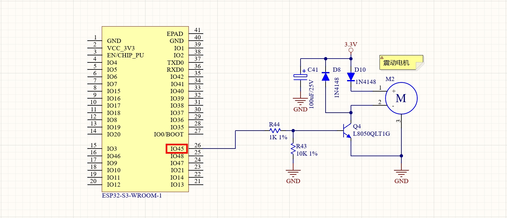

实验六 电机控制实验

【实验目的】

- 学习ESP32的PWM控制信号的生成；

- 学习使用PWM占空比控制电机转速。

【实验原理】

在开发板的左侧，有一个直流电机。它们在电路原理图中的表示如下：

<div align="center">
  
</div>

可以看到，ESP32的GPIO45引脚连接到了电子开关芯片Q4，通过Q4开关的通断来控制电流在电机M2中的流动。当GPIO45引脚输出高电平时，电机M2的2号端子（负极）和GND连接。电机两端形成3.3V的电压差，驱动电机转动。当GPIO45引脚输出低电平时，电机M2的2号端子（负极）和GND断开。电机两端电压差归零，电机失去驱动力。所以只需要在GPIO45引脚上输出PWM信号，就能控制3.3V作用在电机两端的时长，就可以开环的控制电机转动速度。

在ESP32中，一共有16个独立的PWM通道（通道0-15）。每个通道都可以配置独立的频率和分辨率，也可以绑定到任意GPIO输出引脚。这些PWM通道分为高速和低速两类:

- 通道0-7：高速通道，基于硬件定时器实现，适用于电机控制这种对时序精度要求较高的应用。

- 通道8-15：低速通道，基于软件定时器实现，适用于LED调光等精度要求不高的应用。

所以在这个实验中，优先使用通道0-7。这里就选择通道0作为顺时针旋转的PWM通道，映射到ESP32的GPIO45引脚；通过这个通道实现电机的转动。下面按照这个控制方式，编写实验程序：让电机转动3秒，然后停止2秒。接着再转动3秒，然后再停止2秒。这样就把电机的转动和停止状态，都实现了一遍。

【实验步骤】

1.  在Arduino IDE里点击左上角菜单栏的"文件"，在弹出的菜单列表选择"新建项目"。

<div align="center">
  
</div>

实验代码在下载的例子源代码包里，对应的文件为motor.ino。完整代码如下：
```c
const int motor_pin = 45;
const int frequency = 15000;
const int resolution = 8;
const int motor_ch = 0;

void setup()
{
  ledcSetup(motor_ch, frequency, resolution);
  ledcAttachPin(motor_pin, motor_ch);
}

void loop()
{
  ledcWrite(motor_ch, 150);
  delay(3000);
  ledcWrite(motor_ch, 0);
  delay(2000);
}
```
对代码进行解释：
```c
  const int motor_pin = 45;
```
定义电机控制引脚为GPIO 45。
```c
  const int frequency = 15000;
  const int resolution = 8;
  const int motor_ch = 0;
```
设置PWM频率为15KHz，低于这个频率，电机控制会出现抖动发出异响。设置PWM分辨率为8位，也就是占空比分为255（2的8次方）个等级。数值0表示占空比为0，数值255表示占空比拉满，也就是持续高电平。将ESP32的PWM通道0定义为电机控制通道，稍后会绑定到GPIO45引脚上。
```c
void setup()
{
  ledcSetup(motor_ch, frequency, resolution);
  ledcAttachPin(motor_pin, motor_ch);
}
```
在初始化函数里，调用ledcSetup()函数对前面定义的PWM通道进行初始化，包括设置PWM的频率以及分辨率。然后调用ledcAttachPin()函数将通道号映射到对应的GPIO引脚上。
```c
void loop()
{
  ledcWrite(motor_ch, 150);
  delay(3000);
  ledcWrite(motor_ch, 0);
  delay(2000);
}
```
在循环函数的前半段，通过向，motor_ch通道（绑定了GPIO45引脚），发送150/255占空比的PWM信号,让电机转动。调用delay()函数让转动时间持续3000毫秒，也就是3秒钟。然后再通过同时向motor_ch通道（绑定了GPIO45引脚）输出占空比为0的PWM信号（也就是持续低电平），让电机停止转动，持续时间为2000毫秒，也就是2秒钟。

上述这个过程，会随着loop()函数的不停调用而持续的循环进行，方便进行实验结果的观察。

2.  程序编写完毕后，需要为其设置目标设备和程序上传端口，才能进行程序的编译和上传。首先将开发板的Type-C接口，通过USB线缆连接到电脑的USB插口上。

<div align="center">
  
</div>

在Windows系统中，鼠标右键点击桌面左下角的"开始"图标。在弹出的菜单里选择"设备管理器"。在设备管理器里，展开"端口(COM和LPT)"，查看其中的USB-SERIAL CH340K(COMx)一项。记住其中的COMx，比如下图中的COM10，就是将程序上传到ESP32的端口号。

<div align="center">
  
</div>

回到Arduino IDE，点击工具栏里的设备框左侧的向下箭头，弹出端口列表。从中选择上传程序的端口号，比如下图中的COM10。

<div align="center">
  
</div>

在弹出的窗口中，搜索栏里输入"esp32s3 dev"。在下方的列表中，选择"ESP32S3 Dev Module"一项。然后点击窗口右下角的"确定"按钮。

<div align="center">
  
</div>

3.  回到Arduino IDE界面，点击工具栏里的上传按钮，就可以开始编译程序并上传到开发板的ESP32里运行了。

<div align="center">
  
</div>

编译的过程会比较耗时，需要耐心等待。直到界面下方的终端窗口提示如下信息，说明程序上传完毕并已经开始执行。

<div align="center">
  
</div>

这时候再来到开发板面板的左边，就能看到电机的扇叶先顺时针旋转3秒钟，然后停止2秒钟。再逆时针旋转3秒钟，接着停止2秒钟。如此不断循环。

【扩展实验】

结合摇杆控制实验的内容，可以使用摇杆来控制电机的旋转速度。在下载的例子源代码包里，对应的源码文件为motor_joystick.ino。完整代码如下：
```c
// 电机PWM信号引脚
const int motor_pin = 45;
// 频率15kHz，8位分辨率
const int frequency = 15000;
const int resolution = 8;
const int motor_ch = 0;
// 摇杆X轴的ADC输入引脚
const int x_pin = 1;

void setup()
{
  // 配置电机控制PWM通道：频率15kHz，8位分辨率
  ledcSetup(motor_ch, frequency, resolution);
  ledcAttachPin(motor_pin, motor_ch);
  // 设置模拟输入引脚
  pinMode(x_pin, INPUT);
}

void loop()
{
  // 读取模拟输入值(范围0-4095)
  int x_value = analogRead(x_pin);

  // 将模拟输入值映射到PWM范围(0-255)
  int pos = x_value * 255 / 4095;

  // 计算PWM占空比：
  // pos*2得到范围(0-510)
  // 减去255得到范围(-255到+255)
  int duty = pos * 2 - 255;
  if (duty > 0)  // 正值开始转动
  {
    ledcWrite(motor_ch, duty);    // 电机通道输出对应占空比
  }
  else  // 非正值表示停止
  {
    ledcWrite(motor_ch, 0);      // 电机通道停止
  }
  delay(100);
}
```

<div align="center">
  <a href="../../README.md" style="display: inline-block; margin: 10px 0 18px; padding: 10px 18px; border-radius: 999px; background: linear-gradient(135deg, #1f6feb, #3fb950); color: #ffffff; text-decoration: none; font-weight: 700; box-shadow: 0 4px 12px rgba(31, 111, 235, 0.25);">返回 README 主页</a>
</div>
