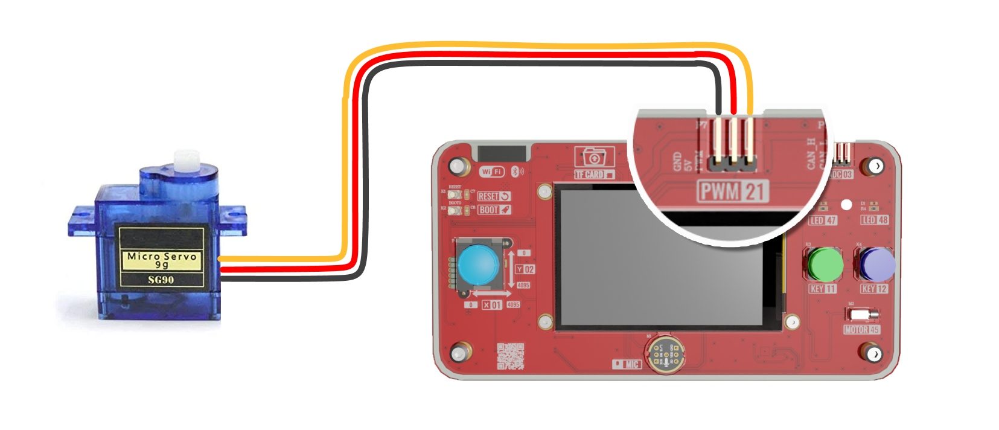
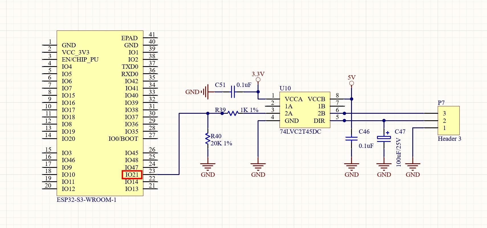
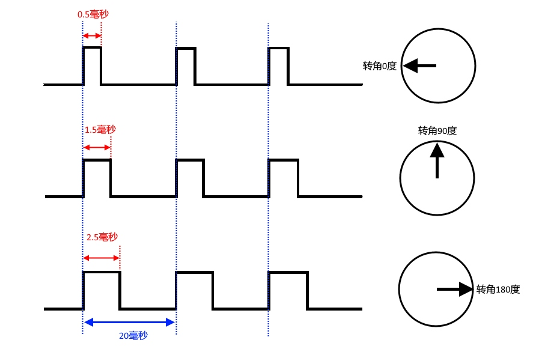
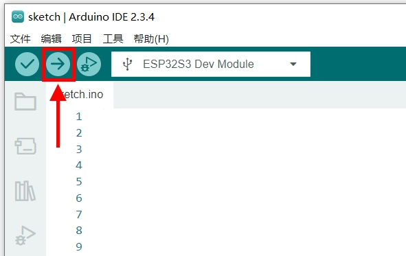

实验七 舵机控制实验

【实验目的】

- 学习ESP32的PWM控制信号的生成；

- 学习使用PWM占空比控制舵机角度。

【实验原理】

在开发板面板的上方，有一个3针的舵机接口。在开发套件中附带了一个SG90舵机，将舵机的控制线插到开发板的3针舵机接口上。连接的时候需要注意观察舵机线束上的线缆颜色：棕色线缆连接开发板插针最左侧的GND；红色线缆连接开发板舵机插针的5V；黄色线缆连接开发板插针最右侧的PWM。

<div align="center">
  
</div>

舵机接口在电路原理图中的表示如下：

<div align="center">
  
</div>

因为舵机工作在5V电压下，而ESP32工作在3.3V。所以ESP32的GPIO21引脚与舵机的控制信号线（P7排针的3引脚，连接舵机的黄色信号线）通过一枚74LVC2T45DC双向电平转换器芯片来进行连接。这样就能把ESP32引脚的3.3V信号转换到5V信号，与舵机的工作电压保持了一致。

舵机的转动角度，是通过ESP32引脚的PWM信号进行控制。PWM的占空比，决定了舵机的转动角度。其对应关系如下：

<div align="center">
  
</div>

从图中可以看出，舵机控制信号的PWM信号是由一系列固定周期的方波来控制的。信号的一个周期是20毫秒，在这个20毫秒周期里，处于高电平的信号持续时间就是占空时间。占空时间为0.5毫秒时，舵机转到0度角；占空时间为1.5毫秒时，舵机转到90度角；占空时间为2.5毫秒时，舵机转到180度角。也就是从0.5毫秒到2.5毫秒中间这2毫秒的占空时间，对应了舵机从0度到180度的转角。所以只要在EPS32的GPIO21上生成一个周期为20毫秒的PWM信号，同时这个PWM信号的占空时间在0.5毫秒到2.5毫秒之间，就能控制舵机的角度转动。下面就来编写一个实验程序，在ESP32的GPIO21上生成一个周期为20毫秒的PWM信号，占空时间分别在0.5毫秒、1.5毫秒和2.5毫秒之间循环变化。让舵机在0度、90度和180度之间循环转动。

在ESP32中，一共有16个独立的PWM通道（通道0-15）。每个通道都可以配置独立的频率和分辨率，也可以绑定到任意GPIO输出引脚。这些PWM通道分为高速和低速两类:

- 通道0-7：高速通道，基于硬件定时器实现，适用于电机控制这种对时序精度要求较高的应用。

- 通道8-15：低速通道，基于软件定时器实现，适用于LED调光等精度要求不高的应用。

所以在这个实验中，优先使用通道0-7。这里就选择通道0作为舵机的PWM通道，后面会将这个通道映射到ESP32的GPIO21引脚，用于控制舵机。

【实验步骤】

1.  在Arduino
    IDE里点击左上角菜单栏的"文件"，在弹出的菜单列表选择"新建项目"。

<div align="center">
  
</div>

在下载的例子源代码包里，对应的源码文件为servo.ino。完整代码如下：
```c
const int servo_pin = 21;
const int servo_ch = 0;

void setup()
{
  ledcSetup(servo_ch, 50, 12);
  ledcAttachPin(servo_pin, servo_ch);
}

void loop()
{
  int min_duty = (0.5 * 4096) / 20;
  int mid_duty = (1.5 * 4096) / 20;
  int max_duty = (2.5 * 4096) / 20;
  ledcWrite(servo_ch, min_duty);
  delay(3000);
  ledcWrite(servo_ch, mid_duty);
  delay(3000);
  ledcWrite(servo_ch, max_duty);
  delay(3000);
}

```
对代码进行解释：
```c
const int servo_pin = 21;
const int servo_ch = 0;
```
定义舵机控制引脚为GPIO 21，选择的PWM通道为通道0。
```c
void setup()
{
  ledcSetup(servo_ch, 50, 12);
  ledcAttachPin(servo_pin, servo_ch);
}
```
在初始化函数里，调用ledcSetup()函数对前面定义的PWM通道进行初始化，包括设置PWM的通道号、信号频率以及分辨率。其中通道号前面已经定义为servo_ch，直接填写servo_ch。舵机控制信号的PWM周期是20毫秒，那么可以计算其控制频率：
```
1000毫秒 / 20毫秒 = 50 赫兹
```
所以设置PWM频率为50赫兹。PWM的分辨率设置为12位，也就是把周期20毫秒分为4096（2的12次方）个相等时间片。最后赋多大的数值，表示多少个时间片处于高电平状态。也就是数值0表示占空时间为0，数值4095表示占空时间为20毫秒。设置完PWM的通道之后，调用ledcAttachPin()函数将通道号映射到控制舵机的GPIO21引脚上。
```c
void loop()
{
  int min_duty = (0.5 * 4096) / 20;
  int mid_duty = (1.5 * 4096) / 20;
  int max_duty = (2.5 * 4096) / 20;
  // ...
}
```
在循环函数的前半段，计算0.5毫秒、1.5毫秒和2.5毫秒这三个占空时间的PWM信号，在12位分辨率下，也就是4096个时间片中，需要多少个时间片处于高电平状态。最后算出来的min_duty、mid_duty和max_duty分别对应舵机的0度、90度和180度三个转角所需要的高电位时间片个数。
```c
void loop()
{
  // ...
  ledcWrite(servo_ch, min_duty);
  delay(3000);
  ledcWrite(servo_ch, mid_duty);
  delay(3000);
  ledcWrite(servo_ch, max_duty);
  delay(3000);
}
```
在循环函数的后半段，通过向servo_ch通道（绑定了GPIO21引脚），循环发送0度、90度和180度三种转角的PWM控制信号。相邻的两个转角变化之间相隔3000毫秒，也是3秒。这个转角跳变的过程，会随着loop()函数的不停调用而持续的循环进行，方便进行实验结果的观察。

2.  程序编写完毕后，需要为其设置目标设备和程序上传端口，才能进行程序的编译和上传。首先将开发板的Type-C接口，通过USB线缆连接到电脑的USB插口上。

<div align="center">
  
</div>

在Windows系统中，鼠标右键点击桌面左下角的"开始"图标。在弹出的菜单里选择"设备管理器"。在设备管理器里，展开"端口(COM和LPT)"，查看其中的USB-SERIAL CH340K(COMx)一项。记住其中的COMx，比如下图中的COM10，就是将程序上传到ESP32的端口号。

<div align="center">
  
</div>

回到Arduino IDE，点击工具栏里的设备框左侧的向下箭头，弹出端口列表。从中选择上传程序的端口号，比如下图中的COM10。

<div align="center">
  
</div>

在弹出的窗口中，搜索栏里输入"esp32s3 dev"。在下方的列表中，选择"ESP32S3 Dev Module"一项。然后点击窗口右下角的"确定"按钮。

<div align="center">
  
</div>

3.  回到Arduino IDE界面，点击工具栏里的上传按钮，就可以开始编译程序并上传到开发板的ESP32里运行了。

<div align="center">
  
</div>

编译的过程会比较耗时，需要耐心等待。直到界面下方的终端窗口提示如下信息，说明程序上传完毕并已经开始执行。

<div align="center">
  
</div>

这时候再来到开发板面板的左边，就能看到舵机的舵盘先转到0度位置，停留3秒钟。然后转到90度位置，停留3秒钟。再下来转到180度位置，停留3秒钟。如此不断循环。

【扩展实验】

结合摇杆控制实验的内容，可以使用摇杆来控制舵机的转角。在下载的例子源代码包里，对应的源码文件为servo_joystick.ino。完整程序代码如下：
```c
// 定义舵机控制引脚和通道
const int servo_pin = 21;  // 舵机PWM信号输出引脚
const int servo_ch = 0;    // 使用ESP32的PWM通道0

// 定义摇杆X轴输入引脚
const int x_pin = 1;

void setup()
{
  // 配置PWM通道
  // 参数: 通道号, 频率50Hz, 分辨率12位(0-4095)
  ledcSetup(servo_ch, 50, 12);

  // 将PWM通道绑定到输出引脚 GPIO21
  ledcAttachPin(servo_pin, servo_ch);

  // 设置摇杆X轴引脚为输入模式
  pinMode(x_pin, INPUT);
}

void loop()
{
  // 读取摇杆X轴的模拟数值(0-4095)
  int x_adc = analogRead(x_pin);

  // 计算舵机PWM信号的最小宽度(0.5ms占空时间对应的计数值)
  int min_width = (0.5 * 4096) / 20;

  // 计算舵机PWM信号的最大宽度(2.5ms占空时间对应的计数值)
  int max_width = (2.5 * 4096) / 20;

  // 计算角度到PWM计数值的转换系数
  double k = (max_width - min_width) / 180.0;

  // 将摇杆的ADC值映射到舵机角度范围，并转换为对应的PWM计数值
  int duty = x_adc * 180 * k / 4095 + min_width;

  // 输出PWM信号控制舵机
  ledcWrite(servo_ch, duty);

  // 延时100ms，控制更新频率
  delay(100);
}
```

<div align="center">
  <a href="../../README.md" style="display: inline-block; margin: 10px 0 18px; padding: 10px 18px; border-radius: 999px; background: linear-gradient(135deg, #1f6feb, #3fb950); color: #ffffff; text-decoration: none; font-weight: 700; box-shadow: 0 4px 12px rgba(31, 111, 235, 0.25);">返回 README 主页</a>
</div>
