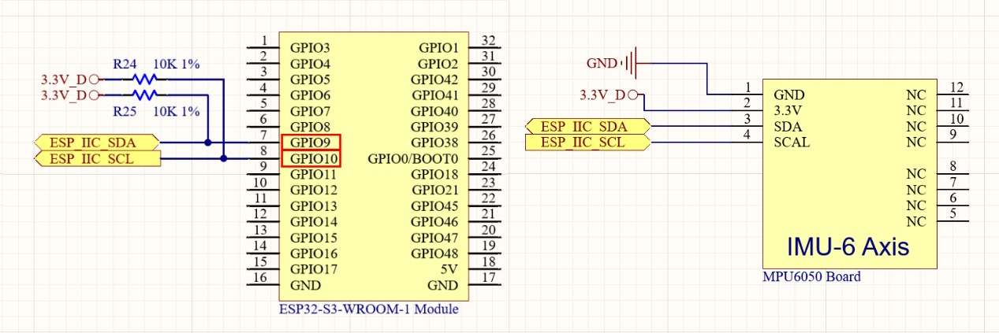
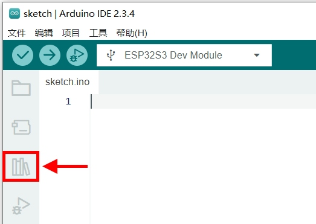
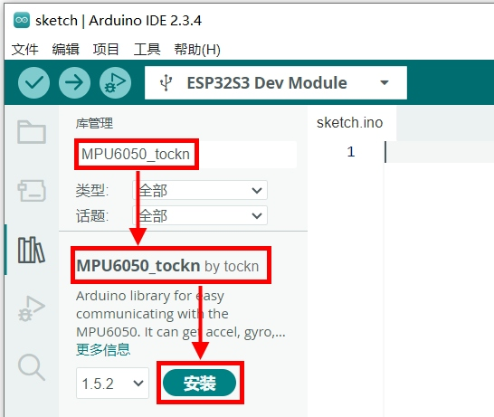

实验八 姿态传感器实验

【实验目的】

- 学习ESP32的I2C总线通讯的使用方法；

- 学习通过I2C总线，获取IMU姿态传感器的测量数据。

【实验原理】

在开发板面板的右侧，有一枚姿态传感器MPU6050。它们在电路原理图中的表示如下：

<div align="center">
  
</div>

可以看到，这枚传感器是与ESP32的GPIO9和GPIO10连接，使用I2C总线与ESP32通讯。ESP32内置两个独立的I2C控制器。它通过SDA（数据线）和SCL（时钟线）实现与外部设备的双向通信，支持标准模式（100kHz）和快速模式（400kHz）。每个控制器都可以灵活配置引脚，并支持多设备共享总线的主从通信架构。在这个实验里，将会使用第一个I2C控制器（序号0）来与MPU6050姿态传感器进行通讯。对MPU6050传感器的数据解析，在Arduino里也有现成的库，直接调用就行。

【实验步骤】

1.  将开发用的电脑连接互联网，后面的操作将会从互联网上下载库文件。

2.  在Arduino IDE的左侧边栏，点击"库管理"图标打开管理库的窗口。

<div align="center">
  
</div>

在"库管理"窗口的搜索栏中，输入"MPU6050_tockn"，下方列表中会出现MPU6050_tockn这个库的信息。点击"安装"按钮，自动完成这个库的下载安装。

<div align="center">
  
</div>

3.  在Arduino IDE里点击左上角菜单栏的"文件"，在弹出的菜单列表选择"新建项目"。

<div align="center">
  
</div>

在下载的例子源代码包里，对应的源码文件为imu.ino。完整代码如下：
```c
#include <TFT_eSPI.h>
#include <Wire.h>
#include <MPU6050_tockn.h>

TFT_eSPI tft = TFT_eSPI(320, 480);

#define I2C_SDA 9
#define I2C_SCL 10

TwoWire I2C_0 = TwoWire(0);

MPU6050 mpu6050(I2C_0);

void setup() {
  tft.init();
  tft.setRotation(1);
  tft.invertDisplay(1);
  tft.setTextSize(2);
  tft.fillScreen(TFT_BLACK);
  tft.setCursor(0, 0);
  tft.println("MPU6050 Initializing...");
  I2C_0.begin(I2C_SDA, I2C_SCL);
  mpu6050.begin();

  tft.println("Calculating offsets...");
  tft.println("DO NOT MOVE MPU6050...");
  mpu6050.calcGyroOffsets(true);

  tft.println("Done!");
  tft.fillScreen(TFT_BLACK);
}

void loop() {
  mpu6050.update();

  tft.fillRect(80, 20, 80, 60, TFT_BLACK);
  tft.setCursor(0, 0);
  tft.println("Angle (deg):");
  tft.setCursor(0, 20);
  tft.print("Roll  : ");
  tft.println(mpu6050.getAngleX(), 1);
  tft.print("Pitch : ");
  tft.println(mpu6050.getAngleY(), 1);
  tft.print("Yaw   : ");
  tft.println(mpu6050.getAngleZ(), 1);

  delay(30);
}
```
对代码进行解释：
```c 
#include <TFT_eSPI.h>
#include <Wire.h>
#include <MPU6050_tockn.h>
```
引入TFT_eSPI库头文件，用于LCD屏幕显示。引入Wire库，用于I2C通信。引入MPU6050_tockn库，用于解析姿态传感器采集的数据。
```c
#define I2C_SDA 9
#define I2C_SCL 10
```
定义I2C通讯的ESP32引脚为GPIO9和GPIO10：
```c
TwoWire I2C_0 = TwoWire(0);
MPU6050 mpu6050(I2C_0);
```
创建I2C控制器实例，使用第一个I2C控制器。创建MPU6050传感器对象，传入I2C实例。
```c
void setup() {
  tft.init();
  tft.setRotation(1);
  tft.invertDisplay(1);
  tft.setTextSize(2);
  tft.fillScreen(TFT_BLACK);
  // ...
}
```
程序启动时，调用init()初始化TFT显示屏；setRotation(1)设置显示屏旋转方向为1，表示横向（0-3数值分别对应四个方向）；invertDisplay(1)反转显示颜色；setTextSize(2)设置文字大小为2倍默认大小；最后fillScreen(TFT_BLACK)将整个屏幕填充为黑色背景。
```c
void setup() {
  // ...
  tft.setCursor(0, 0);
  tft.println("MPU6050 Initializing...");
  I2C_0.begin(I2C_SDA, I2C_SCL);
  mpu6050.begin();
  // ...
}
```
在初始化函数中，先把屏幕光标移动到(0,0)处，显示一段信息，提示MPU6050姿态传感器开始初始化。然后用定义好的SDA和SCL引脚开启I2C通讯。接着初始化MPU6050传感器。
```c
void setup() {
  // ...
  tft.println("Calculating offsets...");
  tft.println("DO NOT MOVE MPU6050...");
  mpu6050.calcGyroOffsets(true);
  // ...
}
```
在屏幕继续输出信息，提示将会对MPU6050姿态传感器的初始误差进行标定，请不要移动姿态传感器模块。然后调用calcGyroOffsets(true)函数开始对传感器进行标定，这个过程会持续一小段时间，期间需要保持姿态传感器所在的电路板模块静止不动。
```c
void setup() {
  // ...
  tft.println("Done!");
  tft.fillScreen(TFT_BLACK);
}
```
经过几秒钟的标定之后，在屏幕输出信息"Done!"，表示标定完毕。然后用黑色填充整个屏幕，把之前显示的初始化信息都清除掉，腾出空间准备显示传感器数值。
```c
void loop() {
  mpu6050.update();
  // ...
}
```
调用mpu6050对象的update()函数，获取姿态传感器读取到的最新姿态数据。
```c
void loop() {
  // ...
  tft.fillRect(80, 20, 80, 60, TFT_BLACK);
  // ...
}
```
紧接着，先在一个矩形区域填充黑色，把上一帧显示的姿态数据抹除掉。这个矩形是以(80,20)为左上角坐标，宽度为80，高度为60。如果不抹除的话，假如最新显示的是长度比较短的数据，会覆盖不掉之前比较长的数据。在最新数值的末尾，会残留一些数字，影响观察读数。
```c
void loop() {
  // ...
  tft.setCursor(0, 0);
  tft.println("Angle (deg):");
  tft.setCursor(0, 20);
  tft.print("Roll  : ");
  tft.println(mpu6050.getAngleX(), 1);
  tft.print("Pitch : ");
  tft.println(mpu6050.getAngleY(), 1);
  tft.print("Yaw   : ");
  tft.println(mpu6050.getAngleZ(), 1);

  delay(100);
}
```
接下来，把屏幕显示光标移动到屏幕左上角(0,0)处。显示"Angle (deg):"表示后面是姿态角度的数值。然后光标移动到屏幕坐标(0,20)处。调用println()函数，显示姿态传感器检测到的滚转角（Roll）。后面使用同样的方法显示俯仰角（Pitch）和航向角（Yaw）。其中println()函数的第二个参数1，表示小数点之后只显示1位小数。最后调用delay(100)延时100毫秒，避免数值刷新太快影响观察读数。

4.  程序编写完毕后，需要为其设置目标设备和程序上传端口，才能进行程序的编译和上传。首先将开发板的Type-C接口，通过USB线缆连接到电脑的USB插口上。

<div align="center">
  
</div>

在Windows系统中，鼠标右键点击桌面左下角的"开始"图标。在弹出的菜单里选择"设备管理器"。在设备管理器里，展开"端口(COM和LPT)"，查看其中的USB-SERIAL CH340K(COMx)一项。记住其中的COMx，比如下图中的COM10，就是将程序上传到ESP32的端口号。

<div align="center">
  
</div>

回到Arduino IDE，点击工具栏里的设备框左侧的向下箭头，弹出端口列表。从中选择上传程序的端口号，比如下图中的COM10。

<div align="center">
  
</div>

在弹出的窗口中，搜索栏里输入"esp32s3 dev"。在下方的列表中，选择"ESP32S3 Dev Module"一项。然后点击窗口右下角的"确定"按钮。

<div align="center">
  
</div>

5.  回到Arduino IDE界面，点击工具栏里的上传按钮，就可以开始编译程序并上传到开发板的ESP32里运行了。

<div align="center">
  
</div>

编译的过程会比较耗时，需要耐心等待。直到界面下方的终端窗口提示如下信息，说明程序上传完毕并已经开始执行。

<div align="center">
  
</div>

这时候来到开发板面板的LCD显示屏，就能看到姿态传感器返回的姿态数值了。可以将姿态传感器所在的小电路板取下来，转动起来查看数值变化。

【扩展实验】

MPU6050传感器除了姿态信息，还能检测惯性加速度以及温度信息。在下载的例子源代码包里，对应的源码文件为imu_detailed.ino。完整代码如下：
```c
#include <TFT_eSPI.h>
#include <Wire.h>
#include <MPU6050_tockn.h>

// 创建TFT显示对象，设置分辨率为320x480
TFT_eSPI tft = TFT_eSPI(320, 480);

// 定义I2C的SDA和SCL引脚
#define I2C_SDA 9
#define I2C_SCL 10

// 创建I2C对象
TwoWire I2C_0 = TwoWire(0);

// 创建MPU6050对象，使用I2C_0
MPU6050 mpu6050(I2C_0);

void setup() {
  // 初始化TFT显示屏
  tft.init();
  // 设置显示屏的旋转方向
  tft.setRotation(1);
  // 反转显示屏颜色
  tft.invertDisplay(1);
  // 设置文本大小
  tft.setTextSize(2);
  // 填充屏幕为黑色
  tft.fillScreen(TFT_BLACK);
  // 设置光标位置并打印初始化信息
  tft.setCursor(0, 0);
  tft.println("MPU6050 Initializing...");
  // 开始I2C通信
  I2C_0.begin(I2C_SDA, I2C_SCL);
  // 初始化MPU6050传感器
  mpu6050.begin();

  // 打印偏移量计算提示
  tft.println("Calculating offsets...");
  tft.println("DO NOT MOVE MPU6050...");
  // 计算陀螺仪偏移量
  mpu6050.calcGyroOffsets(true);
  // 打印完成信息
  tft.println("Done!");
  delay(100);
  // 清空屏幕
  tft.fillScreen(TFT_BLACK);
}

void loop() {
  // 更新传感器数据
  mpu6050.update();
  // 清除之前显示的姿态角度信息
  tft.fillRect(80, 20, 100, 60, TFT_BLACK); // Adjusted width for clarity

  // 设置光标位置并打印姿态角度信息
  tft.setCursor(0, 0);
  tft.println("Angle (deg):"); // 打印姿态角度标题
  tft.setCursor(0, 20);
  tft.print("Roll  : ");
  tft.println(mpu6050.getAngleX(), 1); // 打印横滚角度
  tft.print("Pitch : ");
  tft.println(mpu6050.getAngleY(), 1); // 打印俯仰角度
  tft.print("Yaw   : ");
  tft.println(mpu6050.getAngleZ(), 1); // 打印航向角度

  // 设置光标位置并打印加速度计数据
  tft.fillRect(20, 120, 100, 60, TFT_BLACK); // Adjusted position and width
  tft.setCursor(0, 100);
  tft.println("Accel (g):"); // 打印加速度计标题
  tft.setCursor(0, 120);
  tft.print("X: ");
  tft.println(mpu6050.getAccX(), 2); // 打印X轴加速度
  tft.print("Y: ");
  tft.println(mpu6050.getAccY(), 2); // 打印Y轴加速度
  tft.print("Z: ");
  tft.println(mpu6050.getAccZ(), 2); // 打印Z轴加速度


  // 设置光标位置并打印陀螺仪数据
  tft.fillRect(20, 220, 100, 60, TFT_BLACK); // Adjusted position and width
  tft.setCursor(0, 200);
  tft.println("Gyro (deg/s):"); // 打印陀螺仪标题
  tft.setCursor(0, 220);
  tft.print("X: ");
  tft.println(mpu6050.getGyroX(), 1); // 打印X轴角速度
  tft.print("Y: ");
  tft.println(mpu6050.getGyroY(), 1); // 打印Y轴角速度
  tft.print("Z: ");
  tft.println(mpu6050.getGyroZ(), 1); // 打印Z轴角速度


  // 设置光标位置并打印温度数据
  tft.setCursor(0, 290);
  tft.print("Temperature: ");
  tft.print(mpu6050.getTemp(), 1); // 打印温度
  tft.println(" C"); // 添加单位

  // 延迟30毫秒用于更新数据
  delay(30);
}
```

<div align="center">
  <a href="../../README.md" style="display: inline-block; margin: 10px 0 18px; padding: 10px 18px; border-radius: 999px; background: linear-gradient(135deg, #1f6feb, #3fb950); color: #ffffff; text-decoration: none; font-weight: 700; box-shadow: 0 4px 12px rgba(31, 111, 235, 0.25);">返回 README 主页</a>
</div>
